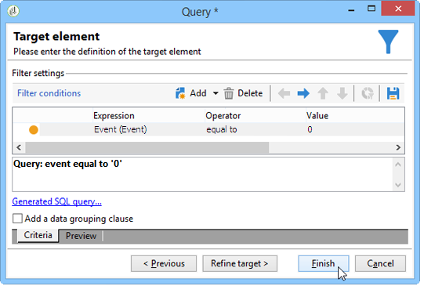

# 数据加载（文件）{#data-loading-file}

## 使用 {#use}

利用&#x200B;**[!UICONTROL Data loading (File)]**&#x200B;活动，可直接访问外部数据源并在Adobe Campaign中使用它。 事实上，定位操作所需的所有数据并不总是可以在Adobe Campaign数据库中找到：这些数据可以在外部文件中提供。

要加载的文件可由过渡指定，或在此活动执行期间进行计算。 例如，它可以是客户最喜爱的10种产品的列表，这些产品的购买在外部数据库中进行管理。

此活动的配置窗口的上半部分允许您定义文件格式。 为此，请使用与要导入的文件格式相同的样例文件。 此文件可以存储在本地或服务器上。

>[!CAUTION]
>
>仅支持“平面”结构文件（例如CSV、TXT等）。 不建议使用XML格式。

您可以定义在文件导入期间要执行的预处理过程，例如，不必在服务器上解压缩文件（从而节省解压缩文件的空间），而要在文件处理中包括解压缩。 选择&#x200B;**[!UICONTROL Pre-process the file]**&#x200B;选项并从3个选项中选择一个：**[!UICONTROL None]**、**[!UICONTROL Decompression]** (zcat)或&#x200B;**[!UICONTROL Decrypt]** (gpg)。

>[!IMPORTANT]
>
>不能解压缩大于4Gb的压缩文件。

## 定义文件格式 {#defining-the-file-format}

加载文件时，将自动检测列格式以及每种数据类型的默认参数。 您可以修改这些默认参数，以指定要应用于数据的特定进程，尤其是当存在错误或空值时。

为此，请在&#x200B;**[!UICONTROL Data loading (file)]**&#x200B;活动的主窗口中选择&#x200B;**[!UICONTROL Click here to change the file format...]**。 随后将打开格式详细信息窗口。

然后，您可以修改文件的常规格式以及每列的格式。

常规文件格式允许您定义识别列的方式（文件编码、使用的分隔符等）。

利用列格式，可定义每个列的值处理：

>[!NOTE]
>
>您可以根据需要添加任意数量的列。 每列中值的最大长度由所选的数据类型决定。

* **[!UICONTROL Ignore column]**：在数据加载过程中不处理此列。
* **[!UICONTROL Data type]**：指定每个列所需的数据类型。
* **[!UICONTROL Allow NULLs]**：指定如何管理空值。

   * **[!UICONTROL Adobe Campaign default]**：仅为数字字段生成错误，否则插入 NULL 值。
   * **[!UICONTROL Empty value allowed]**：授权空值。因此，会插入 NULL 值。
   * **[!UICONTROL Always populated]**：如果值为空，则生成错误。

* **[!UICONTROL Length]**：指定&#x200B;**字符串**&#x200B;数据类型的最大字符数。
* **[!UICONTROL Format]**：定义时间和日期格式。
* **[!UICONTROL Data transformation]**：定义是否需要对&#x200B;**字符串**&#x200B;应用字符大小写处理。

   * **[!UICONTROL None]**：未修改导入的字符串。
   * **[!UICONTROL First letter in upper case]**：字符串中每个单词的第一个字母以大写开头。
   * **[!UICONTROL Upper case]**：字符串中的所有字符都使用大写。
   * **[!UICONTROL Lower case]**：字符串中的所有字符都使用小写。

* **[!UICONTROL White space management]**：指定字符串中是否需要忽略某些空格。 **[!UICONTROL Ignore spaces]**&#x200B;值只允许忽略字符串开头和结尾的空格。
* **[!UICONTROL Error processings]**：定义遇到错误时的行为。

   * **[!UICONTROL Ignore the value]**：忽略值。工作流执行日志中会生成警告。
   * **[!UICONTROL Reject line]**：不处理整个行。
   * **[!UICONTROL Use a default value in case of error]**：将导致错误的值替换为在 **[!UICONTROL Default value]** 字段中定义的默认值。
   * **[!UICONTROL Reject the line when there is no remapping value]**：除非为错误值定义了映射，否则不会处理整行（请参阅下面的&#x200B;**[!UICONTROL Mapping]**&#x200B;选项）。
   * **[!UICONTROL Use a default value in case the value is not remapped]**：将在&#x200B;**[!UICONTROL Default value]**&#x200B;字段中定义的默认值替换导致错误的值，除非已为该错误值定义了映射（请参阅下面的&#x200B;**[!UICONTROL Mapping]**&#x200B;选项）。

* **[!UICONTROL Default value]**：根据所选的错误处理指定默认值。
* **[!UICONTROL Mapping]**：此字段仅在列详细信息配置（通过双击或通过列列表右侧的选项访问）中可用。 这会在导入特定值时对其进行转换。 例如，您可以将“three”转换为“3”。

## 示例：收集数据并将其加载到数据库中 {#example--collecting-data-and-loading-it-in-the-database}

以下示例允许您每天在服务器上收集文件、加载其内容并根据其中包含的信息更新数据库中的数据。 要收集的文件包含客户的信息，这些客户可能购买了（3,000欧元或以下），要求购买退款，或没有购买任何东西就参观了商店。 根据此信息，各种进程将应用于数据库中其用户档案。

1. 使用文件收集器，可根据指定的频率恢复存储在目录中的文件。

   **[!UICONTROL Directory]**&#x200B;选项卡包含有关要恢复的文件的信息。 在我们的示例中，将恢复名称中包含“customers”一词且存储在服务器的tmp/Adobe/数据/文件目录中的所有文本格式文件。

   [文件收集器](file-collector.md)部分中详细介绍了使用&#x200B;**[!UICONTROL File collector]**&#x200B;的情况。

   

   **[!UICONTROL Schedule]**&#x200B;选项卡允许您安排收集器的执行，即指定检查这些文件存在的频率。

   在这里，我们希望在每个工作日的晚上9点触发收集器。

   

   为此，请单击编辑工具右下角的&#x200B;**[!UICONTROL Change...]**&#x200B;按钮并配置计划。

   有关详情，请参阅[计划程序](scheduler.md)。

1. 然后，配置数据加载（文件）活动以指示应如何读取收集的文件。 为此，请选择与要加载的文件具有相同结构的样例文件。

   

   在此，文件包含五列：

   * 第一列包含与事件一致的代码：购买（多或少于3,000欧元）、一次或多次购买不购买或退款。
   * 以下四列包含客户端的名字、姓氏、电子邮件和帐号。

   要加载的文件的格式配置与Adobe Campaign中数据导入期间定义的配置一致。

1. 在拆分活动中，根据&#x200B;**Event**&#x200B;列值指定要创建的子集。

   有关拆分活动的详情，请参阅一节。

   

   对于每个子集，在&#x200B;**Event**&#x200B;列中指定其中一个值。

   

   因此，**[!UICONTROL Split]**&#x200B;活动将包含以下信息：

   

1. 然后，指定针对每种类型的群体执行的流程。 在本例中，我们将转到数据库中的&#x200B;**[!UICONTROL Update the data]**。 为此，请在拆分活动的每个叫客过渡的末尾放置一个&#x200B;**[!UICONTROL Update data]**&#x200B;活动。

   **[!UICONTROL Update data]**&#x200B;活动在[更新数据](update-data.md)部分中有详细说明。
