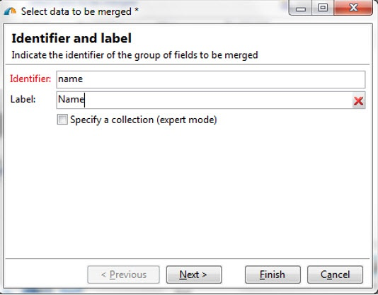
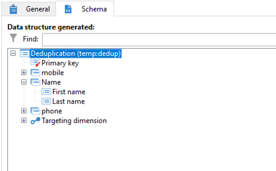

# 使用重复数据删除活动的合并功能 {#deduplication-merge}

## 关于此用例 {#about-this-use-case}

此用例介绍如何使用 **[!UICONTROL Merge]** 功能 **[!UICONTROL Deduplication]** 活动。

有关此功能的更多信息，请参阅 [此部分](deduplication.md#merging-fields-into-single-record).

的 **[!UICONTROL Deduplication]** 活动用于从数据集中删除重复行。 在此用例中，下面显示的数据会根据“电子邮件”字段进行复制。

| 上次修改日期 | 名字 | 姓氏 | 电子邮件 | 手机 | 电话 |
|-----|------------|-----------|-------|--------------|------|
| 5/19/2020 | 罗伯特 | 蒂斯纳 | bob@mycompany.com | 444-444-444 | 777-777-7777 |
| 7/22/2020 | 鲍比 | 蒂斯纳 | bob@mycompany.com |  | 777-777-7777 |
| 10/03/2020 | Bob |  | bob@mycompany.com |  | 888-888-8888 |

使用重复数据删除活动 **[!UICONTROL Merge]** 根据需要，您可以配置重复数据删除的一组规则，以定义要合并到单个生成数据记录中的一组字段。 例如，使用一组重复的记录，您可以选择保留最早的电话号码或最近的名称。

## 激活合并功能 {#activating-merge}

要启用合并功能，您首先需要配置 **[!UICONTROL Deduplication]** 活动。 为此，请执行以下步骤：

1. 打开活动，然后单击 **[编辑配置]** 链接。

1. 选择要用于重复数据删除的协调字段，然后单击 **[!UICONTROL Next]**. 在本例中，我们希望根据电子邮件字段删除重复项。

   

1. 单击 **[!UICONTROL Advanced parameters]** 链接，然后激活 **[!UICONTROL Merge records]** 和 **[!UICONTROL Use several record merging criteria]** 选项。

   

1. 的 **[!UICONTROL Merge]** 选项卡 **[!UICONTROL Deduplication]** 配置屏幕。 执行重复数据删除时，我们将使用此选项卡指定要合并的数据。

## 配置要合并的字段 {#configuring-rules}

以下是用于将数据合并到单个记录中的规则：

* 保留最近的名称（名字和姓氏字段），
* 留下最新的手机，
* 保留最早的电话号码，
* 组中的所有字段都必须为非空，才能符合最终记录的条件。

要配置这些规则，请执行以下步骤：

1. 打开 **[!UICONTROL Merge]** ，然后单击 **[!UICONTROL Add]** 按钮。

   

1. 指定要合并的字段组的标识符和标签。

   

1. 指示选择要考虑的记录的条件。

   

1. 按上次修改日期排序，以选择最新名称。

   

1. 选择要合并的字段。 在本例中，我们希望保留名字和姓氏字段。

   

1. 这些字段将添加到要合并的数据集中，并且还会向工作流架构中添加新元素。

   重复这些步骤以配置移动电话和电话字段。

   

   

## 结果 {#results}

配置这些规则后，会在 **[!UICONTROL Deduplication]** 活动。

| 修改日期 | 名字 | 姓氏 | 电子邮件 | 手机 | 电话 |
|-----|------------|-----------|-------|--------------|------|
| 5/19/2020 | 罗伯特 | 蒂斯纳 | bob@mycompany.com | 444-444-444 | 777-777-7777 |
| 7/22/2020 | 鲍比 | 蒂斯纳 | bob@mycompany.com |  | 777-777-7777 |
| 10/03/2020 | Bob |  | bob@mycompany.com |  | 888-888-8888 |

根据之前配置的规则，从三条记录中合并结果。 比较后得出使用最新姓名和手机以及原电话号码的结论。

| 名字 | 姓氏 | 电子邮件 | 手机 | 电话 |
|------------|-----------|-------|--------------|------|
| 鲍比 | 蒂斯纳 | bob@mycompany.com | 444-444-4444 | 888-888-8888 |

>[!NOTE]
>
> 请注意，已合并的名字是“Bobby”，因为我们配置了由名字和姓氏字段组成的“Name”规则。
>
>因此，无法考虑“Bob”（最近的名字），因为其关联的姓氏字段为空。 名字和姓氏的最近组合被合并到最后记录中。
