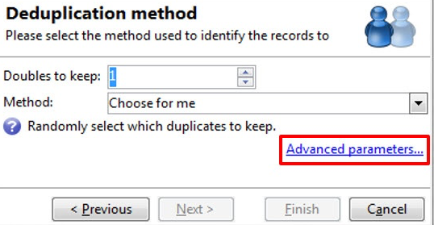

# 重复数据删除{#deduplication}

重复数据删除会从集客活动的结果中删除重复项。 可以对电子邮件地址、电话号码或其他字段执行重复数据删除。

**[!UICONTROL Deduplication]**&#x200B;活动用于从数据集中删除重复行。 例如，下面的记录可能被视为重复，因为它们具有相同的电子邮件地址和相同的手机和/或家庭电话。

| 上次修改日期 | 名字 | 姓氏 | 电子邮件 | 手机 | 电话 |
-----|------------|-----------|-------|--------------|------
| 02/03/2020 | 鲍勃 | 提斯纳 | bob@mycompany.com | 444-444-4444 | 888-888-8888 |
| 05/19/2020 | 罗伯特 | 提斯纳 | bob@mycompany.com | 444-444-4444 | 777-777-7777 |
| 07/22/2020 | 鲍比 | 提斯纳 | bob@mycompany.com | 444-444-4444 | 777-777-7777 |

**[!UICONTROL Deduplication]**&#x200B;活动能够在识别重复项后保留整行作为唯一记录。 例如，在上述用例中，如果活动配置为仅保留具有最旧&#x200B;**[!UICONTROL Date]**&#x200B;的记录，则结果将为：

| 日期 | 名字 | 姓氏 | 电子邮件 | 手机 | 电话 |
-----|----------|------------|-------|--------------|------
| 02/03/2020 | 鲍勃 | 提斯纳 | bob@mycompany.com | 444-444-4444 | 888-888-8888 |

所选主记录将结转数据，而不会将字段数据与重复行中的其他相关数据合并。

补充：

| 日期 | 名字 | 姓氏 | 电子邮件 | 手机 | 电话 |
-----|------------|-----------|-------|--------------|------
| 05/19/2020 | 罗伯特 | 提斯纳 | bob@mycompany.com | 444-444-4444 | 777-777-7777 |
| 07/22/2020 | 鲍比 | 提斯纳 | bob@mycompany.com | 444-444-4444 | 777-777-7777 |

## 最佳实践 {#best-practices}

在重复数据删除期间，将单独处理集客流。 例如，如果在查询1的结果中以及在查询2的结果中找到收件人A，则不会为其去重。

这个问题需要以下述方式解决：

* 创建一个&#x200B;**Union**&#x200B;活动以统一每个入站流。
* 在&#x200B;**合并**&#x200B;活动之后创建&#x200B;**重复数据删除**&#x200B;活动。

## 配置 {#configuration}

要配置重复数据删除，请输入其标签、方法和重复数据删除标准，以及有关结果的选项。

1. 单击&#x200B;**[!UICONTROL Edit configuration...]**&#x200B;链接以定义重复数据删除模式。

   

1. 选择此活动的目标类型（默认情况下，重复数据删除会链接到收件人）以及要使用的条件，即允许您识别重复项的相同值的字段。

   >[!NOTE]
   >
   >如果您使用外部数据作为输入（例如从外部文件），请确保选择&#x200B;**[!UICONTROL Temporary schema]**&#x200B;选项。
   >
   >在下一步中，**[!UICONTROL Other]**&#x200B;选项允许您选择要使用的条件或条件：

   

1. 在下一步中，**[!UICONTROL Other]**&#x200B;选项允许您选择在值相同的情况下使用的标准或条件。

   

1. 从下拉列表中选择要使用的重复数据删除方法，然后输入要保留的重复项数。

   

   可以使用以下方法：

   * **[!UICONTROL Choose for me]**：随机选择要保留的重复项记录。
   * **[!UICONTROL Following a list of values]**：用于为一个或多个字段定义值优先级。要定义该值，请选择一个字段或创建表达式，然后将值添加到相应的表格中。要定义新字段，请单击位于值列表上方的 **[!UICONTROL Add]** 按钮。

     

   * **[!UICONTROL Non-empty value]**：利用此选项可优先保留选定表达式的值不为空的记录。

     

   * **[!UICONTROL Using an expression]**：允许您保留具有给定表达式的最低（或最高）值的记录。

     

   >[!NOTE]
   >
   >通过&#x200B;**[!UICONTROL Advanced parameters]**&#x200B;链接访问的&#x200B;**[!UICONTROL Merge]**&#x200B;功能允许您配置一组规则，以便将字段或字段组合并到单个结果数据记录中。 有关详细信息，请参阅[将字段合并到单个记录中](#merging-fields-into-single-record)。

1. 单击&#x200B;**[!UICONTROL Finish]**&#x200B;以批准选定的重复数据删除方法。

   窗口的中间部分总结了定义的配置。

   在活动编辑器窗口的下部，您可以修改图形对象叫客过渡的标签，并输入与活动结果关联的段代码。 此代码以后可用作定位条件。

   

1. 如果要利用剩余群体，请选中&#x200B;**[!UICONTROL Generate complement]**&#x200B;选项。 补充包含所有重复项。 随后将向活动添加其他过渡，如下所示：

   

## 示例：在投放之前标识重复项 {#example--identify-the-duplicates-before-a-delivery}

在以下示例中，重复数据删除与三个查询的并集有关。

工作流的目的是通过排除重复项来定义投放的目标，以避免将其多次发送给同一收件人。

已识别的重复项还将集成到专用的重复项列表中，如有必要，可以重复使用。

1. 添加并链接工作流运行所需的各种活动，如上所示。

   此处使用合并活动将三个查询“统一”为一个过渡。 因此，重复数据删除不适用于单独的查询，而适用于整个查询。 有关此主题的更多信息，请参阅[最佳实践](#best-practices)。

1. 打开重复数据删除活动，然后单击&#x200B;**[!UICONTROL Edit configuration...]**&#x200B;链接以定义重复数据删除模式。
1. 在新窗口中，选择&#x200B;**[!UICONTROL Database schema]**。
1. 选择&#x200B;**收件人**&#x200B;作为定位和筛选维度。
1. 选择&#x200B;**[!UICONTROL Email]**&#x200B;重复项的ID字段，以仅向每个电子邮件地址发送一次投放，然后单击&#x200B;**[!UICONTROL Next]**。

   如果您希望复制ID基于特定字段，请选择&#x200B;**[!UICONTROL Other]**&#x200B;以访问可用字段列表。

1. 选择此项以在为多个收件人标识了同一电子邮件地址时仅保留一个条目。
1. 选择&#x200B;**[!UICONTROL Choose for me]**&#x200B;重复数据删除模式，以便随机选择在已识别重复项时保存的记录，然后单击&#x200B;**[!UICONTROL Finish]**。

运行工作流时，将从结果（以及投放）中排除所有标识为重复项的收件人，并将其添加到重复项列表中。 此列表可再次使用，而不必重新识别重复项。

## 将字段合并到单个数据记录中 {#merging-fields-into-single-record}

利用&#x200B;**[!UICONTROL Merge]**&#x200B;功能，可为重复数据删除配置一组规则，以定义要合并到单个结果数据记录中的字段或字段组。

例如，如果有一组重复记录，则可以选择保留最早的电话号码或最近的名称。

[此部分](deduplication-merge.md)中提供了利用此功能的用例。

为此，请执行以下步骤：

1. 在&#x200B;**[!UICONTROL Deduplication method]**&#x200B;选择步骤中，单击&#x200B;**[!UICONTROL Advanced Parameters]**&#x200B;链接。

   

1. 选择&#x200B;**[!UICONTROL Merge records]**&#x200B;选项以激活该功能。

   如果要对每个合并条件中的多个数据字段进行分组，请激活&#x200B;**[!UICONTROL Use several record merging criteria]**&#x200B;选项。

   

1. 激活功能后，**[!UICONTROL Merge]**&#x200B;选项卡将添加到&#x200B;**[!UICONTROL Deduplication]**&#x200B;活动中。 它允许您定义要合并的字段组及其关联的规则。

   有关详细信息，请参阅[此部分](deduplication-merge.md)中提供的专用用例。

## 输入参数 {#input-parameters}

* 表名
* 模式

每个入站事件必须指定由这些参数定义的目标。

## 输出参数 {#output-parameters}

* 表名
* 模式
* recCount

这组三个值可标识重复数据删除产生的目标。 **[!UICONTROL tableName]**&#x200B;是保存目标标识符的表的名称，**[!UICONTROL schema]**&#x200B;是群体的架构（通常为nms：recipient），**[!UICONTROL recCount]**&#x200B;是表中的元素数。

与补充关联的转换具有相同的参数。
