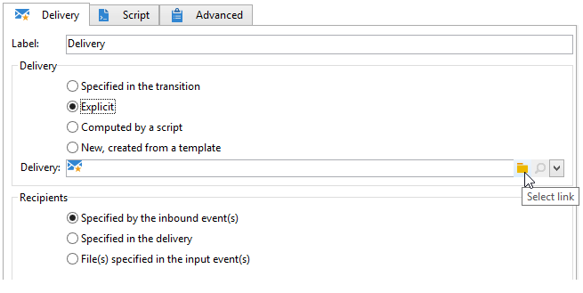
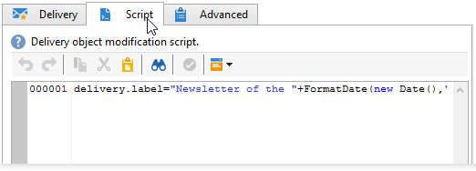

# 投放{#delivery}


A **投放**-type活动允许您创建投放操作。 它可以使用输入元素来构建。

要对其进行配置，请编辑活动并输入提交选项。


1. **投放**

   您可以：

   * 对集客过渡中指定的投放执行操作。 为此，请选择 **[!UICONTROL Delivery]** 的子菜单。

      当之前的工作流活动已创建或指定投放时，可以使用此选项。 与以下示例一样，也可以通过生成叫客过渡的相同类型的活动来执行此操作。

      在以下示例中，首次创建投放。 稍后会定义群体和内容。 接下来，使用集客过渡将这三个元素的信息重新输入到新投放活动中，以便发送该信息。

      

   * 直接选择相关投放。 为此，请选择 **[!UICONTROL Explicit]** 选项，然后从 **[!UICONTROL Delivery]** 字段。

      该列表显示 **投放** 文件夹。 要访问其他营销活动，请单击 **[!UICONTROL Select link]** 图标。

      

      从 **[!UICONTROL Folder]** 字段，或者单击 **[!UICONTROL Display sub-levels]** 要显示子文件夹中包含的所有投放，请执行以下操作：

      

      选择投放操作后，您可以通过单击 **[!UICONTROL Edit link]** 图标。

   * 创建用于计算投放的脚本。 为此，请选择 **[!UICONTROL Computed by a script]** 选项并输入脚本。 您可以通过单击 **[!UICONTROL Edit...]** 选项。 以下示例取回了投放的标识符：

      

   * 创建新投放。 为此，请选择 **[!UICONTROL New, created from a template]** 选项，然后选择投放所基于的投放模板。

      

      单击 **[!UICONTROL Select link]** 图标浏览文件夹，然后单击 **[!UICONTROL Edit link]** 图标。

1. **收件人**

   收件人可由集客事件指定（例如，在文件导入后），或在投放操作中指定。 它们也可以存储在一个或多个文件中。

   

1. **内容**

   可以在投放或集客事件中定义消息的内容。

   

1. **要执行的操作**

   您可以创建投放、准备投放、启动投放、评估目标或发送校样。

   

   选择要执行的操作类型：

   * **[!UICONTROL Save]**:利用此选项，可创建投放并保存。 它不会分析或提交它。
   * **[!UICONTROL Estimate the target]**:利用此选项，可计算投放目标以评估其潜力（第一个分析阶段）。 此操作等同于选择 **[!UICONTROL Estimate the population to be targeted]** 选项并单击 **[!UICONTROL Analyze]** 在通过向主目标发送投放时 **投放**.
   * **[!UICONTROL Prepare]**:利用此选项，可运行完整的分析流程（目标计算和内容准备）。 未发送投放。 此操作等同于选择 **[!UICONTROL Deliver as soon as possible]** 选项并单击 **[!UICONTROL Analyze]** 向主目标发送投放时，使用 **投放**.
   * **[!UICONTROL Send a proof]**:利用此选项，可发送投放的校样。 此操作等同于单击 **[!UICONTROL Send a proof]** 按钮 **投放**
   * **[!UICONTROL Prepare and start]**:此选项会启动完整的分析流程（目标计算和内容准备）并发送投放。 此操作等同于单击 **[!UICONTROL Deliver as soon as possible]**, **[!UICONTROL Analyze]**&#x200B;和 **[!UICONTROL Confirm delivery]** 选项 **投放**.

   的 **[!UICONTROL Act on a delivery]** 通过在工作流中进一步使用的活动，您可以启动开始投放所需的所有其余步骤（目标计算、内容准备、投放）。 有关更多信息，请参阅 [投放控制](delivery-control.md).

   还提供以下选项：

   * **[!UICONTROL Generate an outbound transition]**

      创建将在执行结束时激活的叫客过渡。 您可以选择是否检索叫客投放的目标。

   * **[!UICONTROL Do not recover target]**

      无法恢复传出投放操作的目标。

   * **[!UICONTROL Processing errors]**

      请参阅 [投放控制](delivery-control.md).
   的 **脚本** 选项卡，您可以修改投放参数。

   

## 示例：投放工作流 {#example--delivery-workflow}

创建新工作流并添加活动，如下图所示：


打开 **投放** 活动并定义属性，如下所示：

* 在 **[!UICONTROL Delivery]** 选择 **[!UICONTROL New, created from a template]** ，然后选择投放模板。
* 在 **[!UICONTROL Recipients]** 选择 **[!UICONTROL Specified in the delivery]**.
* 在 **[!UICONTROL Action to execute]** 部分，保留 **[!UICONTROL Prepare]** 选项。


单击 **[!UICONTROL OK]** 以关闭属性窗口。 您刚刚配置了一个活动，该活动包括根据将在其中指定目标的投放模板创建和准备新投放。

打开 **批准** 活动并定义属性，如下所示：

1. 在 **[!UICONTROL Assignment type]** 字段，选择您注册的群组。 如果您使用“管理员”帐户连接，请选择管理组。
1. 接下来，输入标题并在消息正文中插入以下文本：

   ```
   Do you wish to approve delivery (<%= vars.recCount %> recipient(s))?
   ```

   此消息包括使用JavaScript编写的表达式： **[!UICONTROL vars.recCount]** 表示上一任务投放所定向的收件人数。 有关JavaScript表达式的更多信息，请参阅 [JavaScript脚本和模板](javascript-scripts-and-templates.md).

   

   有关“批准”任务的详情，请参阅 [批准](approval.md).

## 输入参数 {#input-parameters}

投放标识符(如果 **[!UICONTROL Specified in the transition]** 选项 **[!UICONTROL Delivery]** 中。

* deliveryId
* tableName
* 模式

每个集客事件必须指定由这些参数定义的目标。

>[!NOTE]
>
>此参数仅在 **[!UICONTROL Specified by inbound event(s)]** 选项 **[!UICONTROL Recipients]** 中。

* 文件名

   如果 **[!UICONTROL File(s) specified by inbound event(s)]** 选项 **[!UICONTROL Recipients]** 中。

* contentId

   内容标识符(如果 **[!UICONTROL Specified by inbound events]** 选项 **[!UICONTROL Content]** 中。

## 输出参数 {#output-parameters}

* tableName
* 模式
* recCount

这三个值集标识由投放生成的目标。 **[!UICONTROL tableName]** 是用于存储目标标识符的表的名称， **[!UICONTROL schema]** 是群体模式（通常为nms:recipient）和 **[!UICONTROL recCount]** 是表中的元素数。

与补码关联的过渡具有相同的参数。

>[!NOTE]
>
>当 **[!UICONTROL Do not recover target]** 选项。
