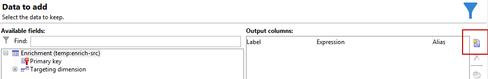
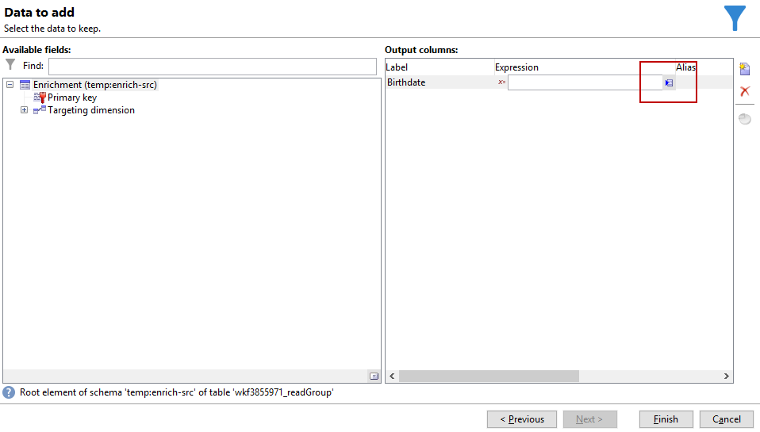
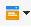

# 具有自定义日期字段的电子邮件扩充{#email-enrichment-with-custom-date-fields}


在此示例中，我们希望向本月将庆祝生日的收件人发送一封包含自定义数据字段的电子邮件。 电子邮件将包含一个优惠券，在他们生日前后一周有效。

我们需要从列表中定位本月将用 **[!UICONTROL Split]** 活动。 然后，使用 **[!UICONTROL Enrichment]** 活动时，自定义数据字段将用作客户特殊选件的电子邮件中的有效日期。


要创建此示例，请应用以下步骤：

1. 在 **[!UICONTROL Targeting and workflows]** ，拖放 **[!UICONTROL Read list]** 活动来定位收件人列表。
1. 要处理的列表可以显式指定，由脚本计算，或根据此处选择的选项和定义的参数动态本地化。

   

1. 添加 **[!UICONTROL Split]** 活动以区分本月将庆祝其生日的收件人与其他收件人。
1. 要拆分列表，请在 **[!UICONTROL Filtering of selected records]** 类别，选择 **[!UICONTROL Add a filtering condition on the inbound population]**. 然后，单击 **[!UICONTROL Edit]**.

   

1. 选择 **[!UICONTROL Filtering conditions]** 然后单击 **[!UICONTROL Edit expression]** 按钮来筛选收件人生日的月份。

   

1. 单击 **[!UICONTROL Advanced Selection]** then **[!UICONTROL Edit the formula using an expression]** 和添加以下表达式：月(@birthDate)。
1. 在 **[!UICONTROL Operator]** 列，选择 **[!UICONTROL equal to]**.
1. 通过添加 **[!UICONTROL Value]** 当前日期的月份：Month(GetDate())。

   这将查询生日月份对应于当月的收件人。

   

1. 单击 **[!UICONTROL Finish]**。然后，在 **[!UICONTROL General]** 选项卡 **[!UICONTROL Split]** 活动，单击 **[!UICONTROL Generate complement]** 在 **[!UICONTROL Results]** 类别。

   使用 **[!UICONTROL Complement]** 结果，您可以添加投放活动或更新列表。 在此，我们刚刚添加了 **[!UICONTROL End]** 活动。

   

您现在需要配置 **[!UICONTROL Enrichment]** 活动：

1. 添加 **[!UICONTROL Enrichment]** 活动，以添加自定义日期字段。

   

1. 打开 **[!UICONTROL Enrichment]** 活动。 在 **[!UICONTROL Complementary information]** 类别，单击 **[!UICONTROL Add data]**.

   

1. 选择 **[!UICONTROL Data linked to the filtering dimension]** then **[!UICONTROL Data of the filtering dimension]**.
1. 单击 **[!UICONTROL Add]** 按钮。

   

1. 添加 **[!UICONTROL Label]**. 然后，在 **[!UICONTROL Expression]** 列，单击 **[!UICONTROL Edit expression]**.

   

1. 首先，我们需要将出生日期前一周的 **有效期开始日期** 具有以下内容 **[!UICONTROL Expression]**: `SubDays([target/@birthDate], 7)`.

   

1. 然后，创建自定义日期字段 **有效期结束日期** 将以出生日期后的一周为目标，您需要添加 **[!UICONTROL Expression]**: `AddDays([target/@birthDate], 7)`.

   您可以向表达式添加标签。

   

1. 单击 **[!UICONTROL Ok]**。您的扩充现已准备就绪。

在 **[!UICONTROL Enrichment]** 活动时，您可以添加投放。 在本例中，我们添加了一封电子邮件投放，用于向收件人发送具有有效日期的特殊选件，以供本月庆祝其生日的客户使用。

1. 拖放 **[!UICONTROL Email delivery]** 活动之后 **[!UICONTROL Enrichment]** 活动。

   

1. 双击 **[!UICONTROL Email delivery]** 活动，以开始个性化投放。
1. 添加 **[!UICONTROL Label]** 投放，单击 **[!UICONTROL Continue]**.
1. 单击 **[!UICONTROL Save]** 创建电子邮件投放。
1. 签入 **[!UICONTROL Approval]** 电子邮件投放的选项卡 **[!UICONTROL Properties]** 该 **[!UICONTROL Confirm delivery before sending option]** 复选框。

   然后，启动工作流，以使用目标信息扩充叫客过渡。

   

现在，您可以使用在 **[!UICONTROL Enrichment]** 活动。

1. 双击 **[!UICONTROL Email delivery]** 活动。
1. 将target扩展添加到电子邮件中。 要配置有效日期的格式，该变量应位于以下表达式内：

   ```
   <%=
           formatDate(targetData.alias of your expression,"%2D.%2M")  %>
   ```

1. 单击 。选择 **[!UICONTROL Target extension]** 之前创建的自定义有效日期，其中 **[!UICONTROL Enrichment]** 活动，将您的扩展添加到formatDate表达式中。

   

1. 根据需要配置电子邮件内容。

   

1. 预览电子邮件，检查自定义日期字段是否正确配置

   

您的电子邮件现已准备就绪。 您可以开始发送校样并确认投放内容以发送生日电子邮件。
