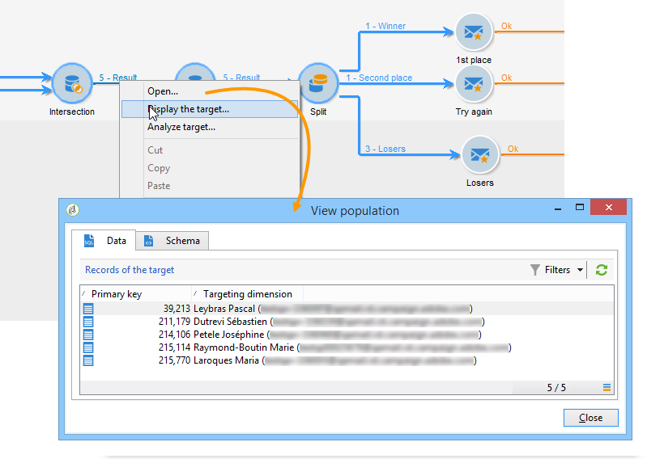
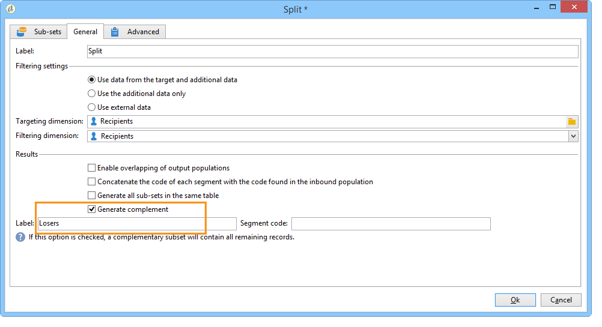

# 丰富数据{#enriching-data}

## 关于扩充数据 {#about-enriching-data}

此用例详细介绍了的可能用法 **[!UICONTROL Enrichment]** 定位工作流中的活动。 有关使用的更多信息 **[!UICONTROL Enrichment]** 活动，请参阅： [扩充](enrichment.md).

中还提供了有关如何使用自定义日期扩充电子邮件投放的用例 [本节](email-enrichment-with-custom-date-fields.md).

通过Web应用程序向营销数据库中的联系人发送参加竞赛的邀请。 比赛结果可于 **[!UICONTROL Competition results]** 表格。 此表链接到联系人表(**[!UICONTROL Recipients]**)。 此 **[!UICONTROL Competition results]** 表包含以下字段：

* 竞争名称(@game)
* 试用号(@trial)
* 分数(@score)

联系人在 **[!UICONTROL Recipients]** 表可以链接到中的几行 **[!UICONTROL Competition results]** 表格。 这两个表之间的关系为1-n类型。 以下是收件人的结果日志示例：

此用例的目的在于向参加过最新竞争的人员（取决于他们的最高得分）发送个性化投放。 得分最高的获奖者获得一等奖，得分第二高的获奖者获得安慰奖，其他所有获奖者都收到一条祝他们下次好运的信息。

为了设置此用例，我们创建了以下定位工作流：

要创建工作流，请应用以下步骤：

1. 两个 **[!UICONTROL Query]** 活动和1 **[!UICONTROL Intersection]** 将添加活动，以定位上次进入竞争的新订阅者。
1. 此 **[!UICONTROL Enrichment]** activity用于添加存储在 **[!UICONTROL Competition results]** 表格。 此 **[!UICONTROL Score]** 将用于进行投放个性化的字段将添加到工作流的工作表。
1. 此 **[!UICONTROL Split]** 类型活动用于根据得分创建收件人子集。
1. 对于每个子集， **[!UICONTROL Delivery]** 活动被添加。

## 步骤1：定位 {#step-1--targeting}

第一个查询用于定向最近六个月添加到数据库的收件人。

第二个查询用于定位参加上次竞争的收件人。

An **[!UICONTROL Intersection]** 然后，会添加type activity以定向过去六个月添加到数据库的收件人以及参加上次竞争的收件人。

## 步骤2：扩充 {#step-2--enrichment}

在此示例中，了解如何根据个性化投放 **[!UICONTROL Score]** 字段存储在 **[!UICONTROL Competition results]** 表格。 此表与收件人表具有1-n类型的关系。 此 **[!UICONTROL Enrichment]** 活动用于将链接到筛选维度的表中的数据添加到工作流的工作表。

1. 在扩充活动的编辑屏幕中，选择 **[!UICONTROL Add data]**，则 **[!UICONTROL Data linked to the filtering dimension]** 并单击 **[!UICONTROL Next]**.

   

1. 然后选择 **[!UICONTROL Data linked to the filtering dimension]** 选项，选择 **[!UICONTROL Competition results]** 表格并单击 **[!UICONTROL Next]**.

   

1. 输入ID和标签，然后选择 **[!UICONTROL Limit the line count]** 中的选项 **[!UICONTROL Data collected]** 字段。 在 **[!UICONTROL Lines to retrieve]** 字段中，选择“1”作为值。 对于每个收件人，扩充活动将添加来自 **[!UICONTROL Competition results]** 工作流程工作表格的表格。 单击 **[!UICONTROL Next]**。

   

1. 在本例中，我们希望恢复收件人的最高得分，但仅针对最后的竞争对手。 为此，请将过滤器添加到 **[!UICONTROL Competition name]** 用于排除与先前竞争相关的所有行的字段。 单击 **[!UICONTROL Next]**。

   

1. 转到 **[!UICONTROL Sort]** 屏幕，然后单击 **[!UICONTROL Add]** 按钮，选择 **[!UICONTROL Score]** 字段，然后选中 **[!UICONTROL descending]** 列，用于对以下项的项排序： **[!UICONTROL Score]** 字段按降序排列。 对于每个收件人，扩充活动会添加与上一个游戏最高分匹配的行。 单击 **[!UICONTROL Next]**。

   

1. 在 **[!UICONTROL Data to add]** 窗口中，双击 **[!UICONTROL Score]** 字段。 对于每个收件人，扩充活动将仅添加 **[!UICONTROL Score]** 字段。 单击 **[!UICONTROL Finish]**。

   

右键单击扩充活动的集客过渡，然后选择 **[!UICONTROL Display the target]**. 该工作表包含以下数据：

链接的架构为：

在扩充活动的叫客过渡上续订此操作。 我们可以看到与收件人得分关联的数据已添加。 已恢复每个收件人的最高分数。

匹配模式也已扩充。

## 步骤3：拆分和交付 {#step-3--split-and-delivery}

要根据收件人的得分对收件人进行排序，请 **[!UICONTROL Split]** 活动在扩充后添加。

1. 第一个(**入选者**)子集已定义为包含得分最高的收件人。 为此，请定义记录数量的限制，对得分应用降序排序，并将记录数量限制为1。

   

1. 第二个(**第二名**)子集包括得分第二高的收件人。 配置与第一个子集的配置相同。

   

1. 第三个(**失败者**)子集包含所有其他收件人。 转到 **[!UICONTROL General]** 制表符并检查 **[!UICONTROL Generate complement]** 框中查找未达到两个最高分的所有收件人。

   

1. 添加 **[!UICONTROL Delivery]** 为每个子集键入活动，并为每个子集使用不同的投放模板。

   
