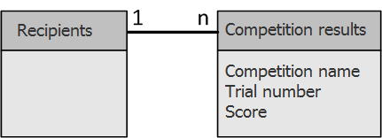

# 丰富数据{#enriching-data}

## 关于扩充数据 {#about-enriching-data}

此用例详细说明了 **[!UICONTROL Enrichment]** 活动。 有关使用的更多信息 **[!UICONTROL Enrichment]** 活动，请参阅： [扩充](enrichment.md).

有关如何使用自定义日期扩充电子邮件投放的用例，请参阅 [此部分](email-enrichment-with-custom-date-fields.md).

通过Web应用程序向营销数据库中的联系人发送参加比赛的邀请。 竞争结果于 **[!UICONTROL Competition results]** 表。 此表链接到联系人表(**[!UICONTROL Recipients]**)。 的 **[!UICONTROL Competition results]** 表包含以下字段：

* 竞争名称(@game)
* 试用号(@trial)
* 得分(@score)

在 **[!UICONTROL Recipients]** 表可以链接到 **[!UICONTROL Competition results]** 表。 这两个表之间的关系为1-n类型。 以下是收件人的结果日志示例：

此用例的用途是：根据参与最新竞争的人员的最高得分，向他们发送个性化投放。 得分最高的受奖人获得第一名，得分第二名的受奖人获得安慰奖，其他所有人都得到一个信息，希望下次能更好运。

要设置此用例，我们创建了以下定位工作流：

要创建工作流，请应用以下步骤：

1. 两个 **[!UICONTROL Query]** 活动和一个 **[!UICONTROL Intersection]** 活动会添加到上次竞争的目标新订阅者。
1. 的 **[!UICONTROL Enrichment]** 活动允许我们添加存储在 **[!UICONTROL Competition results]** 表。 的 **[!UICONTROL Score]** 将进行投放个性化的字段添加到工作流的工作表中。
1. 的 **[!UICONTROL Split]** 类型活动允许我们根据得分创建收件人子集。
1. 对于每个子集， **[!UICONTROL Delivery]** 类型活动。

## 步骤1:定位 {#step-1--targeting}

通过第一个查询，我们可以定位过去六个月内添加到数据库的收件人。

第二个查询使我们能够定位参加上次比赛的收件人。

安 **[!UICONTROL Intersection]** 然后，会添加类型活动，以定位在过去六个月内添加到数据库的收件人以及参加上次竞争的收件人。

## 步骤2:扩充 {#step-2--enrichment}

在本例中，我们希望根据 **[!UICONTROL Score]** 字段 **[!UICONTROL Competition results]** 表。 此表与收件人表具有1-n类型关系。 的 **[!UICONTROL Enrichment]** 活动允许我们将来自链接到过滤维度的表的数据添加到工作流的工作表。

1. 在扩充活动的编辑屏幕中，选择 **[!UICONTROL Add data]**，则 **[!UICONTROL Data linked to the filtering dimension]** 单击 **[!UICONTROL Next]**.

   

1. 然后，选择 **[!UICONTROL Data linked to the filtering dimension]** 选项，选择 **[!UICONTROL Competition results]** 表格和单击 **[!UICONTROL Next]**.

   

1. 输入ID和标签，然后选择 **[!UICONTROL Limit the line count]** 选项 **[!UICONTROL Data collected]** 字段。 在 **[!UICONTROL Lines to retrieve]** 字段中，选择“1”作为值。 对于每个收件人，扩充活动将在 **[!UICONTROL Competition results]** 表格。 单击 **[!UICONTROL Next]**。

   

1. 在此示例中，我们希望恢复收件人的最高分数，但仅用于上一次竞争。 为此，请向 **[!UICONTROL Competition name]** 字段以排除与以前的比赛相关的所有行。 单击 **[!UICONTROL Next]**。

   

1. 转到 **[!UICONTROL Sort]** 屏幕，然后单击 **[!UICONTROL Add]** 按钮，选择 **[!UICONTROL Score]** 字段并选中 **[!UICONTROL descending]** 列来对 **[!UICONTROL Score]** 字段。 对于每个收件人，扩充活动会添加一条与上一个游戏的最高得分匹配的线。 单击 **[!UICONTROL Next]**。

   

1. 在 **[!UICONTROL Data to add]** 窗口，双击 **[!UICONTROL Score]** 字段。 对于每个收件人，扩充活动将仅添加 **[!UICONTROL Score]** 字段。 单击 **[!UICONTROL Finish]**。

   

右键单击扩充活动的集客过渡，然后选择 **[!UICONTROL Display the target]**. 工作表包含以下数据：

链接的架构为：

在扩充活动的叫客过渡上续订此操作。 我们可以看到已添加与收件人得分关联的数据。 已恢复每个收件人的最高分数。

匹配模式也已进行扩充。

## 步骤3:拆分和交付 {#step-3--split-and-delivery}

要根据收件人的得分对收件人进行排序，请 **[!UICONTROL Split]** 扩充后会添加活动。

1. 第一个(**入选者**)子集已定义为包含得分最高的收件人。 为此，请定义记录数的限制，对分数应用降序排序，并将记录数限制为1。

   

1. 第二个(**第二位**)子集包含得分排名第二的收件人。 配置与第一个子集的配置相同。

   

1. 第三个(**失败者**)子集包含所有其他收件人。 转到 **[!UICONTROL General]** 选项卡，并选中 **[!UICONTROL Generate complement]** 框中，可定位未获得最高分数的所有收件人。

   

1. 添加 **[!UICONTROL Delivery]** 为每个子集键入活动，为每个子集使用不同的投放模板。

   
