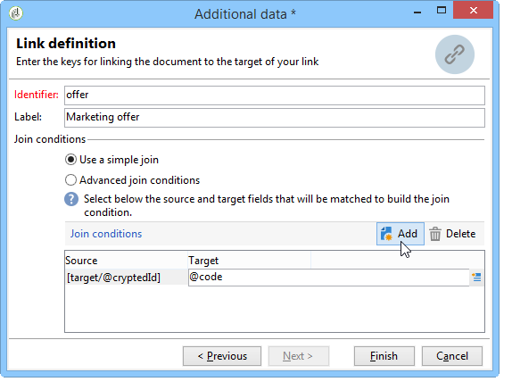

# 扩充{#enrichment}


此 **[!UICONTROL Enrichment]** 利用活动，可将信息添加到用户档案列表并链接到现有表（创建新联接）。 还可以定义与数据库中的用户档案的协调条件。


## 定义 {#definitions}

要使用扩充活动，您需要熟悉添加数据时可用的各种选项。


此 **[!UICONTROL Data linked to the filtering dimension]** 选项授予您：

* 筛选维度的数据：访问工作表数据
* 链接到筛选维度的数据：访问链接到工作表的数据


此 **[!UICONTROL A link]** 选项允许您在数据库的任何表上创建联接。


有四种类型的链接：

* **[!UICONTROL Define a collection]**：用于定义表之间具有1-N基数的链接。
* **[!UICONTROL Define a link whose target is still available]**：用于定义表之间具有1-1基数的链接。 连接条件必须由目标表中的单个记录定义。
* **[!UICONTROL Define a link whose target does not necessarily exist in the base]**：用于定义表之间具有0-1基数的链接。 连接条件必须由0或1（最大值）定义 记录。

  此选项配置于 **[!UICONTROL Simple Join]** 选项卡，可通过 **[!UICONTROL Edit additional data]** 链接 **[!UICONTROL Enrichment]** 活动。

* **[!UICONTROL Define a link by searching for a reference among several options]**：此类链接定义针对唯一记录的协调。 Adobe Campaign通过在目标表中添加用于存储唯一记录引用的外键来创建指向目标表的链接。

  此选项配置于 **[!UICONTROL Reconciliation and deduplication]** 选项卡，可通过 **[!UICONTROL Edit additional data]** 链接 **[!UICONTROL Enrichment]** 活动。

以下章节还提供了详细介绍扩充活动在其上下文中运作的用例：

* [使用自定义日期字段扩充电子邮件](email-enrichment-with-custom-date-fields.md).
* [丰富数据](enrich-data.md)
* [创建摘要列表](create-a-summary-list.md)

## 添加信息 {#adding-information}

使用 **[!UICONTROL Enrichment]** 向工作表添加列的活动：此活动可用作查询活动的补充。

有关其他列的详细配置，请参见 [添加数据](query.md#adding-data).

此 **[!UICONTROL Primary set]** 字段允许您选择集客过渡：将扩充此活动工作表的数据。

单击 **[!UICONTROL Add data]** 链接并选择要添加的数据类型。 提供的数据类型列表取决于平台上安装的模块和选项。 在最小配置中，您始终可以添加链接到筛选维度和链接的数据。


在以下示例中，叫客过渡将包含有关定向用户档案年龄的信息。


右键单击扩充活动的集客过渡，以在扩充阶段之前查看数据。


该工作表包含以下数据和关联的架构：


在扩充阶段输出中重复此操作。


您可以看到已添加与用户档案年龄相关的数据：


匹配模式也已扩充。

## 管理其他数据 {#managing-additional-data}

取消选择 **[!UICONTROL Keep all additional data from the main set]** 选项。 在这种情况下，只有扩充活动中选择的附加列才会添加到传出工作表。 将不会保存添加到上游活动的其他信息。


扩充阶段输出的数据和架构如下：


## 创建链接 {#creating-a-link}

您可以使用扩充活动在工作数据和Adobe Campaign数据库之间创建链接：这将是集客数据之间工作流的本地链接。

例如，如果加载包含收件人帐号、国家/地区和电子邮件文件的数据，则必须创建指向国家/地区表的链接，以便在其用户档案中更新此信息。

要执行此操作，请应用以下步骤：

1. 收集并加载以下类型的文件：

   ```
   Account number;Country;Email
   18D65;FRANCE;agnes@gmail.com
   243PP;RUSSIA;paul@gmail.com
   55H87;CROATIA;dave@gmail.com
   56U81;USA;susan@gmail.com
   853PI;ITALY;anna@gmail.com
   890LP;FRANCE;robert@gmail.com
   83TY2;SWITZERLAND;mike@gmail.com
   ```

1. 编辑扩充活动并单击 **添加数据……** 用于创建与国家/地区表的连接的链接。

   

1. 选择 **[!UICONTROL Link definition]** 选项，然后单击 **[!UICONTROL Next]** 按钮。 指定要创建的链接类型。 在本例中，我们希望将文件收件人的国家/地区与数据库专用表中可用国家/地区列表中的国家/地区进行协调。 选择 **[!UICONTROL Define a link by searching for a reference among several options]** 选项。 选择国家/地区表 **[!UICONTROL Target schema]** 字段。

   

1. 最后，选择字段，您将通过该字段将源文件值链接到数据库中的值。

   

在此扩充活动的输出中，临时架构将包含指向国家/地区表的链接：


## 数据协调 {#data-reconciliation}

扩充活动可用于配置数据协调，包括在将数据加载到数据库后。 在本例中， **[!UICONTROL Reconciliation]** 选项卡允许您定义Adobe Campaign数据库中的数据与工作表中的数据之间的链接。

选择 **[!UICONTROL Identify the targeting document based on work data]** 选项，指定要创建链接的架构并定义连接条件：要实现此目的，请选择工作数据中要协调的字段(**[!UICONTROL Source expression]**)和定向维度中(**[!UICONTROL Destination expression]**)。

您可以使用一个或多个协调标准。


如果指定了多个连接条件，则必须对所有连接条件进行验证，以便将数据链接在一起。

## 插入优惠建议 {#inserting-an-offer-proposition}

通过扩充活动，您可以将优惠或链接添加到投放收件人的优惠。

有关扩充活动的更多信息，请参阅此 [部分](enrichment.md).

例如，您可以在投放之前扩充收件人查询的数据。


配置查询后(请参阅此 [部分](query.md))：

1. 添加并打开扩充活动。
1. 在 **[!UICONTROL Enrichment]** 选项卡，选择 **[!UICONTROL Add data]**.
1. 选择 **[!UICONTROL An offer proposition]** 在要添加的数据类型中。

   

1. 指定要添加的建议标识符和标签。
1. 指定选件选择。 对此有两种可能的选项：

   * **[!UICONTROL Search for the best offer in a category]**：选中此选项并指定选件引擎调用参数（选件空间、类别或主题、联系日期、要保留的选件数）。 引擎将根据这些参数自动计算要添加的选件。 我们建议您完成 **[!UICONTROL Category]** 或 **[!UICONTROL Theme]** 字段，而不是同时执行两者。

     

   * **[!UICONTROL A predefined offer]**：选中此选项并指定选件空间、特定选件和联系日期，以直接配置要添加的选件，而无需调用选件引擎。

     

1. 然后，配置与您选择的渠道对应的投放活动。 请参阅 [跨渠道投放](cross-channel-deliveries.md).

   可用于预览的建议数量取决于在扩充活动中执行的配置，而不是直接在投放中执行的任何可能的配置。

要指定优惠建议，您还可以选择引用优惠的链接。 有关更多信息，请参阅以下部分 [引用优惠的链接](#referencing-a-link-to-an-offer).

## 引用优惠的链接 {#referencing-a-link-to-an-offer}

您还可以在扩充活动中引用指向优惠的链接。

操作步骤：

1. 选择 **[!UICONTROL Add data]** 在活动的 **[!UICONTROL Enrichment]** 选项卡。
1. 在选择要添加的数据类型的窗口中，选择 **[!UICONTROL A link]**.
1. 选择要建立的链接类型及其目标。 在本例中，目标是选件架构。

   

1. 指定扩充活动（此处为收件人表）中的集客表数据与选件表之间的联接。 例如，您可以将优惠代码链接到收件人。

   

1. 然后，配置与您选择的渠道对应的投放活动。 请参阅 [跨渠道投放](cross-channel-deliveries.md).

   >[!NOTE]
   >
   >可用于预览的建议数量取决于投放中执行的配置。

## 存储优惠排名和权重 {#storing-offer-rankings-and-weights}

默认情况下，当 **扩充** 活动用于提供优惠，其排名和权重不会存储在建议表中。

此 **[!UICONTROL Offer engine]** 默认情况下，活动会存储此信息。

但是，您可以按如下方式存储此信息：

1. 在置于查询之后和投放活动之前的扩充活动中创建对优惠引擎的调用。
1. 在活动的主窗口中，选择 **[!UICONTROL Edit additional data...]**.

   

1. 添加 **[!UICONTROL @rank]** 排名和列 **[!UICONTROL @weight]** 选件权重。

   

1. 确认添加并保存工作流。

投放会自动存储优惠的排名和权重。 此信息在投放的 **[!UICONTROL Offers]** 选项卡。
