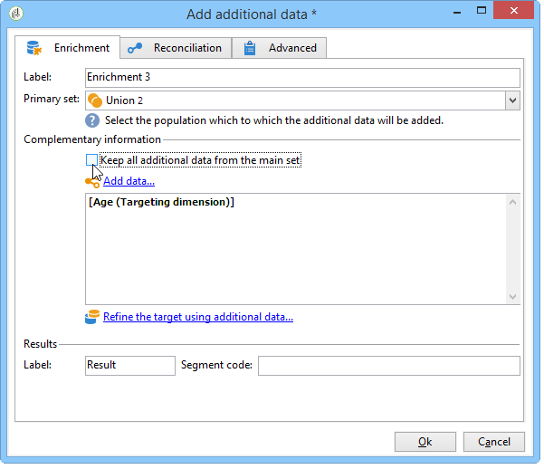
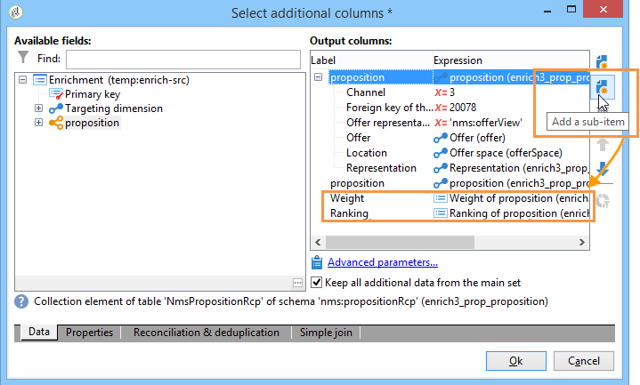

# 扩充{#enrichment}


的 **[!UICONTROL Enrichment]** 利用活动，可向用户档案列表添加信息以及指向现有表格的链接（创建新连接）。 还可以定义数据库中包含用户档案的协调条件。


## 定义 {#definitions}

要使用扩充活动，您需要熟悉添加数据时可用的各种选项。


的 **[!UICONTROL Data linked to the filtering dimension]** 选项允许您访问：

* 过滤维度的数据：对工作表数据的访问
* 链接到过滤维度的数据：对链接到工作表的数据的访问


的 **[!UICONTROL A link]** 选项允许您在数据库的任何表上创建连接。


链接类型有四种：

* **[!UICONTROL Define a collection]**:用于定义在表之间具有1-N基数的链接。
* **[!UICONTROL Define a link whose target is still available]**:用于定义表之间具有1-1基数的链接。 连接条件必须由目标表中的单个记录定义。
* **[!UICONTROL Define a link whose target does not necessarily exist in the base]**:用于定义表之间基数为0-1的链接。 连接条件必须由0或1（最大）定义 记录在目标表中。

   此选项在 **[!UICONTROL Simple Join]** 选项卡 **[!UICONTROL Edit additional data]** 链接 **[!UICONTROL Enrichment]** 活动。

* **[!UICONTROL Define a link by searching for a reference among several options]**:此类链接定义对唯一记录的协调。 Adobe Campaign通过在目标表中添加外键来存储对唯一记录的引用，来创建指向目标表的链接。

   此选项在 **[!UICONTROL Reconciliation and deduplication]** 选项卡 **[!UICONTROL Edit additional data]** 链接 **[!UICONTROL Enrichment]** 活动。

以下章节还提供了详细说明扩充活动在其上下文中运行的用例：

* [具有自定义日期字段的电子邮件扩充](email-enrichment-with-custom-date-fields.md).
* [丰富数据](enrich-data.md)
* [创建摘要列表](create-a-summary-list.md)

## 添加信息 {#adding-information}

使用 **[!UICONTROL Enrichment]** 活动向工作表中添加列：此活动可用作查询活动的补充。

其他列的配置详见 [添加数据](query.md#adding-data).

的 **[!UICONTROL Primary set]** 字段，可选择集客过渡：将扩充此活动工作台的数据。

单击 **[!UICONTROL Add data]** 链接，然后选择要添加的数据类型。 提供的数据类型列表取决于您平台上安装的模块和选项。 在最小的配置中，您始终可以添加链接到过滤维度和链接的数据。


在以下示例中，将使用有关定向用户档案年龄的信息来扩充叫客过渡。


右键单击扩充活动的集客过渡，以在扩充阶段之前查看数据。


工作表包含以下数据和关联的模式：


在扩充阶段输出中重复此操作。


您可以看到已添加与配置文件年龄相关的数据：


匹配模式也已进行扩充。

## 管理其他数据 {#managing-additional-data}

取消选择 **[!UICONTROL Keep all additional data from the main set]** 选项。 在这种情况下，只有扩充活动中选择的附加列才会添加到传出工作表中。 不会保存添加到上游活动的其他信息。



扩充阶段输出的数据和架构将如下所示：


## 创建链接 {#creating-a-link}

您可以使用扩充活动在工作数据与Adobe Campaign数据库之间创建链接：这将是指向集客数据之间工作流的本地链接。

例如，如果加载包含收件人的帐号、国家/地区和电子邮件的文件数据，则必须创建指向国家/地区表的链接，才能更新其用户档案中的此信息。

要执行此操作，请应用以下步骤：

1. 收集并加载以下类型的文件：

   ```
   Account number;Country;Email
   18D65;FRANCE;agnes@gmail.com
   243PP;RUSSIA;paul@gmail.com
   55H87;CROATIA;dave@gmail.com
   56U81;USA;susan@gmail.com
   853PI;ITALY;anna@gmail.com
   890LP;FRANCE;robert@gmail.com
   83TY2;SWITZERLAND;mike@gmail.com
   ```

1. 编辑扩充活动，然后单击 **添加数据……** 链接以创建与国家/地区表的连接。

   

1. 选择 **[!UICONTROL Link definition]** 选项，然后单击 **[!UICONTROL Next]** 按钮。 指定要创建的链接类型。 在本例中，我们希望将文件收件人的国家/地区与数据库专用表中可用国家/地区列表中的国家/地区进行协调。 选择 **[!UICONTROL Define a link by searching for a reference among several options]** 选项。在 **[!UICONTROL Target schema]** 字段。

   

1. 最后，选择字段，该字段将允许您将源文件值链接到数据库中的值。

   

在此扩充活动的输出中，临时架构将包含指向国家/地区表的链接：


## 数据协调 {#data-reconciliation}

扩充活动可用于配置数据协调，包括在数据加载到数据库后进行协调。 在本例中， **[!UICONTROL Reconciliation]** 选项卡，用于定义Adobe Campaign数据库中的数据与工作表中数据之间的链接。

选择 **[!UICONTROL Identify the targeting document based on work data]** 选项，指定要创建链接的架构并定义连接条件：为此，请选择工作数据中要协调的字段(**[!UICONTROL Source expression]**)和定向维度(**[!UICONTROL Destination expression]**)。

您可以使用一个或多个协调条件。


如果指定了多个连接条件，则必须对它们进行ALL验证，以便数据可以链接在一起。

## 插入优惠建议 {#inserting-an-offer-proposition}

利用扩充活动，可向投放收件人的选件添加选件或链接。

有关扩充活动的更多信息，请参阅此 [部分](enrichment.md).

例如，您可以在投放之前扩充收件人查询的数据。


配置查询后(请参阅 [部分](query.md)):

1. 添加并打开扩充活动。
1. 在 **[!UICONTROL Enrichment]** 选项卡中，选择 **[!UICONTROL Add data]**。
1. 选择 **[!UICONTROL An offer proposition]** 在要添加的数据类型中。

   

1. 为要添加的建议指定标识符和标签。
1. 指定选件选择。 可以使用以下两个选项：

   * **[!UICONTROL Search for the best offer in a category]**:选中此选项并指定选件引擎调用参数（选件空间、类别或主题、联系日期、要保留的选件数量）。 引擎将根据这些参数自动计算要添加的选件。 我们建议您完成 **[!UICONTROL Category]** 或 **[!UICONTROL Theme]** 字段，而不是同时使用这两个字段。

      

   * **[!UICONTROL A predefined offer]**:选中此选项并指定选件空间、特定选件和联系日期，以便直接配置要添加的选件，而无需调用选件引擎。

      

1. 然后，配置与您选择的渠道对应的投放活动。 请参阅 [跨渠道投放](cross-channel-deliveries.md).

   可用于预览的建议数取决于扩充活动中执行的配置，而不是直接在投放中执行的任何可能的配置。

要指定优惠建议，您还可以选择引用指向优惠的链接。 有关更多信息，请参阅以下章节 [引用指向选件的链接](#referencing-a-link-to-an-offer).

## 引用指向选件的链接 {#referencing-a-link-to-an-offer}

您还可以引用扩充活动中选件的链接。

操作步骤：

1. 选择 **[!UICONTROL Add data]** 的 **[!UICONTROL Enrichment]** 选项卡。
1. 在选择要添加的数据类型的窗口中，选择 **[!UICONTROL A link]**.
1. 选择要建立的链接类型及其目标。 在这种情况下，目标是选件架构。

   

1. 指定扩充活动（此处为收件人表）中的集客表数据与选件表之间的连接。 例如，您可以将选件代码关联到收件人。

   

1. 然后，配置与您选择的渠道对应的投放活动。 请参阅 [跨渠道投放](cross-channel-deliveries.md).

   >[!NOTE]
   >
   >可用于预览的建议数取决于投放中执行的配置。

## 存储优惠排名和权重 {#storing-offer-rankings-and-weights}

默认情况下，当 **扩充** 活动用于提供优惠，其排名和权重不会存储在建议表中。

的 **[!UICONTROL Offer engine]** 默认情况下，活动会存储此信息。

但是，您可以按如下方式存储此信息：

1. 在扩充活动中创建对选件引擎的调用，该活动放在查询之后和投放活动之前。
1. 在活动的主窗口中，选择 **[!UICONTROL Edit additional data...]**.

   

1. 添加 **[!UICONTROL @rank]** 排名和 **[!UICONTROL @weight]** 选件权重。

   

1. 确认添加并保存工作流。

投放会自动存储选件的排名和权重。 此信息显示在投放的 **[!UICONTROL Offers]** 选项卡。
