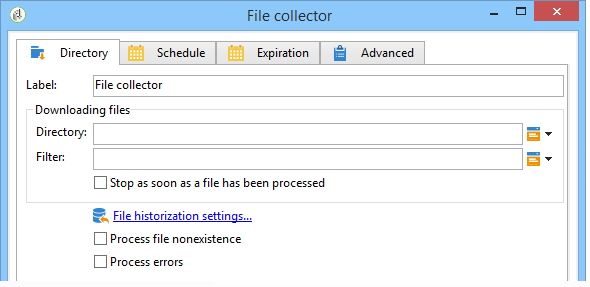

# 文件收集器{#file-collector}

此 **文件收集器** 监视目录中的一个或多个文件的到达，并为收到的每个文件激活其过渡。 对于每个事件， **[!UICONTROL filename]** 变量包含所接收文件的全名。 收集的文件将移动到另一个目录以进行存档，并确保只计数一次。

默认情况下，文件收集器是一个持续性任务，它会在计划指定的时间测试文件的存在。

文件必须位于执行此工作流的wfserver模块的服务器上。 如果在一个实例上部署了多个wfserver模块，则必须指定使用这些文件的活动的亲和度或工作流的整体亲和度。

## 属性 {#properties}

的第一个选项卡 **[!UICONTROL File collector]** 通过活动，您可以选择源目录，并在必要时筛选收集的文件。 有关其他选项卡的详情，请参见 [入站电子邮件](inbound-emails.md) (**[!UICONTROL Schedule]** 和 **[!UICONTROL Expiry]** 选项卡)。

1. **正在下载文件**

   * **[!UICONTROL Directory]**

     包含要下载的文件的目录。 必须在服务器上预先创建此目录：如果该目录不存在，将引发错误。

   * **[!UICONTROL Filter]**

     只考虑与此筛选器匹配的文件。 将忽略目录中的其他文件。 如果过滤器为空，则考虑目录中的所有文件。 过滤器示例： **&#42;.zip**， **导入 — &#42;.txt**.

   * **[!UICONTROL Stop as soon as a file has been processed]**

     如果启用此选项，则任务将在收到第一个文件后结束。 如果目录中存在多个与过滤器对应的文件，则只考虑一个文件。 此选项确保只发送一个事件。 考虑的文件是列表中的第一个文件，按字母顺序排列。

     对于未计划的活动，如果在指定的目录中未找到与过滤器匹配的文件，并且 **[!UICONTROL Process file nonexistence]** 选项未启用，将会引发错误。

   * **[!UICONTROL Execution schedule]**

     通过 **[!UICONTROL Schedule]** 选项卡。

1. **错误处理**

   可以使用以下两个选项：

   * **[!UICONTROL Process file nonexistence]**

     每次在指定目录中找不到与筛选器匹配的文件时，此选项都会启动特殊过渡。

     如果未计划该任务，则此过渡将仅激活一次。

   * **[!UICONTROL Processing errors]**

     此选项会显示一个特殊的过渡，在生成错误时激活。 在这种情况下，工作流不会更改为错误状态，并继续执行

     考虑的错误是文件系统错误（无法移动文件、无法访问目录等）。

     此选项不处理与活动配置相关的错误，即无效值。

1. **历史化**

   请参阅 **[!UICONTROL File historization]** 步骤： [Web下载](web-download.md).

无法确定文件处理顺序。 要按顺序处理一组文件，请使用 **[!UICONTROL Stop as soon as a file has been processed]** 选项并创建循环。 在这种情况下，将按字母顺序处理文件。 此 **[!UICONTROL Process file nonexistence]** 选项允许您完成迭代。

## 输出参数 {#output-parameters}

* 文件名：完整文件名。 这是将其移动到历史化目录后的文件名。 因此，路径不同，但如果目录中已存在另一个同名文件，则名称也不同。 扩展将保留。
