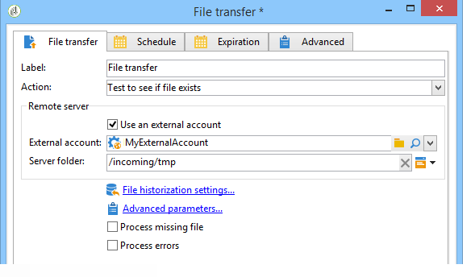

# 文件传输{#file-transfer}

**文件传输**活动允许您接收或发送文件、测试文件是否存在或列出服务器上的文件。 使用的协议为Azure Blob Storage、Amazon Simple Storage Service (S3)、FTP或SFTP。
通过S3、Azure Blob Storage或SFTP连接，您还可以将区段数据导入Adobe实时客户数据平台的Adobe Campaign。 有关详细信息，请参阅此[文档](https://experienceleague.adobe.com/docs/experience-platform/destinations/catalog/email-marketing/adobe-campaign.html){target="_blank"}。

## 属性 {#properties}

使用&#x200B;**[!UICONTROL Action]**&#x200B;字段的下拉列表选择活动的操作。

该配置取决于所选的操作。

1. **正在接收文件**

   要接收存储在远程服务器上的文件，请在&#x200B;**[!UICONTROL Action]**&#x200B;字段中选择&#x200B;**[!UICONTROL File download]**。 您必须在相关字段中指定其URL。

   

   选中&#x200B;**[!UICONTROL Use an external account]**&#x200B;以从树的&#x200B;**[!UICONTROL Administration > Platform > External accounts]**&#x200B;节点中配置的Azure Blob存储、S3、FTP或SFTP帐户中选择帐户。 然后，指定服务器上的哪个目录包含要下载的文件。

   

1. **文件传输**

   若要将文件发送到服务器，请在&#x200B;**[!UICONTROL Action]**&#x200B;字段中选择&#x200B;**[!UICONTROL File upload]**。 您必须在编辑器的&#x200B;**[!UICONTROL Remote server]**&#x200B;部分中指定目标服务器。 这些参数与入站文件的参数相同。 请参阅上文。

   源文件可以来自上一个活动。 在这种情况下，必须选择&#x200B;**[!UICONTROL Use the file generated by the previous activity]**&#x200B;选项。

   

   这可能还涉及一个或多个其他文件。 要选择它们，请取消选中选项，然后单击&#x200B;**[!UICONTROL Insert]**。 指定要发送文件的访问路径。 若要添加其他文件，请再次单击&#x200B;**[!UICONTROL Insert]**。 现在，每个文件都有自己的选项卡。

   

   使用箭头可更改选项卡的顺序。 这与文件发送到服务器的顺序相关。

   **[!UICONTROL Keep history of files sent]**&#x200B;选项允许您跟踪发送的文件。 可以从目录访问此历史记录。

1. **测试文件是否存在**

   要测试文件是否存在，请在&#x200B;**[!UICONTROL Action]**&#x200B;字段中选择&#x200B;**[!UICONTROL Test to see if file exists]**&#x200B;选项。 远程服务器的配置与文件下载的配置相同。 有关详细信息，请参阅此[部分](#properties)。

   

1. **文件列表**

   要列出文件，请从&#x200B;**[!UICONTROL Action]**&#x200B;字段中选择&#x200B;**[!UICONTROL File listing]**&#x200B;选项。 远程服务器的配置与接收文件的配置相同。 有关详细信息，请参阅此[部分](#properties)。

   选择&#x200B;**[!UICONTROL File listing]**&#x200B;操作时可用的&#x200B;**[!UICONTROL List all files]**&#x200B;选项允许您存储服务器上事件变量&#x200B;**vars.filenames**&#x200B;中的所有文件，其中各个文件名之间以`\n`个字符进行分隔。

所有文件传输选项都有两个可能的选项：

* **[!UICONTROL Process missing file]**&#x200B;选项添加了一个过渡，如果在指定的目录中未找到文件，则会激活该过渡。
* **[!UICONTROL Process errors]**&#x200B;选项在[处理错误](monitor-workflow-execution.md#processing-errors)中有详细说明。

**[!UICONTROL Advanced parameters...]**&#x200B;链接允许您访问以下选项：

* **[!UICONTROL Delete the source files after transfer]**

  清除远程服务器上的文件。 如果未选中此选项，请确保手动监控SFTP目录中存档内容的大小。

* **[!UICONTROL Use SSL]**

  允许您在文件传输期间通过SSL协议使用安全连接。

* **[!UICONTROL Display the session logs]**

  允许您恢复Azure Blob存储、S3、FTP或SFTP传输的日志，并将其包含在工作流日志中。

* **[!UICONTROL Disable passive mode]**

  用于指定用于数据传输的连接端口。

通过&#x200B;**[!UICONTROL File historization settings...]**&#x200B;链接可访问[Web下载](web-download.md) （**[!UICONTROL File historization]**&#x200B;步骤）中详述的选项。

## 输入参数 {#input-parameters}

* 文件名

  已发送文件的完整名称。

## 输出参数 {#output-parameters}

* 文件名

  如果选择&#x200B;**[!UICONTROL Use the file generated by the previous activity]**&#x200B;选项，则为已接收文件的完整名称。
