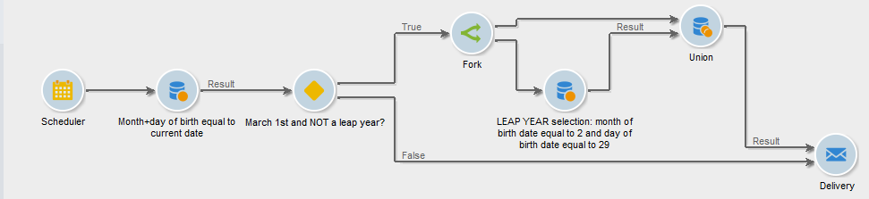

# 分叉{#fork}

您可以使用 **[!UICONTROL Fork]** 活动，以创建多个叫客过渡，并在同一工作流中独立运行多个活动。

>[!IMPORTANT]
>
>您在之后添加的叫客过渡 **[!UICONTROL Fork]** 活动不会同时运行。 此行为可能会影响工作流性能。 使用 **[!UICONTROL Fork]** 活动（如果需要独立运行多个活动）。 （可选）您可以在工作流的后续部分之前加入叫客活动。

配置 **[!UICONTROL Fork]** 活动及其相关活动，请执行以下步骤：

1. 打开 **[!UICONTROL Fork]** 活动，并定义叫客过渡的名称和标签。

   

1. 打开每个叫客过渡并进行配置。
1. （可选）要加入叫客过渡，请添加“与”加入活动。 [了解详情](and-join.md)。

   工作流的后续部分仅在联接的叫客过渡完成后运行。

## 示例：分段

在本例中，不同的电子邮件会发送到不同的群体群体。 A **[!UICONTROL Fork]** 活动在查询后使用，以并行执行两个操作：

* 保存查询结果
* 对发送多个投放的结果进行分段

   

工作流包含以下活动：

1. **[!UICONTROL Query]** 活动

   选定了两个人口群体：妇女和巴黎人。

1. **[!UICONTROL Intersection]** 活动

   已选择查询结果的交集，即巴黎女性。

1. **[!UICONTROL Fork]** 活动

   将保存计算出的群体，并同时将其分为两个组：

   1. 18至40岁的巴黎妇女
   1. 40岁以上的巴黎妇女

1. **[!UICONTROL Delivery]** 活动

   向每个群体发送不同的电子邮件。

## 用例：发送生日电子邮件

定期电子邮件会在收件人的生日当天发送给收件人列表。 A **[!UICONTROL Fork]** 活动用于包含闰年2月29日出生的收件人。 [了解详情](send-a-birthday-email.md) 关于此用例。

## 用例：使用工作流自动化内容

然后，您可以配置每个叫客过渡，然后使用将它们联接在一起 [AND — 连接](and-join.md) 活动（如果需要）。 这样，工作流的其余部分将只执行一次 **[!UICONTROL Fork]** 活动的叫客过渡已完成。

## 相关主题

* [合并连接活动](and-join.md)
* [用例：生日电子邮件](send-a-birthday-email.md)
