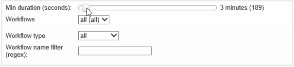

# 工作流热图 {#workflow-heatmap}

Campaign Workflow HeatMap以颜色编码的图形形式表示当前运行的所有工作流。 它仅适用于 **Campaign管理员**.

## 工作流热图入门 {#about-the-workflow-heatmap}

Workflow HeatMap提供了并发工作流数的快速概览，从而使Adobe Campaign平台管理员能够监控实例的负载并相应地计划工作流。

更准确地说，它可以帮助平台管理员：

* 查看和了解并发工作流
* 按持续时间筛选工作流，以查看哪些工作流可能遇到问题
* 按持续时间筛选活动，以查看哪些活动可能会遇到问题
* 轻松查找个别工作流和所有相关活动（及持续时间）
* 按工作流类型筛选： [技术工作流](technical-workflows.md) 或 [活动工作流](campaign-workflows.md)
* 查找要分析的特定工作流

>[!NOTE]
>
>除了 **工作流热图**&#x200B;中，您可以创建一个工作流，用于监视一组工作流的状态并向主管发送定期消息。 有关详细信息，请参见 [专用部分](workflow-supervision.md).

使用Workflow HeatMap需要很好地了解以下概念： [工作流](about-workflows.md)， [活动](activities.md) 和 [工作流最佳实践](workflow-best-practices.md).

## 自定义工作流热图 {#using-the-heatmap}

>[!NOTE]
>
>如果工作流热图中未显示任何数据，请单击 **[!UICONTROL Load data]** 按钮。

1. 转到 **[!UICONTROL Monitoring]** 然后单击 **[!UICONTROL Workflow HeatMap]** 链接以显示 **[!UICONTROL Campaign Workflow HeatMap]** 页面。

   

1. 单击日历以选择日期。

   默认情况下，该页面显示当天的工作流活动。 您可以更改并选择过去的任何一天。

   >[!NOTE]
   > 
   >默认情况下，工作流热图时区是为当前管理员用户定义的时区。 例如，如果您与正在处理的营销用户不在同一区域，则可能需要更改此设置。

1. 单击 **[!UICONTROL Filters]** 按钮。

   

1. 使用滑块设置从0秒到1小时的最短持续时间。 这使您能够仅搜索运行时间超过特定秒数或分钟数的工作流。

   

1. 您还可以从以下列表中选择特定工作流 **[!UICONTROL Workflows]** 下拉列表。

   

   >[!NOTE]
   >
   >此 **[!UICONTROL Min duration]** 已应用筛选器。 如果找不到特定工作流，请将最短持续时间重置为0，以便所有工作流都显示在列表中。

1. 您也可以在 **[!UICONTROL Workflow type]** ：

   * **[!UICONTROL Technical]** ：仅 [内置技术工作流](technical-workflows.md) 和 [数据管理工作流](targeting-workflows.md#data-management) 将显示。
   * **[!UICONTROL Marketing]** ：仅限链接到营销活动（称为）的工作流 [活动工作流](campaign-workflows.md)，则会显示。

1. 要按名称搜索特定工作流，您还可以使用 **[!UICONTROL Workflow name filter]** 字段。

1. 如果您在这段时间内编辑了一些工作流，请单击 **[!UICONTROL Reload data]** 按钮刷新网格中显示的数据。

## 解释工作流热图 {#reading-the-heatmap}

Campaign Workflow HeatMap是从左上到右下自然可读的网格，允许查找颜色编码范围从绿色到红色的“热区”。

* 较暗的红细胞对应于同时运行大量工作流的期间。
* 灰色单元格对应于没有工作流运行时的期间。

要了解如何应用颜色代码以及如何在HeatMap中导航，请单击 **[!UICONTROL Help]** 按钮。

每一行表示一天中的一小时，每个单元格表示该小时中的5分钟。

该网格显示在这些5分钟时段中的每一个时段内同时运行的所有工作流。

在下面的示例中，在早上8点到早上8:05点之间，有三个工作流正在运行（无论其各自的持续时间如何）：

1. 单击彩色单元格以显示此期间运行的所有并发工作流的详细信息。

   

   对于每个工作流，将列出它包含的所有活动及其持续时间。

1. 单击工作流ID或名称，直接打开工作流。
1. 返回 **[!UICONTROL Campaign Workflow HeatMap]** 视图，单击 **[!UICONTROL Home]** 按钮。

## 用例：使用热图执行操作 {#use-cases--using-the-heatmap-to-take-actions}

在以下两种主要情况下，Campaign Workflow HeatMap可能会很有用。

### 减少并发工作流数量 {#reducing-the-number-of-concurrent-workflows}

作为Campaign管理员，工作流HeatMap可以帮助您了解实例的负载并在适当的时候规划现有或新工作流。

1. 从 **[!UICONTROL Campaign Workflow HeatMap]** 视图，单击 **[!UICONTROL Filters]** 按钮。
1. 将持续时间设置为几秒或几分钟。
1. 通过增加持续时间过滤器，排除无关紧要的最短工作流。

   

1. 浏览结果以了解实例上的负载并采取适当的操作：

   * 如果您遇到性能问题，并且在网格中显示一个或多个红单元格，请考虑更改多个工作流的开始时间。 要求营销用户将手动工作流从繁忙（“热点”）时段移动到更多可用时段。 这应该会保持一天中活动的稳定水平。
   * 要避免出现峰值并防止实例过载，请在规划新工作流之前查看热图并选择最佳时间。 考虑与网格中灰色或绿色单元格对应的时隙以启动新工作流。

### 查找长时间运行的影响性能的工作流 {#finding-long-running-workflows-that-impact-performance}

作为Campaign管理员，Workflow HeatMap可帮助您找到最长的工作流，这些工作流可能会降低活动的速度。

1. 从 **[!UICONTROL Campaign Workflow HeatMap]** 视图，单击 **[!UICONTROL Filters]** 按钮。
1. 将持续时间设置为1小时。

   

1. 通过减少 **[!UICONTROL Min duration]** 筛选。
1. 浏览结果以找出最长的工作流，这些工作流可能会对服务器和数据库资源（CPU、RAM、网络、IOPS等）产生更大的影响。
1. 采取适当措施：

   * 建议营销用户拆分最长的工作流，以减少处理时间。
   * 开始更深入地分析特定工作流和特定活动（例如JavaScript、导入、导出等），以隔离问题并更轻松地解决问题。

## 使用HeatMap改进工作流规划 {#example--using-the-heatmap-to-improve-workflow-planning}

以下示例显示了使用Adobe Campaign Workflow HeatMap时，如何提高规划效率以及如何提高性能。

在这种情况下，许多用户抱怨工作流性能。 您需要检查哪些因素会降低活动的速度，以及如何解决问题。

1. 转到 **[!UICONTROL Monitoring]** 然后单击 **[!UICONTROL Workflows]** 链接以显示 **[!UICONTROL Campaign Workflow HeatMap]** 页面。
1. 设置 **[!UICONTROL Min duration]** 过滤至5分钟。
1. 设置 **[!UICONTROL Workflow type]** 筛选至 **[!UICONTROL Marketing]**.
1. 在HeatMap网格中，观察以下内容：

   

   * 上午10点，50个持久的（超过5分钟）营销活动工作流正在运行。
   * 其中大多数具有挂起状态（默认情况下，并发限制设置为20）。
   * 挂起的工作流需要每天手动重新启动。
   * 性能低。

1. 与其让五十个工作流从上午10点开始，不如在一天中的其余时间平均分配工作流的开始时间。
1. 返回 **[!UICONTROL Campaign Workflow HeatMap]** 页面，然后单击 **[!UICONTROL Reload data]** 按钮。
1. 现在，请注意以下事项：

   

   * 上午10点，只有18个持久的活动工作流仍在运行。
   * 没有更多工作流处于待处理状态（并发限制仍设置为20）。
   * 工作流的开始时间平均分布在一天当中。
   * 没有更多用户抱怨性能问题。
