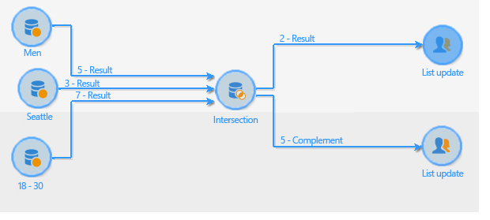

# 交集{#intersection}

安 **交集**-type活动从接收目标的交集创建目标。

利用交集，可仅提取所有集客活动结果共有的群体。 将创建目标，并收到所有结果：因此，在执行交集之前，必须先完成所有之前的活动。 要配置此活动，您需要为其输入标签以及与结果相关的选项。

有关配置和使用交集活动的更多信息，请参阅 [提取关节数据（交集）](targeting-workflows.md#extracting-joint-data--intersection-).

检查 **[!UICONTROL Generate complement]** 选项。 补码将包含所有集客活动结果的并数减去交集。 随后，将向活动添加其他叫客过渡，如下所示：

## 交集示例 {#intersection-example}

在以下示例中，交集的目的是计算三个简单查询共有的收件人，以便创建列表。

1. 在三个简单查询后，插入 **[!UICONTROL Intersection]** -type活动。

   在本例中；这些查询分别针对男性、住在巴黎的收件人和18至30岁的收件人。

1. 配置交集。 为此，请选择 **[!UICONTROL Keys only]** 协调方法，因为查询生成的群体包含一致的数据。
1. 如果您为查询输入了附加数据，则可以通过选中相关框来选择仅保留收件人共享的数据。
1. 如果您希望使用其余数据（与查询相关，但与其交集无关），请检查 **[!UICONTROL Generate complement]** 框中。
1. 在交集结果之后添加列表更新活动。 如果您希望也使用此功能，还可以向补码添加列表更新。
1. 执行工作流。 在此，两个收件人同时应用于所有三个输入的查询。 补码由五个收件人组成，这些收件人仅适用于三个查询中的一个或两个查询。

   交集结果被发送到第一个列表更新。 如果您选择使用补码，则还会将其发送到第二个列表更新。

   

## 输入参数 {#input-parameters}

* tableName
* 模式

每个集客事件必须指定由这些参数定义的目标。

## 输出参数 {#output-parameters}

* tableName
* 模式
* recCount

这组值由三个值组成，用于标识由交集生成的目标。 **[!UICONTROL tableName]** 是记录目标标识符的表的名称， **[!UICONTROL schema]** 是群体的架构(通常 **[!UICONTROL nms:recipient]**)和 **[!UICONTROL recCount]** 是表中的元素数。
