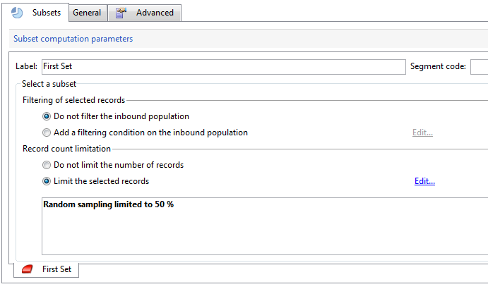

# JavaScript 脚本和模板{#javascript-scripts-and-templates}


通过脚本，可以计算值、在流程中的不同任务之间交换数据，以及使用SOAP调用执行特定操作。

脚本在工作流图中无处不在：

* 所有活动都有初始化脚本。 初始化脚本在激活活动时执行，可用于初始化变量和修改属性。
* “JavaScript代码”活动仅用于执行脚本。
* “测试”活动评估JavaScript表达式以激活相应的过渡。
* 大多数文本字段是JavaScript模板：JavaScript表达式可以包含在&lt;%=和%>之间。 这些字段提供了一个按钮，用于打开下拉列表以帮助您输入表达式。

   

## 对象已公开 {#objects-exposed}

在工作流上下文中执行的JavaScripts访问一系列其他全局对象。

* **实例**：表示正在执行的工作流。 此对象的模式为 **xtk：workflow**.
* **任务**：表示正在执行的任务。 此对象的模式为 **xtk：workflowTask**.
* **事件**：表示激活正在执行的任务的事件。 此对象的模式为 **xtk：workflowEvent**. 此对象未初始化 **AND — 连接** 键入已从多个过渡激活的活动。
* **事件**：表示激活当前任务的事件的列表。 此对象的模式为 **xtk：workflowEvent**. 此表通常包含一个元素，但可能包含多个 **AND — 连接** 键入已根据多个过渡激活的活动。
* **活动**：表示正在执行的任务的模型。 此对象的架构取决于活动类型。 此对象可由初始化脚本修改，而在其他脚本中，修改具有不可确定的效果。

可通过单击脚本工具栏右侧的按钮，在下拉列表中查看这些对象可用的属性。

>[!CAUTION]
>
>这些对象的属性是只读的，但vars属性的子属性除外。
>  
>这些属性中的大多数只会在执行基本任务或实例被钝化后更新。 读取的值不一定与当前状态匹配，而是与以前的状态匹配。

**示例**

在本例和以下示例中，创建一个包含的工作流 **JavaScript代码** 活动和 **结束** 活动，如下图所示。


双击 **JavaScript代码** 活动并插入以下脚本：

```
logInfo("Label: " + instance.label)
logInfo("Start date: " + task.creationDate)
```

此 **[!UICONTROL logInfo(message)]** 函数在日志中插入消息。

单击 **[!UICONTROL OK]** 要关闭创建向导，请使用工作流列表右上角的操作按钮启动工作流。 在执行结束时，请查阅日志。 您应该会看到两条对应于脚本的消息：一条显示工作流的标签，另一条显示脚本激活的日期。

## 变量 {#variables}

变量是 **[!UICONTROL instance]**， **[!UICONTROL task]** 和 **[!UICONTROL event]** 对象。 为这些变量授权的JavaScript类型包括 **[!UICONTROL string]**， **[!UICONTROL number]** 和 **[!UICONTROL Date]**.

### 实例变量 {#instance-variables}

实例变量(**[!UICONTROL instance.vars.xxx]**)与全局变量具有可比性。 所有活动都共享它们。

### 任务变量 {#task-variables}

任务变量(**[!UICONTROL task.vars.xxx]**)与局部变量具有可比性。 它们仅由当前任务使用。 这些变量由永久性活动用来保留数据，有时也用于在同一活动的不同脚本之间交换数据。

### 事件变量 {#event-variables}

事件变量(**[!UICONTROL vars.xxx]**)支持在工作流进程的基本任务之间交换数据。 这些变量由激活正在进行的任务的任务传递。 可以修改它们并定义新它们。 然后，它们会被传递到以下活动。

>[!CAUTION]
>
>在 [AND — 连接](and-join.md) 键入活动，将合并变量，但如果同一变量定义了两次，则会发生冲突，且值仍为未确定。

事件是最常使用的变量，应优先使用它们来使用实例变量。

某些事件变量会被各种活动修改或读取。 这些都是字符串类型的变量。 例如，导出会设置 **[!UICONTROL vars.filename]** 变量中指定刚刚导出文件的全名。 所有这些已读取或修改的变量都记录在中 [关于活动](activities.md)，在部分中 **输入参数** 和 **输出参数** 活动的所有成员。

### 用例 {#example}

>[!NOTE]
>
>其他工作流用例在以下位置提供： [本节](workflow-use-cases.md).

**示例1**

在此示例中，使用实例变量来动态计算要对群体应用的分割百分比。

1. 创建工作流并添加开始活动。

1. 添加和配置JavaScript代码活动以定义实例变量。

   例如：`instance.vars.segmentpercent = 10;`

   

1. 添加查询活动，并根据需要定位收件人。

1. 添加拆分活动，并将其配置为对传入群体执行随机取样。 采样百分比可以是您选择的任何值。 在本例中，它被设置为50%。

   该百分比会根据之前定义的实例变量动态更新。

   

1. 在拆分活动的“高级”选项卡的“初始化脚本”部分中，定义JS条件。 JS条件选择拆分活动中第一个过渡的随机取样百分比，并将其更新为由之前创建的实例变量设置的值。

   ```
   activity.transitions.extractOutput[0].limiter.percent = instance.vars.segmentpercent;
   ```

   

1. 确保在拆分活动的单独过渡中生成补码，并在每个叫客过渡之后添加End活动。

1. 保存并执行工作流。 根据实例变量应用动态取样。

   

**示例 2**

1. 从上例中获取工作流并替换的脚本 **JavaScript代码** 活动，脚本如下：

   ```
   instance.vars.foo = "bar1"
   vars.foo = "bar2"
   task.vars.foo = "bar3"
   ```

1. 将以下脚本添加到的初始化脚本 **结束** 活动：

   ```
   logInfo("instance.vars.foo = " + instance.vars.foo)
   logInfo("vars.foo = " + vars.foo)
   logInfo("task.vars.foo = " + task.vars.foo)
   ```

1. 启动工作流，然后查看日志。

   ```
   Workflow finished
   task.vars.foo = undefined
   vars.foo = bar2
   instance.vars.foo = bar1
   Starting workflow (operator 'admin')
   ```

此示例显示了以下活动 **JavaScript代码** 可访问实例变量和事件变量，但无法从外部访问任务变量（“未定义”）。

### 在查询中调用实例变量 {#calling-an-instance-variable-in-a-query}

在活动中指定实例变量后，您可以在工作流查询中重复使用它。

因此，调用变量 **instance.vars.xxx = &quot;yyy&quot;** 在筛选器中，输入 **$(instance/vars/xxx)**.

例如：

1. 创建实例变量，该变量通过定义投放的内部名称 **[!UICONTROL JavaScript code]**： **instance.vars.deliveryIN = &quot;DM42&quot;**.

   

1. 创建定向和筛选维度为收件人的查询。 在条件中，指定您希望查找通过变量指定的投放发送的所有收件人。

   提醒一下，此信息存储在投放日志中。

   要在中引用实例变量，请执行以下操作 **[!UICONTROL Value]** 列，输入 **$(instance/vars/@deliveryIN)**.

   该工作流将返回DM42投放的收件人。

   

## 高级功能 {#advanced-functions}

除了标准JavaScript函数之外，还可以使用特殊函数来处理文件、读取或修改数据库中的数据，或者向日志中添加消息。

### 日志 {#journal}

**[!UICONTROL logInfo(message)]** 如上例所述。 此函数向日记账中添加一条信息消息。

**[!UICONTROL logError(message)]** 向日志添加一条错误消息。 脚本将中断其执行，工作流将更改为错误状态（默认情况下，实例将暂停）。

## 初始化脚本 {#initialization-script}

在某些情况下，您可以在活动执行时修改活动的属性。

活动的大多数属性都可以使用JavaScript模板进行动态计算，或者因为工作流属性明确允许脚本计算值。

但是，对于其他属性，必须使用初始化脚本。 在执行任务之前评估此脚本。 此 **[!UICONTROL activity]** 变量引用与任务对应的活动。 此活动的属性可以修改，并且只会影响此任务。

**相关主题**
[工作流中的JavaScript代码示例](javascript-in-workflows.md)
