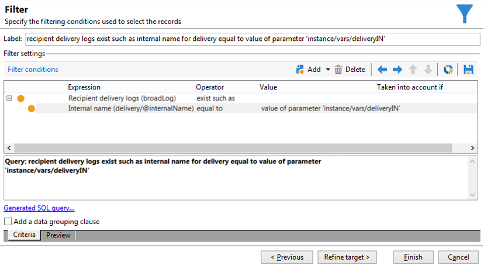

# JavaScript 脚本和模板{#javascript-scripts-and-templates}


脚本使得可以计算值、在进程中的不同任务之间交换数据，以及使用SOAP调用执行特定操作。

脚本在工作流图中非常普遍：

* 所有活动都具有初始化脚本。 激活活动时会执行初始化脚本，该脚本可用于初始化变量和修改属性。
* “JavaScript代码”活动仅用于执行脚本。
* “测试”活动会评估JavaScript表达式，以激活相应的过渡。
* 大多数文本字段是JavaScript模板：JavaScript表达式可以包含在&lt;%=和%>之间。 这些字段提供了一个按钮，可打开一个下拉列表以帮助您输入表达式。

   

## 公开的对象 {#objects-exposed}

在工作流上下文中执行的JavaScript访问一系列其他全局对象。

* **实例**:表示正在执行的工作流。 此对象的模式为 **xtk:workflow**.
* **任务**:表示正在执行的任务。 此对象的模式为 **xtk:workflowTask**.
* **事件**:表示激活正在执行的任务的事件。 此对象的模式为 **xtk:workflowEvent**. 此对象未初始化 **AND — 连接** 键入已从多个过渡激活的活动。
* **事件**:表示激活当前任务的事件列表。 此对象的模式为 **xtk:workflowEvent**. 此表通常包含一个元素，但可能包含 **AND — 连接** 键入已根据多个过渡激活的活动。
* **活动**:表示正在执行的任务的模型。 此对象的架构取决于活动类型。 此对象可由初始化脚本修改，在其他脚本中，具有不可确定效果的修改。

单击脚本工具栏右侧的按钮，即可在下拉列表中查看这些对象的可用属性。

>[!CAUTION]
>
>这些对象的属性是只读的，vars属性的子属性除外。
>  
>大多数这些属性仅在执行基本任务或实例被钝化后才会更新。 读取的值不一定与当前状态匹配，而是与先前的状态匹配。

**示例**

在本例和以下示例中，创建一个包含 **JavaScript代码** 活动和 **结束** 活动，如下图所示。


双击 **JavaScript代码** 活动并插入以下脚本：

```
logInfo("Label: " + instance.label)
logInfo("Start date: " + task.creationDate)
```

的 **[!UICONTROL logInfo(message)]** 函数，将消息插入到日志中。

单击 **[!UICONTROL OK]** 要关闭创建向导，请使用工作流列表右上角的操作按钮启动工作流。 在执行结束时，请查阅日志。 您应会看到与脚本对应的两条消息：一个显示工作流的标签，另一个显示脚本的激活日期。

## 变量 {#variables}

变量是 **[!UICONTROL instance]**, **[!UICONTROL task]** 和 **[!UICONTROL event]** 对象。 为这些变量授权的JavaScript类型包括 **[!UICONTROL string]**, **[!UICONTROL number]** 和 **[!UICONTROL Date]**.

### 实例变量 {#instance-variables}

实例变量(**[!UICONTROL instance.vars.xxx]**)可与全局变量比较。 所有活动均共享这些资源。

### 任务变量 {#task-variables}

任务变量(**[!UICONTROL task.vars.xxx]**)与本地变量类似。 它们仅用于当前任务。 这些变量由永久性活动用来保留数据，有时用于在同一活动的不同脚本之间交换数据。

### 事件变量 {#event-variables}

事件变量(**[!UICONTROL vars.xxx]**)允许在工作流进程的基本任务之间交换数据。 这些变量由激活正在进行的任务的任务传递。 可以修改它们并定义新的。 然后，这些活动会被传递到以下活动。

>[!CAUTION]
>
>对于 [AND — 连接](and-join.md) 类型活动时，会合并变量，但如果同一变量被定义两次，则会发生冲突，值仍不确定。

事件是最常用的变量，应首选使用它们来替换实例变量。

某些事件变量会被各种活动修改或读取。 这些都是字符串类型的变量。 例如，导出会设置 **[!UICONTROL vars.filename]** 变量，其中包含刚刚导出的文件的全名。 所有这些读取或修改的变量都记录在 [关于活动](activities.md)，在部分中 **输入参数** 和 **输出参数** 活动。

### 用例 {#example}

>[!NOTE]
>
>在 [此部分](workflow-use-cases.md).

**示例1**

在此示例中，实例变量用于动态计算要应用于群体的拆分百分比。

1. 创建工作流并添加开始活动。

1. 添加和配置JavaScript代码活动以定义实例变量。

   例如：`instance.vars.segmentpercent = 10;`

   

1. 根据需要添加查询活动并定位收件人。

1. 添加拆分活动并对其进行配置以对传入群体执行随机取样。 取样百分比可以是您选择的任何内容。 在本例中，该值被设置为50%。

   这一百分比会因之前定义的实例变量而动态更新。

   

1. 在拆分活动高级选项卡的初始化脚本部分中，定义JS条件。 JS条件会选择拆分活动中产生的第一个过渡的随机取样百分比，并将其更新为由之前创建的实例变量设置的值。

   ```
   activity.transitions.extractOutput[0].limiter.percent = instance.vars.segmentpercent;
   ```

   

1. 确保在拆分活动的单独过渡中生成补码，并在每个叫客过渡后添加结束活动。

1. 保存并执行工作流。 将根据实例变量应用动态采样。

   

**示例 2**

1. 从上一个示例中获取工作流，并替换 **JavaScript代码** 活动：

   ```
   instance.vars.foo = "bar1"
   vars.foo = "bar2"
   task.vars.foo = "bar3"
   ```

1. 将以下脚本添加到的初始化脚本中 **结束** 活动：

   ```
   logInfo("instance.vars.foo = " + instance.vars.foo)
   logInfo("vars.foo = " + vars.foo)
   logInfo("task.vars.foo = " + task.vars.foo)
   ```

1. 启动工作流，然后查看日志。

   ```
   Workflow finished
   task.vars.foo = undefined
   vars.foo = bar2
   instance.vars.foo = bar1
   Starting workflow (operator 'admin')
   ```

此示例展示了以下活动 **JavaScript代码** 访问实例变量和事件变量，但无法从外部访问任务变量（“未定义”）。

### 在查询中调用实例变量 {#calling-an-instance-variable-in-a-query}

在活动中指定实例变量后，即可在工作流查询中重复使用该变量。

因此，调用变量 **instance.vars.xxx = &quot;yyyy&quot;** 在筛选器中，输入 **$(instance/vars/xxx)**.

例如：

1. 创建一个实例变量，该变量通过 **[!UICONTROL JavaScript code]**: **instance.vars.deliveryIN = &quot;DM42&quot;**.

   

1. 创建以定向和过滤维度为收件人的查询。 在条件中，指定您希望查找已发送变量指定投放的所有收件人。

   提醒一下，此信息存储在投放日志中。

   在 **[!UICONTROL Value]** 列，输入 **$(instance/vars/@deliveryIN)**.

   工作流将返回DM42投放的收件人。

   

## 高级功能 {#advanced-functions}

除了标准的JavaScript函数外，还提供特殊函数，用于处理文件、读取或修改数据库中的数据，或将消息添加到日志中。

### 日志 {#journal}

**[!UICONTROL logInfo(message)]** 详见上述示例。 此函数向日志中添加信息消息。

**[!UICONTROL logError(message)]** 向日志中添加错误消息。 脚本会中断其执行，并且工作流会更改为错误状态（默认情况下，实例将暂停）。

## 初始化脚本 {#initialization-script}

在某些情况下，您可以在执行时修改活动的属性。

活动的大多数属性都可以动态计算，这既可以使用JavaScript模板，也可以因为工作流属性明确允许由脚本计算值。

但是，对于其他属性，必须使用初始化脚本。 在执行任务之前会评估此脚本。 的 **[!UICONTROL activity]** 变量引用与任务对应的活动。 此活动的属性可以修改，且仅会影响此任务。

**相关主题**
[工作流中的JavaScript代码示例](javascript-in-workflows.md)
