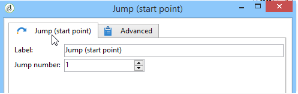

# 跳转（开始点和结束点）{#jump-start-point-and-end-point}

**[!UICONTROL Jump]** — 类型的图形对象用于提高复杂图的可读性，尤其是具有交叉过渡的图。

跳跃是没有箭头的过渡。

它们从一个活动转到另一个活动，如以下示例所示：

对于每个“起点”类型的过渡，必须定位“终点”类型的过渡。

可在同一工作流中插入多个起点和终点跳转。 它们由必须在参数中输入的数字标识：

为了提高图的可读性，您可以更改与跳转关联的图像以显示相关编号。 查看[更改活动图像](change-activity-images.md)。
