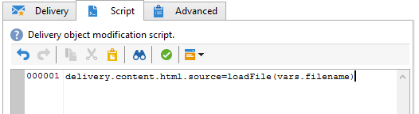

# 加载投放内容{#loading-delivery-content}

如果您的投放内容位于Amazon S3、FTP或SFTP服务器上的HTML文件中，则可以轻松地将此内容加载到Adobe Campaign投放中。

操作步骤：

1. 如果您尚未定义Adobe Campaign与托管内容文件的(S) FTP服务器之间的连接，请在中创建新的S3、FTP或SFTP外部帐户 **[!UICONTROL Administration]** > **[!UICONTROL Platform]** > **[!UICONTROL External Accounts]**. 在此外部帐户中指定用于建立与S3或(S) FTP服务器连接的地址和凭据。

   以下是S3外部帐户的示例：

   

1. 创建新工作流，例如从 **[!UICONTROL Profiles and Targets]** > **[!UICONTROL Jobs]** > **[!UICONTROL Targeting workflows]**.
1. 添加 **[!UICONTROL File transfer]** 活动，并通过指定来配置它

   * 用于连接到S3或(S) FTP服务器的外部帐户。
   * S3或(S) FTP服务器上的文件路径。

   

1. 添加 **[!UICONTROL Delivery]** 活动，并将其连接到的叫客过渡 **[!UICONTROL File transfer]** 活动。 按如下方式配置：

   * 投放：根据您的需求，它可以是系统中已创建的特定投放，也可以是基于现有模板的新投放。
   * 收件人：在本例中，将视为在投放本身中指定了目标。
   * 内容：即使在上一个活动中导入了内容，请选择 **[!UICONTROL Specified in the delivery]**. 由于内容直接从位于远程服务器上的文件导入，因此工作流处理内容时没有标识符，并且无法识别为来自入站事件。
   * 要执行的操作：选择 **[!UICONTROL Save]** 以保存投放并能够从中访问 **[!UICONTROL Campaign management]** > **[!UICONTROL Deliveries]** 执行工作流后。

   

1. 在 **[!UICONTROL Script]** 的选项卡 **[!UICONTROL Delivery]** 活动，添加以下命令以在投放中加载导入文件的内容：

   ```
   delivery.content.html.source=loadFile(vars.filename)
   ```

   

1. 保存并执行工作流。 已加载内容的新投放创建于 **[!UICONTROL Campaign management]** > **[!UICONTROL Deliveries]**.

