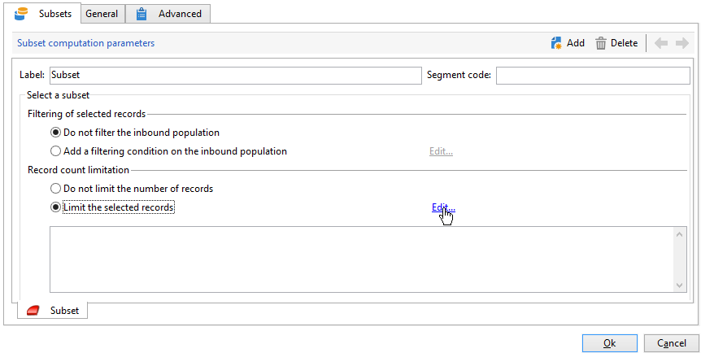
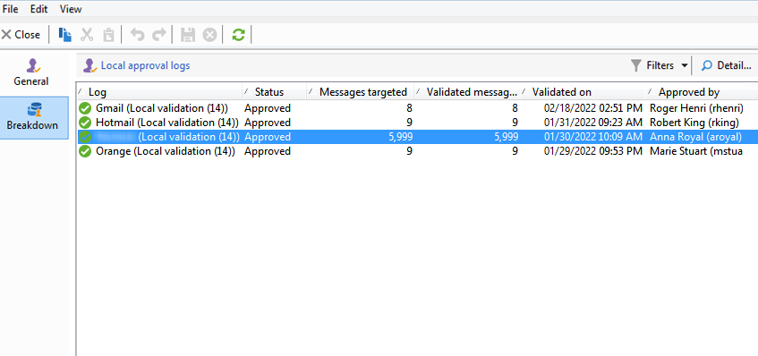

# 使用本地审批活动{#using-the-local-approval-activity}

此 **[!UICONTROL Local approval]** 集成到定位工作流中的活动允许您在发送投放之前设置收件人审批流程。

>[!CAUTION]
>
>要使用此函数，您需要购买分布式营销模块，这是一个促销活动选项。 请核实您的许可协议。

为了设置此用例，我们创建了以下定位工作流：

本地审批流程的主要步骤包括：

1. 由于存在以下问题，定位导致的人口可能会受到限制 **[!UICONTROL Split]** 使用数据分发模型键入活动。

   

1. 此 **[!UICONTROL Local approval]** 然后，活动接管并向每个本地主管发送通知电子邮件。 该活动将挂起，直到每个本地主管批准分配给他们的收件人。

1. 一旦达到审批截止日期，工作流将再次启动。 在此示例中， **[!UICONTROL Delivery]** 活动开始，并且投放被发送到批准的目标。

   >[!NOTE]
   >
   >一旦达到截止日期，未获批准的收件人将被排除在定位之外。

   

1. 几天后，第二个 **[!UICONTROL Local approval]** 类型活动会向每个本地主管发送一封通知电子邮件，其中包含其联系人执行的操作（单击、打开等）的摘要。

## 步骤1：创建数据分发模板 {#step-1--creating-the-data-distribution-template-}

通过数据分发模板，您可以根据数据分组限制因定向而导致的群体，同时还可以将每个值分配给本地主管。 在此示例中，我们已定义 **[!UICONTROL Email address domain]** 字段作为分发字段，并为每个本地主管分配了域

有关创建数据分发模板的详细信息，请参阅 [限制每个数据分布的子集记录数](split.md#limiting-the-number-of-subset-records-per-data-distribution).

1. 要创建数据分发模板，请转到 **[!UICONTROL Resources > Campaign management > Data distribution]** 节点并单击 **[!UICONTROL New]**.

   

1. 选择 **[!UICONTROL General]** 选项卡。

   

1. 输入 **[!UICONTROL Label]** 和 **[!UICONTROL Distribution context]**. 在此示例中，我们已选择 **[!UICONTROL Recipient]** 定位模式和 **[!UICONTROL Email domain]** 字段作为分发字段。 收件人列表将按域细分。
1. 在 **[!UICONTROL Distribution type]** 字段中，选择目标限制值的表示方式 **[!UICONTROL Distribution]** 选项卡。 在此，我们选择了 **[!UICONTROL Percentage]**.
1. 在 **[!UICONTROL Approval storage]** 字段中，输入与正在使用的定向架构匹配的审批的存储架构。 在此，我们将使用默认存储架构： **[!UICONTROL Local approval of recipients]**.
1. 然后单击 **[!UICONTROL Advanced parameters]** 链接。

   

1. 保留 **[!UICONTROL Approve the targeted messages]** 选中选项，以便从要批准的收件人列表中预先选择所有收件人。
1. 在 **[!UICONTROL Delivery label]** 字段，我们保留了默认表达式（投放的计算字符串）。 反馈通知中将使用投放的标准标签。
1. 在 **[!UICONTROL Grouping field]** 部分，我们已选择 **[!UICONTROL Gender]** 字段作为分组字段，用于在审批和反馈通知中显示收件人。
1. 在 **[!UICONTROL Edit targeted messages]** 部分，我们已选择 **[!UICONTROL Edit recipients]** Web应用程序和 **[!UICONTROL recipientId]** 参数。 在审批和反馈通知中，收件人将可点击，并将指向Web应用程序的URL。 额外的URL参数将为 **[!UICONTROL recipientId]**.
1. 然后单击 **[!UICONTROL Distribution]** 选项卡。 对于每个域，输入以下字段：

   

   * **[!UICONTROL Value]**：输入域名的值。
   * **[!UICONTROL Percentage / Fixed]**：对于每个域，输入max。 要向其发送投放的收件人数量。 在本例中，我们希望将每个域的投放限制为10%。
   * **[!UICONTROL Label]**：输入要在审批和反馈通知中显示的域标签。
   * **[!UICONTROL Group or operator]**：选择分配给域的运算符或运算符组。

     >[!CAUTION]
     >
     >确保为操作员分配了适当的权限。

## 步骤2：创建定位工作流 {#step-2--creating-the-targeting-workflow}

为了设置此用例，我们创建了以下定位工作流：

添加了以下活动：

* 两个 **[!UICONTROL Query]** 活动，
* 一 **[!UICONTROL Intersection]** 活动，
* 一 **[!UICONTROL Split]** 活动，
* 一 **[!UICONTROL Local approval]** 活动，
* 一 **[!UICONTROL Delivery]** 活动，
* 一 **[!UICONTROL Wait]** 活动，
* 秒 **[!UICONTROL Local approval]** 活动，
* 一 **[!UICONTROL End]** 活动。

### 查询、交集和拆分 {#queries--intersection-and-split}

上游定位由两个查询组成，一个交叉点和一个拆分。 可以使用限制定位所得的群体 **[!UICONTROL Split]** 使用数据分发模板的活动。

有关配置拆分活动的更多信息，请参阅 [Split](split.md). 有关创建数据分发模板的详情，请参见 [限制每个数据分布的子集记录数](split.md#limiting-the-number-of-subset-records-per-data-distribution).

如果您不想限制查询中的群体，则不必使用 **[!UICONTROL Query]**， **[!UICONTROL Intersection]**、和 **[!UICONTROL Split]** 活动。 在这种情况下，请先完成数据分发模板 **[!UICONTROL Local approval]** 活动。

1. 在 **[!UICONTROL Record count limitation]** 部分，选择 **[!UICONTROL Limit the selected records]** 选项，然后单击 **[!UICONTROL Edit]** 链接。

   

1. 选择 **[!UICONTROL Keep only the first records after sorting]** 选项并单击 **[!UICONTROL Next]**.

   

1. 在 **[!UICONTROL Sort columns]** 部分，添加应用排序的字段。 在此，我们选择了 **[!UICONTROL Email]** 字段。 单击 **[!UICONTROL Next]**。

   

1. 选择 **[!UICONTROL By data distribution]** 选项，选择之前创建的分发模板(请参阅 [步骤1：创建数据分发模板](#step-1--creating-the-data-distribution-template-))，然后单击 **[!UICONTROL Finish]**.

   

在分布模板中，我们选择将群体限制为每个分组值10%，这与工作流中显示的值（340作为输入，34作为输出）一致。

### 审批通知 {#approval-notification}

此 **[!UICONTROL Local approval]** 利用活动，可向每个本地主管发送通知。

有关配置 **[!UICONTROL Local approval]** 活动，请参阅 [本地审批](local-approval.md).

需要输入以下字段：

1. 在 **[!UICONTROL Action to execute]** 部分中，选择 **[!UICONTROL Target approval notification]** 选项。
1. 在 **[!UICONTROL Distribution context]** 部分中，选择 **[!UICONTROL Specified in the transition]** 选项。

   如果您不想限制定向群体，请选择 **[!UICONTROL Explicit]** 选项，然后输入之前在 **[!UICONTROL Data distribution]** 字段。

1. 在 **[!UICONTROL Notification]** 部分，选择投放模板和要用于通知电子邮件的主题。 在本例中，我们选择了默认模板： **[!UICONTROL Local approval notification]**.
1. 在 **[!UICONTROL Approval schedule]** 部分，我们保留默认审批截止日期（3天）并添加了一个提醒。 投放将在批准开始后的3天后离开。 一旦达到审批截止日期，未获批准的收件人将不会按定位被考虑在内。

通知电子邮件由发送 **[!UICONTROL Local approval]** 活动发送给本地主管。

### 等待 {#wait}

利用等待活动，可延迟启动将发送投放反馈通知的第二个本地审批活动。 在 **[!UICONTROL Duration]** 字段，我们已输入 **[!UICONTROL 5d]** 值（5天）。 发送投放后5天内收件人执行的操作将包含在反馈通知中。

### 反馈通知 {#feedback-notification}

第二个 **[!UICONTROL Local approval]** 利用活动，可向每位本地主管发送投放反馈通知。

需要输入以下字段。

1. 在 **[!UICONTROL Action to execute]** 部分，选择 **[!UICONTROL Delivery feedback report]**.
1. 在 **[!UICONTROL Delivery]** 部分，选择 **[!UICONTROL Specified in the transition]**.
1. 在 **[!UICONTROL Notification]** 部分，选择投放模板和要用于通知电子邮件的主题。

达到等待活动中配置的截止日期后，第二个截止日期 **[!UICONTROL Local approval]** 类型活动会向每个本地主管发送以下通知电子邮件：

### 管理员的审批跟踪 {#approval-tracking-by-the-administrator}

每次启动本地审批活动时，都会创建一个审批任务。 管理员可以控制每个批准任务。

转到营销策划的定位工作流，然后单击 **[!UICONTROL Local approval tasks]** 选项卡。

本地审批任务的列表也可以通过 **[!UICONTROL Approval tasks]** 数据分发模板的选项卡。

选择要监视的任务，然后单击 **[!UICONTROL Detail]** 按钮。 此 **[!UICONTROL General]** 通过本地审批任务的选项卡，可以查看有关任务的信息。 如有必要，您可以更改批准和提醒日期。

此选项卡显示以下信息：

* 任务的标签及其ID
* 使用的分发模板
* 目标消息数
* 链接的工作流和活动
* 任务计划

此 **[!UICONTROL Distribution]** 通过任务的选项卡，可查看批准日志、状态、定向的消息数、批准日期以及批准投放的操作员。

选择审批日志，然后单击 **[!UICONTROL Detail]** 按钮以显示更多信息。 此 **[!UICONTROL General]** 通过本地审批日志的选项卡，可以查看常规日志信息。 您还可以更改审批状态。

此选项卡显示以下信息：

* 链接的审批任务
* 审批状态(**[!UICONTROL Approved]** 或 **[!UICONTROL Pending]**)
* 使用的分发模板
* 批准的本地主管和批准日期
* 已定向和批准的消息数

此 **[!UICONTROL Targeted]** 审批日志的选项卡显示定向收件人列表及其审批状态。 您可以根据需要更改此状态。

