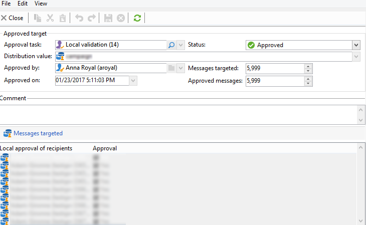

# 使用本地审批活动{#using-the-local-approval-activity}

集成到定位工作流中的&#x200B;**[!UICONTROL Local approval]**&#x200B;活动允许您在发送投放之前设置收件人审批流程。

>[!CAUTION]
>
>要使用此函数，您需要购买分布式营销模块，这是一个促销活动选项。 请核实您的许可协议。

为了设置此用例，我们创建了以下定位工作流：

本地审批流程的主要步骤包括：

1. 由于使用数据分发模型的&#x200B;**[!UICONTROL Split]**&#x200B;类型活动，因此定位所得的群体可能会受到限制。

   

1. 然后，**[!UICONTROL Local approval]**&#x200B;活动接管并向每个本地主管发送通知电子邮件。 该活动将挂起，直到每个本地主管批准分配给他们的收件人。

1. 一旦达到审批截止日期，工作流将再次启动。 在此示例中，将启动&#x200B;**[!UICONTROL Delivery]**&#x200B;活动并将投放发送到批准的目标。

   >[!NOTE]
   >
   >一旦达到截止日期，未获批准的收件人将被排除在定位之外。

   

1. 几天后，第二个&#x200B;**[!UICONTROL Local approval]**&#x200B;类型活动会向每个本地主管发送一封通知电子邮件，其中包含其联系人执行的操作（单击、打开等）的摘要。

## 步骤1：创建数据分发模板 {#step-1--creating-the-data-distribution-template-}

通过数据分发模板，您可以根据数据分组限制因定向而导致的群体，同时还可以将每个值分配给本地主管。 在此示例中，我们已将&#x200B;**[!UICONTROL Email address domain]**&#x200B;字段定义为分发字段并为每个本地主管分配了一个域

有关创建数据分发模板的详细信息，请参阅[限制每个数据分发的子集记录数](split.md#limiting-the-number-of-subset-records-per-data-distribution)。

1. 要创建数据分发模板，请转到&#x200B;**[!UICONTROL Resources > Campaign management > Data distribution]**&#x200B;节点并单击&#x200B;**[!UICONTROL New]**。

   

1. 选择 **[!UICONTROL General]** 选项卡。

   

1. 输入&#x200B;**[!UICONTROL Label]**&#x200B;和&#x200B;**[!UICONTROL Distribution context]**。 在此示例中，我们已选择&#x200B;**[!UICONTROL Recipient]**&#x200B;定向架构和&#x200B;**[!UICONTROL Email domain]**&#x200B;字段作为分发字段。 收件人列表将按域细分。
1. 在&#x200B;**[!UICONTROL Distribution type]**&#x200B;字段中，选择目标限制值在&#x200B;**[!UICONTROL Distribution]**&#x200B;选项卡中的表示方式。 在此，我们已选择&#x200B;**[!UICONTROL Percentage]**。
1. 在&#x200B;**[!UICONTROL Approval storage]**&#x200B;字段中，输入与正在使用的目标架构匹配的审批的存储架构。 在这里，我们将使用默认存储架构： **[!UICONTROL Local approval of recipients]**。
1. 然后单击&#x200B;**[!UICONTROL Advanced parameters]**&#x200B;链接。

   

1. 保持选中&#x200B;**[!UICONTROL Approve the targeted messages]**&#x200B;选项，以便从要批准的收件人列表中预先选择所有收件人。
1. 在&#x200B;**[!UICONTROL Delivery label]**&#x200B;字段中，我们保留了默认表达式（投放的计算字符串）。 反馈通知中将使用投放的标准标签。
1. 在&#x200B;**[!UICONTROL Grouping field]**&#x200B;部分中，我们已选择&#x200B;**[!UICONTROL Gender]**&#x200B;字段作为分组字段，以便在审批和反馈通知中显示收件人。
1. 在&#x200B;**[!UICONTROL Edit targeted messages]**&#x200B;部分中，我们已选择&#x200B;**[!UICONTROL Edit recipients]** Web应用程序和&#x200B;**[!UICONTROL recipientId]**&#x200B;参数。 在审批和反馈通知中，收件人将可点击，并将指向Web应用程序的URL。 其他URL参数将为&#x200B;**[!UICONTROL recipientId]**。
1. 然后单击&#x200B;**[!UICONTROL Distribution]**&#x200B;选项卡。 对于每个域，输入以下字段：

   

   * **[!UICONTROL Value]**：输入域名的值。
   * **[!UICONTROL Percentage / Fixed]**：为每个域输入最大值。 要向其发送投放的收件人数量。 在本例中，我们希望将每个域的投放限制为10%。
   * **[!UICONTROL Label]**：输入要显示在审批和反馈通知中的域标签。
   * **[!UICONTROL Group or operator]**：选择分配给域的运算符或运算符组。

     >[!CAUTION]
     >
     >确保为操作员分配了适当的权限。

## 步骤2：创建定位工作流 {#step-2--creating-the-targeting-workflow}

为了设置此用例，我们创建了以下定位工作流：

添加了以下活动：

* 两个&#x200B;**[!UICONTROL Query]**&#x200B;活动，
* 一个&#x200B;**[!UICONTROL Intersection]**&#x200B;活动，
* 一个&#x200B;**[!UICONTROL Split]**&#x200B;活动，
* 一个&#x200B;**[!UICONTROL Local approval]**&#x200B;活动，
* 一个&#x200B;**[!UICONTROL Delivery]**&#x200B;活动，
* 一个&#x200B;**[!UICONTROL Wait]**&#x200B;活动，
* 第二个&#x200B;**[!UICONTROL Local approval]**&#x200B;活动，
* 一个&#x200B;**[!UICONTROL End]**&#x200B;活动。

### 查询、交集和拆分 {#queries--intersection-and-split}

上游定位由两个查询组成，一个交叉点和一个拆分。 可以使用数据分发模板通过&#x200B;**[!UICONTROL Split]**&#x200B;活动限制定位所得的群体。

有关配置拆分活动的详细信息，请参阅[拆分](split.md)。 在[限制每个数据分发的子集记录数](split.md#limiting-the-number-of-subset-records-per-data-distribution)中详细描述了数据分发模板的创建。

如果不想限制查询中的群体，则不必使用&#x200B;**[!UICONTROL Query]**、**[!UICONTROL Intersection]**&#x200B;和&#x200B;**[!UICONTROL Split]**&#x200B;活动。 在这种情况下，请完成前&#x200B;**[!UICONTROL Local approval]**&#x200B;个活动中的数据分发模板。

1. 在&#x200B;**[!UICONTROL Record count limitation]**&#x200B;部分中，选择&#x200B;**[!UICONTROL Limit the selected records]**&#x200B;选项并单击&#x200B;**[!UICONTROL Edit]**&#x200B;链接。

   

1. 选择&#x200B;**[!UICONTROL Keep only the first records after sorting]**&#x200B;选项并单击&#x200B;**[!UICONTROL Next]**。

   

1. 在&#x200B;**[!UICONTROL Sort columns]**&#x200B;部分中，添加应用排序的字段。 在此，我们已选择&#x200B;**[!UICONTROL Email]**&#x200B;字段。 单击 **[!UICONTROL Next]**。

   

1. 选择&#x200B;**[!UICONTROL By data distribution]**&#x200B;选项，选择之前创建的分发模板（请参阅[步骤1：创建数据分发模板](#step-1--creating-the-data-distribution-template-)），然后单击&#x200B;**[!UICONTROL Finish]**。

   

在分布模板中，我们选择将群体限制为每个分组值10%，这与工作流中显示的值（340作为输入，34作为输出）一致。

### 审批通知 {#approval-notification}

**[!UICONTROL Local approval]**&#x200B;活动允许您向每个本地主管发送通知。

有关配置&#x200B;**[!UICONTROL Local approval]**&#x200B;活动的详细信息，请参阅[本地审批](local-approval.md)。

需要输入以下字段：

1. 在 **[!UICONTROL Action to execute]** 部分中，选择 **[!UICONTROL Target approval notification]** 选项。
1. 在 **[!UICONTROL Distribution context]** 部分中，选择 **[!UICONTROL Specified in the transition]** 选项。

   如果您不想限制目标群体，请在此处选择&#x200B;**[!UICONTROL Explicit]**&#x200B;选项，然后在&#x200B;**[!UICONTROL Data distribution]**&#x200B;字段中输入之前创建的分发模板。

1. 在&#x200B;**[!UICONTROL Notification]**&#x200B;部分中，选择要用于通知电子邮件的投放模板和主题。 在此，我们选择了默认模板：**[!UICONTROL Local approval notification]**。
1. 在&#x200B;**[!UICONTROL Approval schedule]**&#x200B;部分中，我们保留默认审批截止日期（3天）并添加了一个提醒。 投放将在批准开始后的3天后离开。 一旦达到审批截止日期，未获批准的收件人将不会按定位被考虑在内。

**[!UICONTROL Local approval]**&#x200B;活动向本地主管发送通知电子邮件。

### 等待 {#wait}

利用等待活动，可延迟启动将发送投放反馈通知的第二个本地审批活动。 在&#x200B;**[!UICONTROL Duration]**&#x200B;字段中，我们输入了&#x200B;**[!UICONTROL 5d]**&#x200B;值（5天）。 发送投放后5天内收件人执行的操作将包含在反馈通知中。

### 反馈通知 {#feedback-notification}

第二个&#x200B;**[!UICONTROL Local approval]**&#x200B;活动允许您向每个本地主管发送投放反馈通知。

需要输入以下字段。

1. 在&#x200B;**[!UICONTROL Action to execute]**&#x200B;部分中，选择&#x200B;**[!UICONTROL Delivery feedback report]**。
1. 在&#x200B;**[!UICONTROL Delivery]**&#x200B;部分中，选择&#x200B;**[!UICONTROL Specified in the transition]**。
1. 在&#x200B;**[!UICONTROL Notification]**&#x200B;部分中，选择要用于通知电子邮件的投放模板和主题。

一旦到达等待活动中配置的截止日期，第二个&#x200B;**[!UICONTROL Local approval]**&#x200B;类型活动会向每个本地主管发送以下通知电子邮件：

### 管理员的审批跟踪 {#approval-tracking-by-the-administrator}

每次启动本地审批活动时，都会创建一个审批任务。 管理员可以控制每个批准任务。

转到营销活动的定位工作流，然后单击&#x200B;**[!UICONTROL Local approval tasks]**&#x200B;选项卡。

也可以通过数据分发模板的&#x200B;**[!UICONTROL Approval tasks]**&#x200B;选项卡访问本地审批任务列表。

选择要监视的任务，然后单击&#x200B;**[!UICONTROL Detail]**&#x200B;按钮。 本地审批任务的&#x200B;**[!UICONTROL General]**&#x200B;选项卡允许您查看有关该任务的信息。 如有必要，您可以更改批准和提醒日期。

此选项卡显示以下信息：

* 任务的标签及其ID
* 使用的分发模板
* 目标消息数
* 链接的工作流和活动
* 任务计划

任务的&#x200B;**[!UICONTROL Distribution]**&#x200B;选项卡允许您查看审批日志、状态、定向的消息数、审批日期以及审批投放的操作员。

选择审批日志，然后单击&#x200B;**[!UICONTROL Detail]**&#x200B;按钮以显示更多信息。 本地审批日志的&#x200B;**[!UICONTROL General]**&#x200B;选项卡允许您查看常规日志信息。 您还可以更改审批状态。

此选项卡显示以下信息：

* 链接的审批任务
* 审批状态（**[!UICONTROL Approved]**&#x200B;或&#x200B;**[!UICONTROL Pending]**）
* 使用的分发模板
* 批准的本地主管和批准日期
* 已定向和批准的消息数

审批日志的&#x200B;**[!UICONTROL Targeted]**&#x200B;选项卡显示定向收件人列表及其审批状态。 您可以根据需要更改此状态。

