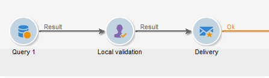
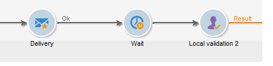

# 本地审批{#local-approval}

集成到定位工作流中后， **[!UICONTROL Local approval]** 活动可让您在发送投放之前设置收件人审批流程。

>[!CAUTION]
>
>要使用此活动，您需要已购买分布式营销模块，这是一个促销活动选项。 请核实您的许可协议。

例如， **[!UICONTROL Local approval]** 使用分发模板的活动，请参阅 [使用本地审批活动](local-approval-activity.md).

首先为活动输入一个标签，然后 **[!UICONTROL Action to execute]** 字段：

* 选择 **[!UICONTROL Target approval notification]** 选项用于在投放之前向本地主管发送通知电子邮件，要求他们批准分配给他们的收件人。

* **增量查询**：用于执行查询并计划其执行。 请参阅 [增量查询](incremental-query.md) 部分。

  

## 目标审批通知 {#target-approval-notification}

在本例中， **[!UICONTROL Local approval]** 活动位于上游定位和投放之间：

如果收到目标审批通知，则要输入的字段包括：

* **[!UICONTROL Distribution context]**：选择 **[!UICONTROL Specified in the transition]** 选项(如果使用 **[!UICONTROL Split]** 键入活动以限制定向群体。 在这种情况下，在拆分活动中输入分发模板。 如果不限制定向群体，请选择 **[!UICONTROL Explicit]** 选项，然后在 **[!UICONTROL Data distribution]** 字段。

  有关创建数据分发模板的详细信息，请参阅 [限制每个数据分布的子集记录数](split.md#limiting-the-number-of-subset-records-per-data-distribution).

* **[!UICONTROL Approval management]**

   * 选择投放模板和将用于电子邮件通知的主题。 默认模板可用： **[!UICONTROL Local approval notification]**. 您还可以添加描述，该描述将显示在审批和反馈通知的收件人列表上方。
   * 指定 **[!UICONTROL Approval type]** 与审批截止日期（从审批开始算起的日期或截止日期）对应的日期。 在此日期，工作流将再次启动，并且未在定向中考虑未批准的收件人。 发送通知后，活动将排入队列，以便本地主管批准其联系人。

     >[!NOTE]
     >
     >默认情况下，审批流程开始后，活动将暂停三天。

     您还可以添加一个或多个提醒，以通知本地主管截止日期即将到来。 要执行此操作，请单击 **[!UICONTROL Add a reminder]** 链接。

* **[!UICONTROL Complementary set]**：和 **[!UICONTROL Generate complement]** 选项允许您生成包含所有未批准目标的第二个集合。

  >[!NOTE]
  >
  >此选项默认处于禁用状态。

## 投放反馈报告 {#delivery-feedback-report}

在本例中， **[!UICONTROL Local approval]** 活动在投放之后进行：

如果是投放反馈报告，则必须输入以下字段：

* 选择 **[!UICONTROL Specified in the transition]** 选项（如果投放是在前一个活动期间输入的）。 选择 **[!UICONTROL Explicit]** 以指定本地审批活动中的投放。
* 选择投放模板和通知电子邮件的对象。 有一个默认模板： **[!UICONTROL Local approval notification]**.

## 示例：批准工作流投放 {#example--approving-a-workflow-delivery}

此示例说明如何为工作流投放设置批准流程。 有关创建投放工作流的更多信息，请参阅 [示例：投放工作流](delivery.md#example--delivery-workflow) 部分。

操作员可通过以下两种方式之一批准投放：使用电子邮件中链接的网页，或通过客户端控制台。

* Web审批

  发送给管理员组操作员的电子邮件允许您批准投放目标。 该消息使用定义的文本，并且JavaScript表达式会被替换为计算值（在本例中为“574”）

  要批准投放，请单击相关链接，然后登录到Adobe Campaign客户端控制台。

  

  进行选择并单击 **[!UICONTROL Submit]** 按钮。

  

* 通过Client Console审批

  在树结构中， **[!UICONTROL Administration > Production > Objects created automatically > Approvals pending]** 节点包含要由当前连接的操作员批准的任务的列表。 列表应显示一行。 双击此行以响应。 将显示以下窗口：

选择 **是**，然后单击 **[!UICONTROL Approve]**. 一条消息将通知您已记录该响应。

返回工作流屏幕：大约10秒后，图表显示如下：

工作流已执行 **[!UICONTROL Delivery control]** 任务，在此例中，这意味着开始之前创建的投放。 工作流已完成，并且没有错误。
