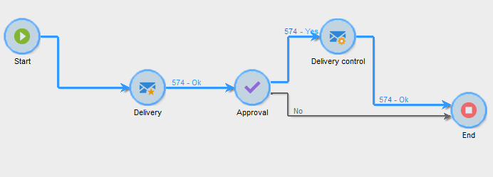

# 本地审批{#local-approval}

集成到定位工作流中后，**[!UICONTROL Local approval]**&#x200B;活动允许您在发送投放之前设置收件人审批流程。

>[!CAUTION]
>
>要使用此活动，您需要已购买分布式营销模块，这是一个促销活动选项。 请核实您的许可协议。

有关具有分发模板的&#x200B;**[!UICONTROL Local approval]**&#x200B;活动的示例，请参阅[使用本地审批活动](local-approval-activity.md)。

首先为活动和&#x200B;**[!UICONTROL Action to execute]**&#x200B;字段输入标签：

* 选择&#x200B;**[!UICONTROL Target approval notification]**&#x200B;选项可在投放之前向本地主管发送通知电子邮件，要求他们批准分配给他们的收件人。

* **增量查询**：允许您执行查询并计划其执行。 请参阅[增量查询](incremental-query.md)部分。

  

## 目标审批通知 {#target-approval-notification}

在这种情况下，**[!UICONTROL Local approval]**&#x200B;活动位于上游定位和投放之间：

如果收到目标审批通知，则要输入的字段包括：

* **[!UICONTROL Distribution context]**：如果您使用&#x200B;**[!UICONTROL Split]**&#x200B;类型活动来限制目标群体，请选择&#x200B;**[!UICONTROL Specified in the transition]**&#x200B;选项。 在这种情况下，在拆分活动中输入分发模板。 如果不限制定向群体，请在此处选择&#x200B;**[!UICONTROL Explicit]**&#x200B;选项，然后在&#x200B;**[!UICONTROL Data distribution]**&#x200B;字段中输入分发模板。

  有关创建数据分发模板的详细信息，请参阅[限制每个数据分发的子集记录数](split.md#limiting-the-number-of-subset-records-per-data-distribution)。

* **[!UICONTROL Approval management]**

   * 选择投放模板和将用于电子邮件通知的主题。 默认模板可用： **[!UICONTROL Local approval notification]**。 您还可以添加描述，该描述将显示在审批和反馈通知的收件人列表上方。
   * 指定与审批截止日期（自审批开始起的日期或截止日期）对应的&#x200B;**[!UICONTROL Approval type]**。 在此日期，工作流将再次启动，并且未在定向中考虑未批准的收件人。 发送通知后，活动将排入队列，以便本地主管批准其联系人。

     >[!NOTE]
     >
     >默认情况下，审批流程开始后，活动将暂停三天。

     您还可以添加一个或多个提醒，以通知本地主管截止日期即将到来。 为此，请单击&#x200B;**[!UICONTROL Add a reminder]**&#x200B;链接。

* **[!UICONTROL Complementary set]**： **[!UICONTROL Generate complement]**&#x200B;选项允许您生成包含所有未批准目标的第二个集合。

  >[!NOTE]
  >
  >默认禁用此选项。

## 投放反馈报告 {#delivery-feedback-report}

在这种情况下，**[!UICONTROL Local approval]**&#x200B;活动放在投放之后：

如果是投放反馈报告，则必须输入以下字段：

* 如果投放是在前一个活动期间输入的，请选择&#x200B;**[!UICONTROL Specified in the transition]**&#x200B;选项。 选择&#x200B;**[!UICONTROL Explicit]**&#x200B;以在本地审批活动中指定投放。
* 选择投放模板和通知电子邮件的对象。 有一个默认模板： **[!UICONTROL Local approval notification]**。

## 示例：批准工作流投放 {#example--approving-a-workflow-delivery}

此示例说明如何为工作流投放设置批准流程。 有关创建投放工作流的详细信息，请参阅[示例：投放工作流](delivery.md#example--delivery-workflow)部分。

操作员可通过以下两种方式之一批准投放：使用电子邮件中链接的网页，或通过客户端控制台。

* Web审批

  发送给管理员组操作员的电子邮件允许您批准投放目标。 该消息使用定义的文本，并且JavaScript表达式将由计算值替换（在本例中为“574”）

  要批准投放，请单击相关链接，然后登录到Adobe Campaign客户端控制台。

  

  进行选择并单击&#x200B;**[!UICONTROL Submit]**&#x200B;按钮。

  

* 通过Client Console审批

  在树结构中，**[!UICONTROL Administration > Production > Objects created automatically > Approvals pending]**&#x200B;节点包含要由当前连接的运算符批准的任务的列表。 列表应显示一行。 双击此行以响应。 将显示以下窗口：

选择&#x200B;**是**，然后单击&#x200B;**[!UICONTROL Approve]**。 一条消息将通知您已记录该响应。

返回工作流屏幕：大约10秒后，图表显示如下：

工作流已执行&#x200B;**[!UICONTROL Delivery control]**&#x200B;任务，在本例中，这意味着开始之前创建的投放。 工作流已完成，并且没有错误。
