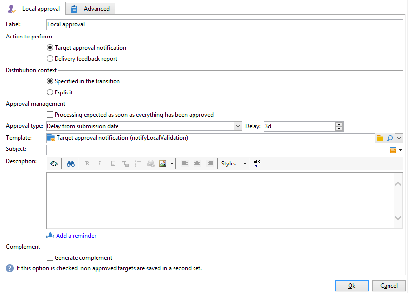

# 本地审批{#local-approval}

集成到定位工作流后， **[!UICONTROL Local approval]** 活动允许您在发送投放之前设置收件人批准流程。

>[!CAUTION]
>
>要使用此活动，您需要购买“分布式营销”模块（即营销活动选项）。 请核实您的许可协议。

例如 **[!UICONTROL Local approval]** 活动，请参阅 [使用本地批准活动](local-approval-activity.md).

首先，输入活动的标签和 **[!UICONTROL Action to execute]** 字段：

* 选择 **[!UICONTROL Target approval notification]** 选项，在投放之前向本地主管发送电子邮件通知，要求他们批准分配给他们的收件人。

* **增量查询**:允许您执行查询并规划其执行。 请参阅 [增量查询](incremental-query.md) 中。

   

## Target批准通知 {#target-approval-notification}

在本例中， **[!UICONTROL Local approval]** 活动位于上游定位和投放之间：

在发出目标批准通知时要输入的字段包括：

* **[!UICONTROL Distribution context]**:选择 **[!UICONTROL Specified in the transition]** 选项 **[!UICONTROL Split]** 键入活动以限制目标群体。 在这种情况下，分发模板会在拆分活动中输入。 如果不限制目标群体，请选择 **[!UICONTROL Explicit]** 选项，然后在 **[!UICONTROL Data distribution]** 字段。

   有关创建数据分发模板的更多信息，请参阅 [限制每个数据分发的子集记录数](split.md#limiting-the-number-of-subset-records-per-data-distribution).

* **[!UICONTROL Approval management]**

   * 选择投放模板以及用于电子邮件通知的主题。 默认模板可用： **[!UICONTROL Local approval notification]**. 您还可以添加将在批准和反馈通知中收件人列表上方显示的描述。
   * 指定 **[!UICONTROL Approval type]** 对应于批准截止时间（从批准开始的日期或截止时间）。 在此日期，工作流将再次启动，并且定向中不会考虑未获批准的收件人。 发送通知后，活动将排入队列，以便本地主管可以批准其联系人。

      >[!NOTE]
      >
      >默认情况下，当批准流程启动时，该活动会暂停三天。

      您还可以添加一个或多个提醒，以告知本地主管截止时间即将到来。 为此，请单击 **[!UICONTROL Add a reminder]** 链接。

* **[!UICONTROL Complementary set]**:the **[!UICONTROL Generate complement]** 选项允许您生成第二个集，其中包含所有未批准的目标。

   >[!NOTE]
   >
   >默认情况下，此选项处于禁用状态。

## 投放反馈报告 {#delivery-feedback-report}

在本例中， **[!UICONTROL Local approval]** 活动放在投放之后：

如果是投放反馈报告，则必须输入以下字段：

* 选择 **[!UICONTROL Specified in the transition]** 选项。 选择 **[!UICONTROL Explicit]** 以指定本地批准活动中的投放。
* 选择投放模板和通知电子邮件的对象。 有一个默认模板： **[!UICONTROL Local approval notification]**.

## 示例：批准工作流投放 {#example--approving-a-workflow-delivery}

此示例展示了如何为工作流投放设置批准流程。 有关创建投放工作流的更多信息，请参阅 [示例：投放工作流](delivery.md#example--delivery-workflow) 中。

操作员可以通过以下两种方式之一批准投放：使用电子邮件中链接的网页，或通过控制台进行访问。

* Web批准

   通过发送给管理员组操作员的电子邮件，您可以批准投放目标。 消息使用定义的文本，JavaScript表达式将被计算值替换（在本例中为“574”）

   要批准投放，请单击相关链接，然后登录到Adobe Campaign控制台。

   

   选择并单击 **[!UICONTROL Submit]** 按钮。

   

* 通过控制台进行批准

   在树结构中， **[!UICONTROL Administration > Production > Objects created automatically > Approvals pending]** 节点包含要由当前连接的操作员批准的任务列表。 列表应显示一行。 双击此行以做出响应。 将显示以下窗口：

选择 **是**，然后单击 **[!UICONTROL Approve]**. 系统会显示一条消息，通知您响应已被记录。

返回到工作流屏幕：大约10秒后，该图表显示如下：

工作流已执行 **[!UICONTROL Delivery control]** 任务，在此例中，这意味着开始之前创建的投放。 工作流已完成，且未出现错误。
