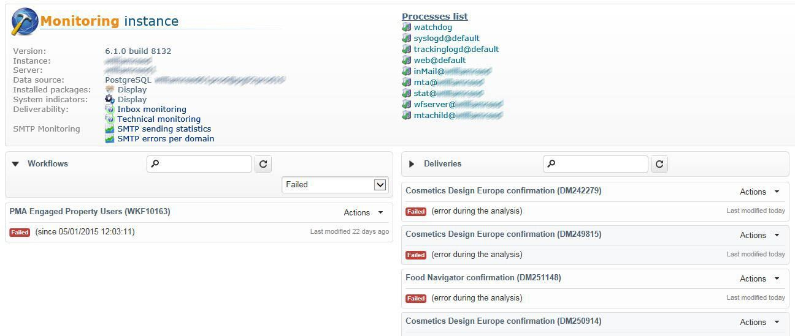

# 监测技术工作流 {#monitoring-technical-workflows}

需要对技术工作流进行监控，并在工作流失败时采取行动。

## 实例监视仪表板 {#instance-monitoring-dashboard}

可通过&#x200B;**[!UICONTROL Monitoring]**&#x200B;选项卡访问实例监视仪表板。

在“System Indicators（系统指示器）”和“core files（核心文件）”下，检查指示器是否以红色突出显示。 如果情况确实如此，并且有些确实如此，则您应：

* 检查必需的进程是否始终运行，
* 检查流程是否都不太旧，
* 检查不同进程的日志文件是否不包含警报和重复错误。

## 技术工作流 {#technical-workflows}

技术工作流可从&#x200B;**[!UICONTROL Administration]** > **[!UICONTROL Production]** > **[!UICONTROL Technical workflows]**&#x200B;获得。

根据技术工作流，请按照下面详述的步骤操作，以确保一切都按预期运行。

要更好地了解每个技术工作流应该做什么，请参阅此[部分](technical-workflows.md)。

对于&#x200B;**[!UICONTROL Database Cleanup workflow ('cleanup')]**：

检查日志，验证所用的时间在一段时间内相对稳定，不会影响其他工作流。

对于&#x200B;**[!UICONTROL Tracking workflow ('tracking')]**：

检查跟踪工作流是否按计划运行（默认情况下每小时运行一次），以及日记帐是否未高亮显示重复错误。 有关更多信息，请参阅此](delivery.md)章节[。

对于&#x200B;**[!UICONTROL Deliverability update ('deliverabilityUpdate')]**：

1. 检查&#x200B;**[!UICONTROL Deliverability update]**&#x200B;工作流是否每天运行并成功完成。
1. 在日志中验证规则是否定期更新。

对于&#x200B;**[!UICONTROL Campaign process ('operationMgt', 'deliveryMgt', ...)]**：

1. 查看&#x200B;**[!UICONTROL Campaign process]**&#x200B;文件夹下的所有工作流。 有关详细信息，请参见此 [ 页面](technical-workflows.md)。
1. 检查工作流是否按计划运行，以及日记帐是否未突出显示重复出现的错误。

## 工作流监督 {#workflow-supervision}

**[!UICONTROL Workflow supervisors]**&#x200B;组应包含需要随时通知失败情况的操作员以及可以及时采取操作的操作员。

如果出现问题，应生成警报并将其发送到正确的组。

确保每个操作员都有有效的电子邮件地址。

任何应该运行以保持平台正常工作的工作流（如每日数据导入）都应声明为“生产”（复选框），并显示为粗体。

## 工作流维护列表 {#workflow-maintenance-list}

所有自定义技术工作流都应记录在包含以下内容的工作表中：

* 工作流的名称和位置。
* 目的。
* 正在计划和依赖关系。
* 操作员负责监控。
* 有关出错时执行的操作说明。

## 监控的规划和自动化 {#planning-and-automation-of-monitoring}

规划工作流监控提高了效率。 有些任务需要每天执行，而其他任务可以每周或每月执行。

在按循环命名并按执行计划排序的文件夹中设置工作流可以提高监视效率。

监控自动化可减少资源开销，并确保以适当的频率安排任务。

您可以构建监控工作流，以便在某些任务失败或关键表变得过大时发送电子邮件。

您可以创建一个视图，以便可以监视某个功能区域或系统范围内的所有工作流。

您还可以使用Adobe Campaign作业或报表功能根据需要构建文档，这些文档始终保持最新。
