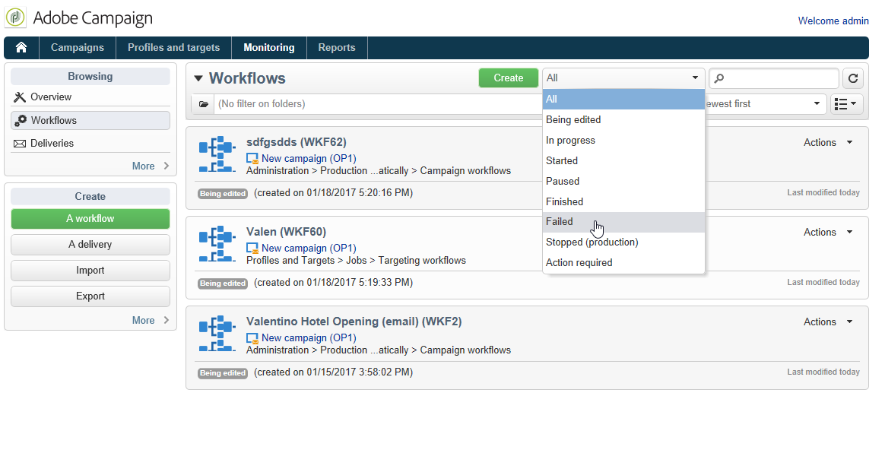

# 监测工作流执行 {#monitoring-workflow-execution}

本节介绍如何监测工作流的执行情况。

[本节](workflow-supervision.md#supervising-workflows)中还提供了有关如何创建工作流以允许您监视一组“已暂停”、“已停止”或“出现错误”的工作流状态的用例。

此外，实例的管理员可以使用&#x200B;**审核跟踪**&#x200B;来检查活动和上次对工作流所做的修改，以及工作流的状态。 在此[页面](../../v8/reporting/audit-trail.md){target="_blank"}中了解有关审核追踪的详细信息。

## 显示进度 {#displaying-progress}

您可以使用工具栏上的相应图标显示进度，从而监控执行情况。

通过&#x200B;**[!UICONTROL Display progress information]**&#x200B;图标，可在执行屏幕中显示状态和活动结果。


选择此选项时，已执行的活动以蓝色显示，待处理活动闪烁，警告以橙色显示，错误以红色显示。 此选项还显示叫客过渡中的活动结果，其后显示活动属性中定义的结果标签，如果超过一秒，则显示作业的持续时间


## 显示日志 {#displaying-logs}

日志包含工作流的历史记录或审核跟踪。 它注册所有用户操作、执行的所有操作以及遇到的错误。 您可以：

* 在详细信息中选择&#x200B;**[!UICONTROL Tracking]**&#x200B;选项卡。 此列表包含所有工作流消息。

  

* 按活动筛选日志消息。 为此，请单击图上方工具栏上的&#x200B;**[!UICONTROL Display the tasks and the log]**&#x200B;以显示图下方的&#x200B;**[!UICONTROL Log]**&#x200B;和&#x200B;**[!UICONTROL Tasks]**&#x200B;选项卡。 选择活动以查看所有相关消息。 此列表包含未选择活动时的所有消息。

  

  >[!NOTE]
  >
  >单击图的背景以取消选择所有元素。

* 仅查看那些链接到给定任务的消息。 为此，请选择&#x200B;**[!UICONTROL Tasks]**&#x200B;选项卡，然后在图中选择活动以限制列表。 双击任务以显示信息；窗口中的最后一个选项卡包含日志。

  

  通过&#x200B;**[!UICONTROL Details...]**&#x200B;按钮，可显示有关活动执行的所有其他信息。 例如，您可以查看验证运算符以及批准期间输入的注释（如果适用）。

>[!NOTE]
>
>重新启动工作流时，不会清除日志。 保留所有消息。 如果要放弃上一次执行的消息，必须清除历史记录。

日志显示与定向工作流活动相关的执行消息的时间顺序列表。

* 定位活动日志

  执行定向营销活动后，单击&#x200B;**[!UICONTROL Tracking]**&#x200B;选项卡以查看执行跟踪。

  

  将显示所有营销活动消息：执行的营销活动以及警告或错误。

* 活动日志

  您还可以查看每个活动的执行日志和详细信息。 可通过两种方式来做到这一点：

   1. 选择目标活动并单击&#x200B;**[!UICONTROL Display the tasks and the log]**&#x200B;图标。

      

      图表的下部分显示两个选项卡：“日志”和“任务”。

      在图表中选定的活动在日志和任务列表中充当筛选器。

      

   1. 右键单击目标活动并选择&#x200B;**[!UICONTROL Display logs]**。

      

      日志会显示在单独的窗口中。

## 清除日志 {#purging-the-logs}

系统不会自动清除工作流历史记录：默认情况下会保留所有消息。 可通过&#x200B;**[!UICONTROL File > Actions]**&#x200B;菜单或单击列表上方工具栏中的&#x200B;**[!UICONTROL Actions]**&#x200B;按钮清除历史记录。 选择 **[!UICONTROL Purge history]**。有关&#x200B;**[!UICONTROL Actions]**&#x200B;菜单中可用选项的详情，请参见[操作工具栏](start-a-workflow.md)部分。


## 工作表和工作流模式 {#worktables-and-workflow-schema}

工作流可传送可通过特定活动操作的工作表。 Adobe Campaign允许您通过数据管理活动，修改、重命名和扩充工作流工作表的列，例如，根据客户需求使列与命名法保持一致，以收集有关合同共同受益人的其他信息等。

还可以在各种工作维度之间创建链接，并定义维度更改。 例如，对于数据库中记录的每个合同，寻址主要持有者，并在附加信息中使用共同持有者数据。

工作流钝化时，会自动删除工作流的工作表。 如果要保留工作表，请通过&#x200B;**[!UICONTROL List update]**&#x200B;活动将其保存在列表中（请参阅[列表更新](list-update.md)）。

## 管理错误 {#managing-errors}

发生错误时，工作流将暂停，并且发生错误时执行的活动会以红色闪烁。 在工作流概述的&#x200B;**[!UICONTROL Monitoring]**&#x200B;选项卡 — **[!UICONTROL Workflows]**&#x200B;链接下，您可以仅显示有错误的工作流，如下所示。



在Adobe Campaign Explorer中，工作流列表默认显示&#x200B;**[!UICONTROL Failed]**&#x200B;列。


当工作流出错时，只要用户档案中列出了属于工作流监督组的操作员的电子邮件地址，该操作员就会收到电子邮件通知。 在工作流属性的&#x200B;**[!UICONTROL Supervisor(s)]**&#x200B;字段中选择此组。


通知内容在&#x200B;**[!UICONTROL Workflow manager notification]**&#x200B;默认模板中配置：在工作流属性的&#x200B;**[!UICONTROL Execution]**&#x200B;选项卡中选择此模板。 通知显示错误工作流的名称和相关任务。

通知示例：


利用链接，可在Web模式下访问Adobe Campaign客户端控制台，并在登录后处理错误工作流。


可以配置工作流，使其在发生错误时不暂停并继续执行。为此，请编辑工作流&#x200B;**[!UICONTROL Properties]**，然后在&#x200B;**[!UICONTROL Error management]**&#x200B;部分的&#x200B;**[!UICONTROL In case of error]**&#x200B;字段中选择&#x200B;**[!UICONTROL Ignore]**&#x200B;选项。 随后，您可以指定在流程暂停前可忽略的连续错误的数量。

在这种情况下，错误任务将中止。 此模式特别适合用于稍后重新尝试营销活动（定期操作）的工作流。


>[!NOTE]
>
>您可以为每个活动单独应用此配置。 为此，请编辑活动属性并在&#x200B;**[!UICONTROL Advanced]**&#x200B;选项卡中选择错误管理模式。

## 处理错误 {#processing-errors}

关于活动，**[!UICONTROL Process errors]**&#x200B;选项显示将在生成错误时启用的特定过渡。 在这种情况下，工作流不会进入错误模式，并继续执行。

考虑的错误是文件系统错误（无法移动文件、无法访问目录等）。

此选项不处理与活动配置相关的错误，即无效值。 与错误配置相关的错误将不会启用此转换（目录不存在等）。

如果工作流暂停（手动或在出错后自动暂停），**[!UICONTROL Start]**&#x200B;按钮将在工作流停止的位置重新启动工作流执行。 错误活动（或暂停的活动）将被重新执行。 不会重新执行之前的活动。

要重新执行所有工作流活动，请使用&#x200B;**[!UICONTROL Restart]**&#x200B;按钮。

如果修改已执行的活动，则重新启动工作流执行时不会考虑这些更改。

如果修改未执行的活动，则重新启动工作流执行时将会考虑这些活动。

如果修改暂停的活动，则在重新启动工作流时，无法正确考虑这些更改。

如果可能，我们建议在执行修改后完全重新启动工作流。

## 实例监督 {#instance-supervision}

**[!UICONTROL Instance supervision]**&#x200B;页面允许您查看Adobe Campaign服务器活动，并显示包含错误的工作流和投放列表。

要访问此页面，请转到&#x200B;**[!UICONTROL Monitoring]**&#x200B;选项卡并单击&#x200B;**[!UICONTROL General view]**&#x200B;链接。


要显示所有工作流，请单击&#x200B;**[!UICONTROL Workflows]**&#x200B;链接。 使用下拉列表根据工作流在平台中的状态显示工作流。


单击发生错误的工作流上的链接，以打开工作流并查看其日志。


## 防止同时执行多个操作 {#preventing-simultaneous-multiple-executions}

单个工作流可以同时运行多个执行。 在某些情况下，您应该防止这种情况发生。

例如，您可以让调度程序每小时触发一次工作流执行，但有时整个工作流的执行需要超过一小时。 如果工作流已在运行，则您可能需要跳过执行。

如果在工作流开始时有信号活动，则在工作流正在运行时，您可能希望跳过该信号。

一般原则是：


解决方案是使用实例变量。 实例变量由工作流的所有并行执行共享。

下面是一个简单的测试工作流程：


**[!UICONTROL Scheduler]**&#x200B;每分钟触发一次事件。 以下&#x200B;**[!UICONTROL Test]**&#x200B;活动将测试&#x200B;**isRunning**&#x200B;实例变量以确定是否继续执行操作：


>[!NOTE]
>
>**isRunning**&#x200B;是为此示例选择的变量名称。 这不是内置变量。

**是**&#x200B;分支中紧跟&#x200B;**[!UICONTROL Test]**&#x200B;之后的活动必须在其&#x200B;**初始化脚本**&#x200B;中设置实例变量：

```
instance.vars.isRunning = true
```

**是**&#x200B;分支中的最后一个活动必须在其&#x200B;**初始化脚本**&#x200B;中将变量还原为false：

```
instance.vars.isRunning = false
```

请注意：

* 您可以通过工作流&#x200B;**属性**&#x200B;中的&#x200B;**变量**&#x200B;选项卡检查实例变量的当前值。
* 重新启动工作流时会重置实例变量。
* 在JavaScript中，未定义的值在测试中为false，从而允许在初始化实例变量之前对其进行测试。
* 您可以通过向“no”结尾的初始化脚本添加日志记录指令来监视由于此机制而未处理的活动。

  ```
  logInfo("Workflow already running, parallel execution not allowed.");
  ```

本节中提供了使用案例： [协调数据更新](coordinate-data-updates.md)。

## 数据库维护 {#database-maintenance}

工作流使用许多工作表，这些工作表占用空间，如果不进行维护，最终会导致整个平台速度变慢。

可通过&#x200B;**管理>生产>技术工作流**&#x200B;节点访问&#x200B;**数据库清理**&#x200B;工作流，可让您删除过时的数据，以避免数据库呈指数增长。 工作流将自动触发，无需用户干预。

您还可以创建特定的技术工作流以清除不必要的占用空间的数据。 请参阅   和此[节](#purging-the-logs)。

## 处理暂停的工作流 {#handling-of-paused-workflows}

默认情况下，如果暂停工作流，则永远不会清除工作流的工作表。 从Build 8880开始，已处于暂停状态太长时间的工作流将被自动停止，并且其工作表会被清除。 此行为的触发方式如下：

* 在监控功能板（和监控API）中，暂停时间超过7天的工作流会显示为警告，并向主管组发送通知。
* 每周在触发&#x200B;**[!UICONTROL cleanupPausedWorkflows]**&#x200B;技术工作流时也会发生同样的情况。 有关工作流的更多详细信息，请参阅[此部分](delivery.md)。
* 在4个通知（即，默认情况下处于暂停状态的一个月）后，工作流将无条件停止。 停止工作流后，该工作流中会显示日志。 在下次执行&#x200B;**[!UICONTROL cleanup]**&#x200B;工作流时清除这些表

这些时间段可通过NmsServer_PausedWorkflowPeriod选项进行配置。

通知工作流主管。 此外，还会通知修改工作流的创建者和上一个用户。 管理员不会收到通知。

## 根据工作流的状态进行筛选 {#filtering-workflows-status}

Campaign Classic界面允许您使用预定义的&#x200B;**视图**&#x200B;监视实例上所有工作流的执行状态。 要访问这些视图，请打开&#x200B;**[!UICONTROL Administration]** / **[!UICONTROL Audit]** / **[!UICONTROL Workflows Status]**&#x200B;节点。

可以使用以下视图：

* **[!UICONTROL Running]**：列出所有正在运行的工作流。
* **[!UICONTROL Paused]**：列出所有暂停的工作流。
* **[!UICONTROL Failed]**：列出所有失败的工作流。
* ** )。


默认情况下，这些视图可在&#x200B;**[!UICONTROL Audit]**&#x200B;文件夹中访问。 但是，您可以在文件夹树中选择的位置重新创建它们。 这样，它们就可供没有管理权限的标准用户使用。

为此，请执行以下操作：

1. 右键单击要添加视图的文件夹。
1. 在&#x200B;**[!UICONTROL Add new folder]** / **[!UICONTROL Administration]**&#x200B;中，选择要添加的视图。
1. 将文件夹添加到树后，请确保将其配置为视图，以便显示所有工作流，无论其原始文件夹是什么。 有关如何配置视图的详细信息，请参阅[此页面](../../v8/audiences/folders-and-views.md#turn-a-folder-to-a-view)。

除了这些视图，您还可以设置过滤器文件夹，以允许您根据工作流的执行状态筛选工作流列表。 操作步骤：

1. 访问工作流类型文件夹，然后选择&#x200B;**[!UICONTROL Filters]** / **[!UICONTROL Advanced filter]**&#x200B;菜单。
1. 配置过滤器，使工作流的&#x200B;**[!UICONTROL @status]**&#x200B;字段等于您选择的状态。
1. 保存并命名过滤器。 然后，即可直接从过滤器列表中访问它。


有关更多信息，请参阅以下章节：
