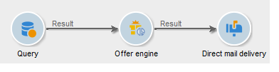

# 产品建议引擎{#offer-engine}

**[!UICONTROL Offer engine]**&#x200B;活动允许您在投放之前定义对优惠引擎的调用。

此活动的原理与通过引擎调用的扩充活动相同，即在投放前使用引擎计算的优惠扩充集客群体数据。

配置查询后（请参阅此[部分](query.md)）：

1. 添加并打开&#x200B;**[!UICONTROL Offer engine]**&#x200B;活动。
1. 填写各种可用字段以指定调用选件引擎参数（选件空间、类别或主题、联系日期、要保留的选件数）。 引擎将根据这些参数自动计算要添加的选件。

   >[!CAUTION]
   >
   >如果您使用此活动，则只会存储投放中使用的优惠建议。

   

1. 然后，配置与您选择的渠道对应的投放活动。 请参阅[跨渠道投放](cross-channel-deliveries.md)。
