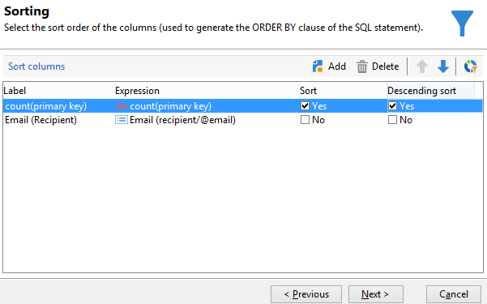

# 查询投放信息 {#querying-delivery-information}

## 特定投放的点击次数 {#number-of-clicks-for-a-specific-delivery}

在本例中，我们希望恢复特定投放的点击次数。 由于收件人在给定时间段内获取的跟踪日志，因此会记录这些点击。 收件人通过其电子邮件地址进行标识。 此查询使用 **[!UICONTROL Recipient tracking logs]** 表。

* 需要选择哪个表？

   收件人日志跟踪表(**[!UICONTROL nms:trackingLogRcp]**)

* 要为输出列选择的字段？

   主键（包含计数）和电子邮件

* 将根据哪些标准过滤信息？

   投放标签的特定时段和元素

要执行此示例，请应用以下步骤：

1. 打开 **[!UICONTROL Generic query editor]** ，然后选择 **[!UICONTROL Recipient tracking logs]** 架构。

   

1. 在 **[!UICONTROL Data to extract]** 窗口，我们要创建聚合以收集信息。 为此，请添加主键（位于主键的上方） **[!UICONTROL Recipient tracking logs]** 元素):跟踪日志计数对此执行 **[!UICONTROL Primary key]** 字段。 编辑后的表达式将 **[!UICONTROL x=count(primary key)]**. 它会将各种跟踪日志的总和链接到单个电子邮件地址。

   操作步骤：

   * 单击 **[!UICONTROL Add]** 图标 **[!UICONTROL Output columns]** 字段。 在 **[!UICONTROL Formula type]** 窗口，选择 **[!UICONTROL Edit the formula using an expression]** 选项并单击 **[!UICONTROL Next]**. 在 **[!UICONTROL Field to select]** 窗口，单击 **[!UICONTROL Advanced selection]**.

      

   * 在 **[!UICONTROL Formula type]** 窗口，对聚合函数运行进程。 此过程将是主键计数。

      选择 **[!UICONTROL Process on an aggregate function]** 在 **[!UICONTROL Aggregate]** 部分，单击 **[!UICONTROL Count]**.

      

      单击 **[!UICONTROL Next]**。

   * 选择 **[!UICONTROL Primary key (@id)]** 字段。 的 **[!UICONTROL count (primary key)]** 输出列。

      

1. 选择要在输出列中显示的其他字段。 在 **[!UICONTROL Available fields]** 列，打开 **[!UICONTROL Recipient]** 节点和选择 **[!UICONTROL Email]**. 检查 **[!UICONTROL Group]** 框 **[!UICONTROL Yes]** 要按电子邮件地址对跟踪日志进行分组，请执行以下操作：此组将每个日志链接到其收件人。

   

1. 配置列排序，以便最先显示最活跃的收件人（具有最多的跟踪日志）。 检查 **[!UICONTROL Yes]** 在 **[!UICONTROL Descending sort]** 列。

   

1. 然后，您必须过滤您感兴趣的日志，即2周以下且与销售相关的投放相关的日志。

   操作步骤：

   * 配置数据过滤。 要执行此操作，请选择 **[!UICONTROL Filter conditions]** 然后单击 **[!UICONTROL Next]**.

      

   * 在特定投放的给定时间段内恢复跟踪日志。 需要满足以下三个筛选条件：两个日期条件来设置在当前日期之前2周到当前日期之前1天之间的搜索期；以及将搜索限制为特定投放的其他条件。

      在 **[!UICONTROL Target element]** 窗口中，配置开始跟踪日志的日期。 单击 **[!UICONTROL Add]**。将显示条件行。 编辑 **[!UICONTROL Expression]** 列 **[!UICONTROL Edit expression]** 函数。 在 **[!UICONTROL Field to select]** 窗口，选择 **[!UICONTROL Date (@logDate)]**.

      

      选择 **[!UICONTROL greater than]** 运算符。 在 **[!UICONTROL Value]** 列，单击 **[!UICONTROL Edit expression]**&#x200B;和 **[!UICONTROL Formula type]** 窗口，选择 **[!UICONTROL Process on dates]**. 最后，输入 **[!UICONTROL Current date minus n days]**，输入“15”。

      单击 **[!UICONTROL Finish]**。

      

   * 要选择跟踪日志搜索结束日期，请通过单击 **[!UICONTROL Add]**. 在 **[!UICONTROL Expression]** 列，选择 **[!UICONTROL Date (@logDate)]** 再次。

      选择 **[!UICONTROL less than]** 运算符。 在 **[!UICONTROL Value]** 列，单击 **[!UICONTROL Edit expression]**. 要进行日期处理，请转到 **[!UICONTROL Formula type]** 窗口中输入“1” **[!UICONTROL Current date minus n days]**.

      单击 **[!UICONTROL Finish]**。

      

      现在，我们要配置第三个筛选条件，即查询所关注的投放标签。

   * 单击 **[!UICONTROL Add]** 函数创建其他筛选条件。 在 **[!UICONTROL Expression]** 列，单击 **[!UICONTROL Edit expression]**. 在 **[!UICONTROL Field to select]** 窗口，选择 **[!UICONTROL Label]** 在 **[!UICONTROL Delivery]** 节点。

      单击 **[!UICONTROL Finish]**。

      

      查找包含“sales”字样的投放。 由于您不记得其确切标签，因此可以选择 **[!UICONTROL contains]** 运算符并在 **[!UICONTROL Value]** 列。

      

1. 单击 **[!UICONTROL Next]** 直到你到达 **[!UICONTROL Data preview]** 窗口：此处不需要格式设置。
1. 在 **[!UICONTROL Data preview]** 窗口，单击 **[!UICONTROL Start the preview of the data]** 以查看每个投放收件人的跟踪日志数。

   结果以降序显示。

   

   此投放的用户最多日志数为6。 5个不同的用户打开了投放电子邮件，或单击了电子邮件中的一个链接。

## 未打开任何投放的收件人 {#recipients-who-did-not-open-any-delivery}

在本例中，我们希望过滤过去7天内未打开电子邮件的收件人。

要创建此示例，请应用以下步骤：

1. 拖放 **[!UICONTROL Query]** 活动，然后打开活动。
1. 单击 **[!UICONTROL Edit query]** 并将目标和过滤维度设置为 **[!UICONTROL Recipients]**.

   

1. 选择 **[!UICONTROL Filtering conditions]** 然后单击 **[!UICONTROL Next]**.
1. 单击 **[!UICONTROL Add]** 按钮，选择 **[!UICONTROL Tracking logs]**.
1. 设置 **[!UICONTROL Operator]** 的 **[!UICONTROL Tracking logs]** 表达式 **[!UICONTROL Do not exist such as]**.

   

1. 添加其他表达式。 选择 **[!UICONTROL Type]** 在 **[!UICONTROL URL]** 类别。
1. 然后，设置 **[!UICONTROL Operator]** to **[!UICONTROL equal to]** 和 **[!UICONTROL Value]** to **[!UICONTROL Open]**.

   

1. 添加其他表达式并选择 **[!UICONTROL Date]**. **[!UICONTROL Operator]** 应设置为 **[!UICONTROL on or after]**.

   

1. 要设置最近7天的值，请单击 **[!UICONTROL Edit expression]** 按钮 **[!UICONTROL Value]** 字段。
1. 在 **[!UICONTROL Function]** 类别，选择 **[!UICONTROL Current date minus n days]** 并添加要定位的天数。 在这里，我们想定位过去7天。

   

您的叫客过渡将包含过去7天内未打开电子邮件的收件人。

相反，如果要筛选至少打开了一封电子邮件的收件人，则查询应如下所示。 请注意，在本例中， **[!UICONTROL Filtering dimension]** 应设置为 **[!UICONTROL Tracking logs (Recipients)]**.

## 已打开投放的收件人 {#recipients-who-have-opened-a-delivery}

以下示例显示如何定位在过去2周内打开了投放的用户档案：

1. 要定位已打开投放的用户档案，您需要使用跟踪日志。 它们存储在链接的表中：首先，在 **[!UICONTROL Filtering dimension]** 字段，如下所示：

   

1. 有关筛选条件，请单击 **[!UICONTROL Edit expression]** 跟踪日志的子树结构中显示的标准图标。 选择 **[!UICONTROL Date]** 字段。

   

   单击 **[!UICONTROL Finish]** 确认选择。

   要仅恢复不到两周前的跟踪日志，请选择 **[!UICONTROL Greater than]** 运算符。

   

   然后，单击 **[!UICONTROL Edit expression]** 图标 **[!UICONTROL Value]** 列来定义要应用的计算公式。 选择 **[!UICONTROL Current date minus n days]** 公式中输入15。

   

   单击 **[!UICONTROL Finish]** 按钮。 在筛选窗口中，单击 **[!UICONTROL Preview]** 选项卡来检查定位标准。

   

## 过滤投放后收件人的行为 {#filtering-recipients--behavior-folllowing-a-delivery}

在工作流中， **[!UICONTROL Query]** 和 **[!UICONTROL Split]** 框中，您可以选择上次投放后的行为。 此选择通过 **[!UICONTROL Delivery recipient]** 过滤器。

* 示例的目标

   在投放工作流中，有多种方法跟踪第一次电子邮件通信。 此类操作涉及使用 **[!UICONTROL Split]** 框中。

* 上下文

   将发送“夏季体育优惠”投放。 投放四天后，会发送其他两个投放。 其中一个是“水上运动服务”，另一个是“夏季运动服务”首次投放的后续活动。

   “水上运动选件”投放将发送给在首次投放中单击“水上运动”链接的收件人。 这些点击表示收件人对主题感兴趣。 将他们引导至类似的报价是明智的。 但是，未在“夏季体育选件”中单击的收件人将再次收到相同的内容。

以下步骤将向您展示如何配置 **[!UICONTROL Split]** 框中：

1. 插入 **[!UICONTROL Split]** 框中。 此框会将第一个投放的收件人划分为接下来的两个投放。 划分基于在首次投放期间链接到收件人行为的筛选条件。

   

1. 打开 **[!UICONTROL Split]** 框中。 在 **[!UICONTROL General]** 选项卡，输入标签： **根据行为进行拆分** 例如。

   

1. 在 **[!UICONTROL Subsets]** 选项卡，定义第一个拆分分支。 例如，输入 **已单击** 此分支的标签。
1. 选择 **[!UICONTROL Add a filtering condition on the incoming population]** 选项。 单击 **[!UICONTROL Edit]**。
1. 在 **[!UICONTROL Targeting and filtering dimension]** 窗口，双击 **[!UICONTROL Recipients of a delivery]** 过滤器。

   

1. 在 **[!UICONTROL Target element]** 窗口，选择要应用于此分支的行为： **[!UICONTROL Recipients having clicked (email)]**.

   在下面，选择 **[!UICONTROL Delivery specified by the transition]** 选项。 此功能将在首次投放期间自动恢复目标人员。

   这是“水上运动优惠”投放。

   

1. 定义第二个分支。 此分支将包含与首次投放内容相同的后续电子邮件。 转到 **[!UICONTROL Subsets]** 选项卡，单击 **[!UICONTROL Add]** 来创建它。

   

1. 将显示另一个子选项卡。 将其命名为“**未单击**&quot;
1. 单击 **[!UICONTROL Add a filtering condition for the incoming population]**。然后单击 **[!UICONTROL Edit...]**。

   

1. 单击 **[!UICONTROL Delivery recipients]** 在 **[!UICONTROL Targeting and filtering dimension]** 窗口。
1. 在 **[!UICONTROL Target element]** 窗口，选择 **[!UICONTROL Recipients who did not click (email)]** 行为。 选择 **[!UICONTROL Delivery specified by the transition]** 选项，如最后一个分支所示。

   的 **[!UICONTROL Split]** 框现已完全配置。

   

以下是默认配置的各种组件列表：

* **[!UICONTROL All recipients]**
* **[!UICONTROL Recipients of successfully sent messages,]**
* **[!UICONTROL Recipients who opened or clicked (email),]**
* **[!UICONTROL Recipients who clicked (email),]**
* **[!UICONTROL Recipients of a failed message,]**
* **[!UICONTROL Recipients who didn't open or click (email),]**
* **[!UICONTROL Recipients who didn't click (email).]**

   
