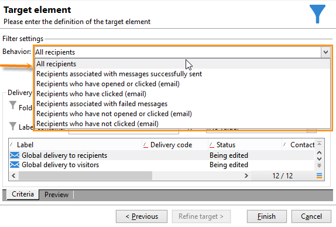

# 查询投放信息 {#querying-delivery-information}

## 特定投放的点击次数 {#number-of-clicks-for-a-specific-delivery}

在本例中，我们将恢复特定投放的点击数。 这些点击量会根据给定时间段内的收件人跟踪日志进行记录。 收件人通过其电子邮件地址进行标识。 此查询使用 **[!UICONTROL Recipient tracking logs]** 表格。

* 需要选择哪个表？

  收件人日志跟踪表(**[!UICONTROL nms:trackingLogRcp]**)

* 要为输出列选择的字段？

  主键（含计数）和电子邮件

* 信息过滤依据什么标准？

  投放标签的特定期间和元素

要执行此示例，请应用以下步骤：

1. 打开 **[!UICONTROL Generic query editor]** 并选择 **[!UICONTROL Recipient tracking logs]** 架构。

   

1. 在 **[!UICONTROL Data to extract]** 窗口中，我们希望创建一个聚合来收集信息。 为此，请添加主键（位于主键上方） **[!UICONTROL Recipient tracking logs]** 元素)：对此执行跟踪日志计数 **[!UICONTROL Primary key]** 字段。 编辑后的表达式将为 **[!UICONTROL x=count(primary key)]**. 它将各种跟踪日志的总和链接到单个电子邮件地址。

   操作步骤：

   * 单击 **[!UICONTROL Add]** 图标（位于页面右侧） **[!UICONTROL Output columns]** 字段。 在 **[!UICONTROL Formula type]** 窗口中，选择 **[!UICONTROL Edit the formula using an expression]** 选项并单击 **[!UICONTROL Next]**. 在 **[!UICONTROL Field to select]** 窗口，单击 **[!UICONTROL Advanced selection]**.

     

   * 在 **[!UICONTROL Formula type]** 窗口，对聚合函数运行进程。 此过程将为主键计数。

     选择 **[!UICONTROL Process on an aggregate function]** 在 **[!UICONTROL Aggregate]** 部分并单击 **[!UICONTROL Count]**.

     

     单击 **[!UICONTROL Next]**。

   * 选择 **[!UICONTROL Primary key (@id)]** 字段。 此 **[!UICONTROL count (primary key)]** 已配置输出列。

     

1. 选择要显示在输出列中的其他字段。 在 **[!UICONTROL Available fields]** 列，打开 **[!UICONTROL Recipient]** 节点并选择 **[!UICONTROL Email]**. 查看 **[!UICONTROL Group]** 框至 **[!UICONTROL Yes]** 要按电子邮件地址对跟踪日志进行分组：此组将每个日志链接到其收件人。

   

1. 配置列排序，以便最先显示最活跃的收件人（具有最多的跟踪日志）。 Check **[!UICONTROL Yes]** 在 **[!UICONTROL Descending sort]** 列。

   

1. 然后，您必须筛选出您感兴趣的日志，即存在时间少于2周并与销售相关投放相关的日志。

   操作步骤：

   * 配置数据筛选。 要执行此操作，请选择 **[!UICONTROL Filter conditions]** 然后单击 **[!UICONTROL Next]**.

     

   * 在特定投放的给定时间段内恢复跟踪日志。 需要三个过滤条件：两个日期条件，用于将搜索时段设置在当前日期之前的2周和当前日期之前的1天之间；另一个条件，用于将搜索限制到特定投放。

     在 **[!UICONTROL Target element]** 窗口中，配置将考虑跟踪日志的开始日期。 单击 **[!UICONTROL Add]**。将显示条件行。 编辑 **[!UICONTROL Expression]** 列，方法是单击 **[!UICONTROL Edit expression]** 函数。 在 **[!UICONTROL Field to select]** 窗口，选择 **[!UICONTROL Date (@logDate)]**.

     

     选择 **[!UICONTROL greater than]** 运算符。 在 **[!UICONTROL Value]** 列，单击 **[!UICONTROL Edit expression]**、和 **[!UICONTROL Formula type]** 窗口，选择 **[!UICONTROL Process on dates]**. 最后，在 **[!UICONTROL Current date minus n days]**，输入“15”。

     单击 **[!UICONTROL Finish]**。

     

   * 要选择跟踪日志搜索结束日期，请通过单击 **[!UICONTROL Add]**. 在 **[!UICONTROL Expression]** 列，选择 **[!UICONTROL Date (@logDate)]** 再来一次。

     选择 **[!UICONTROL less than]** 运算符。 在 **[!UICONTROL Value]** 列，单击 **[!UICONTROL Edit expression]**. 要处理日期，请转到 **[!UICONTROL Formula type]** 窗口中，输入“1” **[!UICONTROL Current date minus n days]**.

     单击 **[!UICONTROL Finish]**。

     

     现在，我们要配置第三个筛选条件，即查询涉及的投放标签。

   * 单击 **[!UICONTROL Add]** 函数，以创建另一个筛选条件。 在 **[!UICONTROL Expression]** 列，单击 **[!UICONTROL Edit expression]**. 在 **[!UICONTROL Field to select]** 窗口，选择 **[!UICONTROL Label]** 在 **[!UICONTROL Delivery]** 节点。

     单击 **[!UICONTROL Finish]**。

     

     查找包含“sales”一词的投放。 由于您不记得它的确切标签，因此可以选择 **[!UICONTROL contains]** 运算符，并在中输入“sales” **[!UICONTROL Value]** 列。

     

1. 单击 **[!UICONTROL Next]** 直到您到达 **[!UICONTROL Data preview]** 窗口：此处不需要设置格式。
1. 在 **[!UICONTROL Data preview]** 窗口，单击 **[!UICONTROL Start the preview of the data]** 用于查看每个投放收件人的跟踪日志数量。

   结果按降序显示。

   

   对于此投放，用户的最大日志数为6。 5个不同的用户打开了投放电子邮件或单击了电子邮件中的某个链接。

## 未打开任何投放的收件人 {#recipients-who-did-not-open-any-delivery}

在本例中，我们要筛选过去7天内未打开电子邮件的收件人。

要创建此示例，请应用以下步骤：

1. 拖放 **[!UICONTROL Query]** 活动，并打开该活动。
1. 单击 **[!UICONTROL Edit query]** 并将目标和筛选维度设置为 **[!UICONTROL Recipients]**.

   

1. 选择 **[!UICONTROL Filtering conditions]** 然后单击 **[!UICONTROL Next]**.
1. 单击 **[!UICONTROL Add]** 按钮并选择 **[!UICONTROL Tracking logs]**.
1. 设置 **[!UICONTROL Operator]** 的 **[!UICONTROL Tracking logs]** 表达式到 **[!UICONTROL Do not exist such as]**.

   

1. 添加另一个表达式。 选择 **[!UICONTROL Type]** 在 **[!UICONTROL URL]** 类别。
1. 然后，设置其 **[!UICONTROL Operator]** 到 **[!UICONTROL equal to]** 及其 **[!UICONTROL Value]** 到 **[!UICONTROL Open]**.

   

1. 添加另一个表达式并选择 **[!UICONTROL Date]**. **[!UICONTROL Operator]** 应设置为 **[!UICONTROL on or after]**.

   

1. 要设置最近7天的值，请单击 **[!UICONTROL Edit expression]** 中的按钮 **[!UICONTROL Value]** 字段。
1. 在 **[!UICONTROL Function]** 类别，选择 **[!UICONTROL Current date minus n days]** 并添加要定位的天数。 这里，我们要定位过去7天。

   

叫客过渡将包含过去7天内未打开电子邮件的收件人。

相反，如果您希望筛选至少打开了一封电子邮件的收件人，则您的查询应如下所示。 请注意，在本例中， **[!UICONTROL Filtering dimension]** 应设置为 **[!UICONTROL Tracking logs (Recipients)]**.

## 已打开投放的收件人 {#recipients-who-have-opened-a-delivery}

以下示例显示如何定向最近2周内打开过投放的用户档案：

1. 要定位已打开投放的用户档案，您需要使用跟踪日志。 它们存储在链接表中：首先从以下内容的下拉列表中选择此表： **[!UICONTROL Filtering dimension]** 字段，如下所示：

   

1. 关于过滤条件，单击 **[!UICONTROL Edit expression]** 在跟踪日志的子树结构中显示的标准图标。 选择 **[!UICONTROL Date]** 字段。

   

   单击 **[!UICONTROL Finish]** 以确认选择。

   要仅恢复两周前的跟踪日志，请选择 **[!UICONTROL Greater than]** 运算符。

   

   然后单击 **[!UICONTROL Edit expression]** 图标 **[!UICONTROL Value]** 列，以定义要应用的计算公式。 选择 **[!UICONTROL Current date minus n days]** 公式，并在相关字段中输入15。

   

   单击 **[!UICONTROL Finish]** 公式窗口的按钮。 在筛选窗口中，单击 **[!UICONTROL Preview]** 选项卡，以检查定位标准。

   

## 过滤投放后的收件人行为 {#filtering-recipients--behavior-folllowing-a-delivery}

在工作流中， **[!UICONTROL Query]** 和 **[!UICONTROL Split]** 允许您选择上一次投放后的行为。 此项选择是通过 **[!UICONTROL Delivery recipient]** 筛选。

* 示例的目的

  在投放工作流中，有几种方法可跟进第一个电子邮件通信。 此类操作涉及使用 **[!UICONTROL Split]** 盒子。

* 上下文

  发送“夏季体育优惠”投放。 投放四天后，将发送其他两个投放。 其中一个是“水上运动优惠”，另一个是第一个“夏季运动优惠”的后续服务。

  “水上运动选件”投放会发送给在第一次投放中单击“水上运动”链接的收件人。 这些点击显示收件人对该主题感兴趣。 有必要引导他们接受类似的提议。 但是，未点击“夏季体育优惠”的收件人将再次收到相同的内容。

以下步骤说明了如何配置 **[!UICONTROL Split]** 框中的两个不同行为：

1. 插入 **[!UICONTROL Split]** 框中。 此框将第一个投放的收件人划分为接下来的两个投放。 在首次投放期间，根据与收件人行为关联的筛选条件发生细分。

   

1. 打开 **[!UICONTROL Split]** 盒子。 在 **[!UICONTROL General]** 选项卡，输入标签： **根据行为拆分** 例如。

   

1. 在 **[!UICONTROL Subsets]** 选项卡，定义第一个拆分分支。 例如，输入 **已单击** 此分支的标签。
1. 选择 **[!UICONTROL Add a filtering condition on the incoming population]** 选项。 单击 **[!UICONTROL Edit]**。
1. 在 **[!UICONTROL Targeting and filtering dimension]** 窗口中，双击 **[!UICONTROL Recipients of a delivery]** 筛选。

   

1. 在 **[!UICONTROL Target element]** 窗口中，选择要应用于此分支的行为： **[!UICONTROL Recipients having clicked (email)]**.

   在下方，选择 **[!UICONTROL Delivery specified by the transition]** 选项。 此功能将在首次投放期间自动恢复目标人员。

   这是“水上运动选件”交付。

   

1. 定义第二个分支。 此分支将包括跟进电子邮件，其内容与首次投放的内容相同。 转到 **[!UICONTROL Subsets]** 选项卡，然后单击 **[!UICONTROL Add]** 创建它。

   

1. 将显示另一个子选项卡。 将其命名为&quot;**未单击**“。
1. 单击 **[!UICONTROL Add a filtering condition for the incoming population]**。然后单击 **[!UICONTROL Edit...]**。

   

1. 单击 **[!UICONTROL Delivery recipients]** 在 **[!UICONTROL Targeting and filtering dimension]** 窗口。
1. 在 **[!UICONTROL Target element]** 窗口中，选择 **[!UICONTROL Recipients who did not click (email)]** 行为。 选择 **[!UICONTROL Delivery specified by the transition]** 选项，如最后一个分支中所示。

   此 **[!UICONTROL Split]** 框现已完全配置。

   

以下是默认配置的各种组件的列表：

* **[!UICONTROL All recipients]**
* **[!UICONTROL Recipients of successfully sent messages,]**
* **[!UICONTROL Recipients who opened or clicked (email),]**
* **[!UICONTROL Recipients who clicked (email),]**
* **[!UICONTROL Recipients of a failed message,]**
* **[!UICONTROL Recipients who didn't open or click (email),]**
* **[!UICONTROL Recipients who didn't click (email).]**

  
