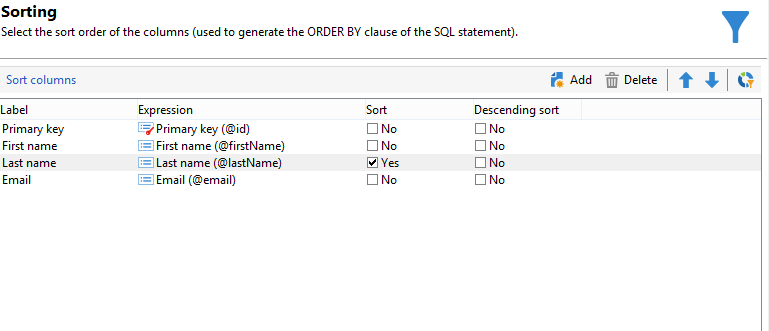

# 使用多对多关系进行查询 {#querying-using-a-many-to-many-relationship}


在本例中，我们要恢复过去7天内未联系的收件人。 此查询涉及所有投放。

此示例还说明如何配置与选择收集要素（或橙色节点）相关的过滤器。 收集要素位于 **[!UICONTROL Field to select]** 窗口。

* 需要选择哪个表？

  收件人表(**nms：recipient**)

* 要为输出列选择的字段

  主键、姓氏、名字和电子邮件

* 根据过滤信息的标准

  基于今天之前7天的收件人投放日志

应用以下步骤：

1. 打开通用查询编辑器并选择收件人表 **[!UICONTROL (nms:recipient)]**.
1. 在 **[!UICONTROL Data to extract]** 窗口，选择 **[!UICONTROL Primary key]**， **[!UICONTROL First name]**， **[!UICONTROL Last name]** 和 **[!UICONTROL Email]**.

   

1. 在排序窗口中，按字母顺序对名称排序。

   

1. 在 **[!UICONTROL Data filtering]** 窗口，选择 **[!UICONTROL Filtering conditions]**.
1. 在 **[!UICONTROL Target element]** 窗口中，用于提取过去7天内无跟踪日志的用户档案的过滤条件包括两个步骤。 您需要选择的元素是多对多链接。

   * 首先，选择 **[!UICONTROL Recipient delivery logs (broadlog)]** 第一个收集要素（橙色节点） **[!UICONTROL Value]** 列。

     

     选择 **[!UICONTROL do not exist as]** 运算符。 无需在此行中选择第二个值。

   * 第二过滤条件的内容取决于第一过滤条件。 在此， **[!UICONTROL Event date]** 字段直接在以下位置提供： **[!UICONTROL Recipient delivery logs]** 因为存在指向此表的链接。

     

     选择 **[!UICONTROL Event date]** 使用 **[!UICONTROL greater than or equal to]** 运算符。 选择 **[!UICONTROL DaysAgo (7)]** 值。 为此，请单击 **[!UICONTROL Edit expression]** 在 **[!UICONTROL Value]** 字段。 在 **[!UICONTROL Formula type]** 窗口，选择 **[!UICONTROL Process on dates]** 和 **[!UICONTROL Current date minus n days]**，将“7”作为值提供。

     

     筛选器条件已配置。

     

1. 在 **[!UICONTROL Data formatting]** 窗口，将姓氏切换为大写。 单击 **[!UICONTROL Last name]** 中的行 **[!UICONTROL Transformation]** 列并选择 **[!UICONTROL Switch to upper case]** （在下拉菜单中）。

   

1. 使用 **[!UICONTROL Add a calculated field]** 函数，用于将列插入数据预览窗口。

   在本例中，添加一个计算字段，将收件人的名字和姓氏添加到单列中。 单击 **[!UICONTROL Add a calculated field]** 函数。 在 **[!UICONTROL Export calculated field definition]** 窗口，输入标签和内部名称，然后选择 **[!UICONTROL JavaScript Expression]** 类型。 然后输入以下表达式：

   ```
   var rep = source._firstName+" - "+source._lastName
   return rep
   ```

   

   单击 **[!UICONTROL OK]**。此 **[!UICONTROL Data formatting]** 窗口已配置。

   有关添加计算字段的更多信息，请参阅此章节。

1. 结果显示在 **[!UICONTROL Data preview]** 窗口。 过去7天内未联系的收件人按字母顺序显示。 名称以大写显示，并且已创建具有名字和姓氏的列。

   
