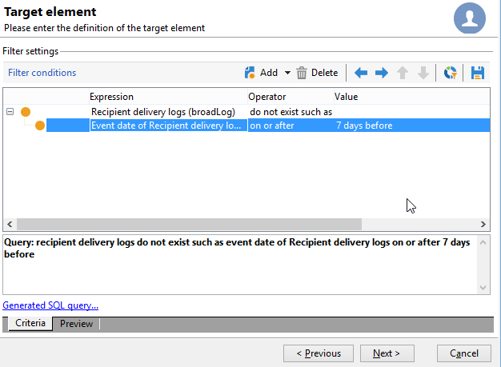

# 使用多对多关系进行查询 {#querying-using-a-many-to-many-relationship}


在本例中，我们要恢复过去7天内未联系的收件人。 此查询涉及所有投放。

此示例还说明如何配置与选择收集要素（或橙色节点）相关的过滤器。 收藏集元素在&#x200B;**[!UICONTROL Field to select]**&#x200B;窗口中可用。

* 需要选择哪个表？

  收件人表(**nms：recipient**)

* 要为输出列选择的字段

  主键、姓氏、名字和电子邮件

* 根据过滤信息的标准

  基于今天之前7天的收件人投放日志

应用以下步骤：

1. 打开通用查询编辑器并选择收件人表&#x200B;**[!UICONTROL (nms:recipient)]**。
1. 在&#x200B;**[!UICONTROL Data to extract]**&#x200B;窗口中，选择&#x200B;**[!UICONTROL Primary key]**、**[!UICONTROL First name]**、**[!UICONTROL Last name]**&#x200B;和&#x200B;**[!UICONTROL Email]**。

   

1. 在排序窗口中，按字母顺序对名称排序。

   

1. 在&#x200B;**[!UICONTROL Data filtering]**&#x200B;窗口中，选择&#x200B;**[!UICONTROL Filtering conditions]**。
1. 在&#x200B;**[!UICONTROL Target element]**&#x200B;窗口中，用于提取过去7天没有跟踪日志的用户档案的过滤条件包括两个步骤。 您需要选择的元素是多对多链接。

   * 首先，为前&#x200B;**[!UICONTROL Value]**&#x200B;列选择&#x200B;**[!UICONTROL Recipient delivery logs (broadlog)]**&#x200B;收藏集元素（橙色节点）。

     

     选择&#x200B;**[!UICONTROL do not exist as]**&#x200B;运算符。 无需在此行中选择第二个值。

   * 第二过滤条件的内容取决于第一过滤条件。 此处，**[!UICONTROL Event date]**&#x200B;字段直接在&#x200B;**[!UICONTROL Recipient delivery logs]**&#x200B;表中提供，因为存在指向此表的链接。

     

     选择包含&#x200B;**[!UICONTROL greater than or equal to]**&#x200B;运算符的&#x200B;**[!UICONTROL Event date]**。 选择&#x200B;**[!UICONTROL DaysAgo (7)]**&#x200B;值。 为此，请单击&#x200B;**[!UICONTROL Value]**&#x200B;字段中的&#x200B;**[!UICONTROL Edit expression]**。 在&#x200B;**[!UICONTROL Formula type]**&#x200B;窗口中，选择&#x200B;**[!UICONTROL Process on dates]**&#x200B;和&#x200B;**[!UICONTROL Current date minus n days]**，并提供“7”作为值。

     

     筛选器条件已配置。

     

1. 在&#x200B;**[!UICONTROL Data formatting]**&#x200B;窗口中，将姓氏切换为大写。 单击&#x200B;**[!UICONTROL Transformation]**&#x200B;列中的&#x200B;**[!UICONTROL Last name]**&#x200B;行，然后在下拉菜单中选择&#x200B;**[!UICONTROL Switch to upper case]**。

   

1. 使用&#x200B;**[!UICONTROL Add a calculated field]**&#x200B;函数在数据预览窗口中插入列。

   在本例中，添加一个计算字段，将收件人的名字和姓氏添加到单列中。 单击&#x200B;**[!UICONTROL Add a calculated field]**&#x200B;函数。 在&#x200B;**[!UICONTROL Export calculated field definition]**&#x200B;窗口中，输入标签和内部名称，然后选择&#x200B;**[!UICONTROL JavaScript Expression]**&#x200B;类型。 然后输入以下表达式：

   ```
   var rep = source._firstName+" - "+source._lastName
   return rep
   ```

   

   单击 **[!UICONTROL OK]**。已配置&#x200B;**[!UICONTROL Data formatting]**&#x200B;窗口。

   有关添加计算字段的更多信息，请参阅此章节。

1. 结果显示在&#x200B;**[!UICONTROL Data preview]**&#x200B;窗口中。 过去7天内未联系的收件人按字母顺序显示。 名称以大写显示，并且已创建具有名字和姓氏的列。

   
