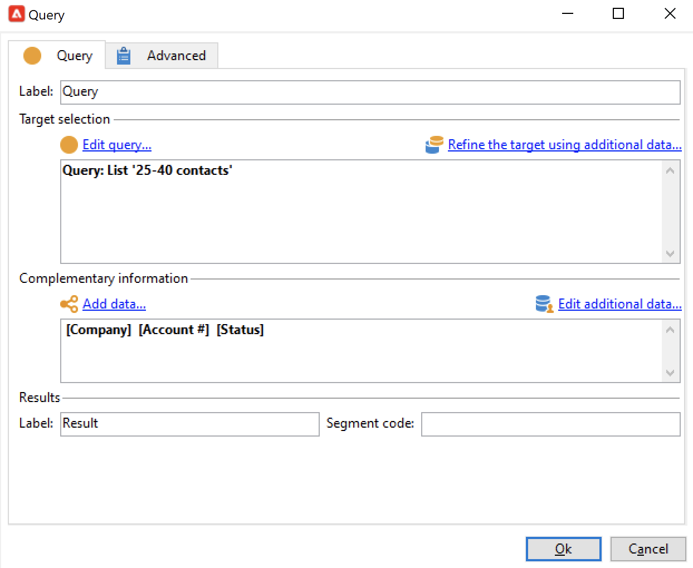
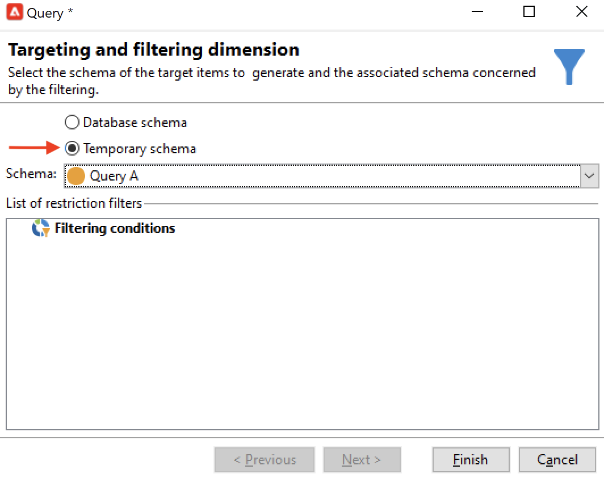
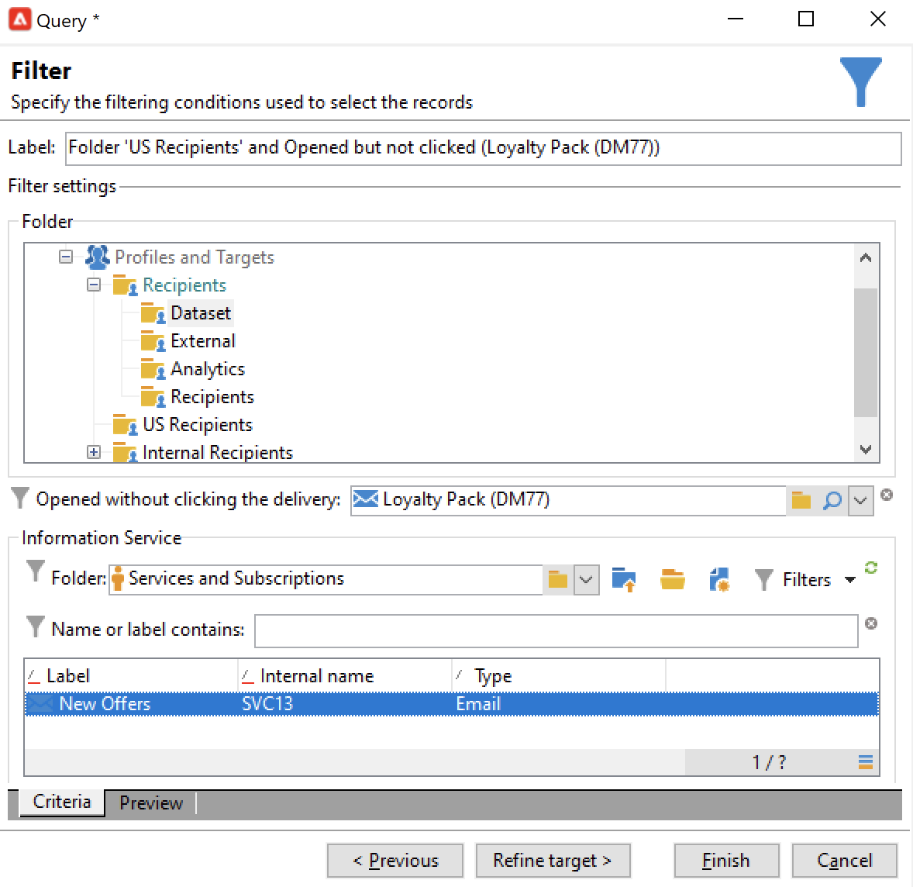

# 查询{#query}

## 创建查询 {#creating-a-query}

通过查询，您可以根据条件选择目标。 您可以将段代码与查询结果关联，并向其中插入附加数据。
有关查询示例的更多信息，请参阅此 [此部分](querying-recipient-table.md).

有关使用和管理附加数据的更多信息，请参阅 [添加数据](#adding-data).

的 **[!UICONTROL Edit query...]** 链接允许您通过以下方式定义群体的定位类型、限制和选择标准：

1. 选择定向和过滤维度。 默认情况下，会从收件人中选择目标。 限制筛选器的列表与用于投放定位的列表相同。

   定向维度与我们要处理的元素类型一致，例如操作所定向的群体。

   过滤维度允许收集这些元素，例如与目标人员（合同、完全和最终结算等）相关的信息。

   有关更多信息，请参阅 [定位和筛选维度](targeting-workflows.md#targeting-and-filtering-dimensions).

   

   查询可以根据来自集客过渡的数据（如有必要）通过选择 **[!UICONTROL Temporary schema]** 选择定位和筛选维度时，会出现以下问题。

   

1. 使用向导定义群体。 要输入的字段可能因目标类型而异。 您可以使用 **[!UICONTROL Preview]** 选项卡。

   有关创建和使用过滤器或查询的更多信息，请参阅此内容。

   

1. 如果已选择 **[!UICONTROL Filtering conditions]** 在步骤1中或使用 **[!UICONTROL Filters]** > **[!UICONTROL Advanced filter...]** 选项，则以后必须手动添加筛选条件。

   您还可以通过选中相应的框来添加数据分组条件。 要实现此目的，筛选维度必须与查询的定向维度不同。 有关分组的详细信息，请参阅 [部分](query-grouping-management.md).

   您还可以使用表达式生成器并将其与逻辑选项AND、OR和EXCEPT组合来添加更多标准。 然后，您可以预览**。

   如果您希望稍后重新使用过滤器，请保存该过滤器。

## 添加数据 {#adding-data}

利用额外的列，可收集有关目标群体的其他信息，例如合同编号、新闻稿订阅或来源。 此数据可存储在Adobe Campaign数据库或外部数据库中。

的 **[!UICONTROL Add data...]** 链接允许您选择要收集的附加数据。

首先，选择要添加的数据类型：

* 选择 **[!UICONTROL Data linked to the filtering dimension]** 来选择Adobe Campaign数据库中的数据。
* 选择 **[!UICONTROL External data]** 从外部数据库添加数据。 仅当您购买了 **联合数据访问** 选项。 有关更多信息，请参阅 [访问外部数据库(FDA)](accessing-an-external-database--fda-.md).
* 选择 **[!UICONTROL An offer proposition]** 选项，以添加一组列，用于存储选件引擎生成的最佳建议。 仅当您购买了 **互动** 模块。

如果平台上未安装可选模块，则不会显示此阶段。 你会被带到下一个阶段。

从Adobe Campaign数据库添加数据：

1. 选择要添加的数据类型。 这可以是属于过滤维度的数据或存储在链接表中的数据。

   

1. 如果数据属于查询的过滤维度，则只需在可用字段列表中选择该数据即可将其显示在输出列中。

   

   您可以添加：

   * 根据从目标群体或聚合中获取的数据（上个月的待定购买数、接收的平均金额等）计算的字段。 例如，转到 [选择数据](targeting-workflows.md#selecting-data).
   * 使用 **[!UICONTROL Add]** 按钮。

      您还可以添加信息集合，例如合同列表、最近5次投放等。 收藏集与可以具有同一用户档案多个值（1-N关系）的字段一致。 有关更多信息，请参阅 [编辑其他数据](targeting-workflows.md#editing-additional-data).

要添加链接到目标群体的信息集合，请执行以下操作：

1. 在向导的第一步中，选择 **[!UICONTROL Data linked to the filtering dimension]** 选项：
1. 选择包含要收集的信息的表并单击 **[!UICONTROL Next]**.

   

1. 如有必要，请通过选择 **[!UICONTROL Data collected]** 字段。 默认情况下，将恢复集合的所有行，然后根据下一步中指定的条件进行筛选。

   * 如果收藏集的单个元素与此收藏集的筛选条件一致，请选择 **[!UICONTROL Single row]** 在 **[!UICONTROL Data collected]** 字段。

      >[!IMPORTANT]
      >
      >此模式优化了由于集合元素上的直接连接而生成的SQL查询。
      >
      >如果不遵守初始条件，结果可能有缺陷（缺少线或重叠线）。

   * 如果选择恢复几行(**[!UICONTROL Limit the line count]**)可指定要收集的行数。
   * 如果收集的列包含聚合，例如声明的失败次数、网站平均支出等。 您可以使用 **[!UICONTROL Aggregates]** 值。

   

1. 指定集合的子选项。

   

1. 如果已选择 **[!UICONTROL Limit the line count]** 选项，定义收集数据的过滤顺序。 如果收集的行数大于您指定要保留的行数，则可使用筛选顺序指定要保留的行。

## 示例：基于简单的收件人属性定位 {#example--targeting-on-simple-recipient-attributes}

在下例中，该查询试图查明18至30岁在法国居住的男子。 此查询将用在旨在使其成为例如专用选件的工作流中。

>[!NOTE]
>
>其他查询示例请参见 [此部分](querying-recipient-table.md).

1. 命名查询，然后选择 **[!UICONTROL Edit query...]** 链接。
1. 选择 **[!UICONTROL Filtering conditions]** （在可用过滤器类型列表中）。
1. 为建议的目标输入不同的标准。 此处，使用AND选项组合了标准。 要纳入选择，收件人必须满足以下四个条件：

   * 标题为“Mr”的收件人(也可使用 **性别** 字段和选择 **男** 作为值)。
   * 30岁以下的收件人。
   * 18岁以上的收件人。
   * 住在法国的收件人。

   

   您可以查看与标准组合匹配的SQL:

   

1. 您可以通过在相关选项卡中预览与查询匹配的收件人，来检查标准是否正确：

   

1. 保存过滤器，以便您稍后通过单击 **[!UICONTROL Finish]** > **[!UICONTROL OK]**.
1. 通过向工作流中添加其他活动，继续编辑工作流。 启动查询并完成上一个查询步骤后，将显示找到的收件人数。 您可以使用鼠标弹出菜单（右键单击过渡>）显示更多详细信息 **[!UICONTROL Display the target...]**)。

   

## 输出参数 {#output-parameters}

* tableName
* 模式
* recCount

这组值由三个值组成，用于标识查询所定向的群体。 **[!UICONTROL tableName]** 是记录目标标识符的表的名称， **[!UICONTROL schema]** 是群体模式（通常为nms:recipient）和 **[!UICONTROL recCount]** 是表中的元素数。

此值是工作表的架构。 此参数适用于具有 **[!UICONTROL tableName]** 和 **[!UICONTROL schema]**.

## 优化查询 {#optimizing-queries}

以下部分提供了优化在Adobe Campaign上运行的查询以限制数据库工作量并改善用户体验的最佳实践。

### 连接和索引 {#joins-and-indexes}

* 有效的查询依赖于索引。
* 对所有连接使用索引。
* 在架构上定义链接将确定连接条件。 链接的表应在主键上具有唯一索引，且连接应位于此字段中。
* 通过在数字字段而不是字符串字段中定义键来执行联接。
* 避免执行外连接。 尽可能使用零ID记录来实现外部连接功能。
* 为联接使用正确的数据类型。

   确保 `where` 子句的类型与字段相同。

   一个常见的错误是： `iBlacklist='3'` where `iBlacklist` 是数字字段， `3` 表示文本值。

   确保知道查询的执行计划。 避免进行全表扫描，尤其是实时查询或几乎每分钟运行的实时查询。

   有关更多信息，请根据您的Campaign版本，参阅以下章节：

   !

   [  Campaign v8 文档](https://experienceleague.adobe.com/docs/campaign/campaign-v8/architecture/shemas-forms/database-mapping.html)

### 函数 {#functions}

* 请注意 `Lower(...)`. 使用Lower函数时，不使用Index。
* 使用“like”指令或“upper”或“lower”指令仔细检查查询。 在用户输入上应用“Upper”，而不是在数据库字段上应用。

   有关函数的更多信息，请参阅。

### 筛选维度 {#filtering-dimensions}

使用查询的过滤维度，而不是使用“存在，如”运算符。

在查询中，过滤器中的“存在，如”条件不有效。 它们等同于SQL中的子查询：

`select iRecipientId from nmsRecipient where iRecipientId IN (select iRecipientId from nmsBroadLog where (...))`

最佳做法是改用查询的过滤维度：

SQL中筛选维的等效项是内部连接：

`select iRecipientId from nmsRecipient INNER JOIN nmsBroadLog ON (...)`

有关筛选维度的更多信息，请参阅 [此部分](build-a-workflow.md#targeting-and-filtering-dimensions).

### 架构 {#architecture}

* 构建一个与生产平台具有相似卷、参数和架构的开发平台。
* 对开发和生产环境使用相同的值。 请尽可能使用相同的：

   * 操作系统,
   * 版本,
   * 数据,
   * 应用程序、
   * 卷。

   >[!NOTE]
   >
   >在开发环境中工作的功能在数据可能不同的生产环境中可能无法工作。 尝试识别主要差异以预测风险并准备解决方案。

* 进行与目标卷匹配的配置。 大型卷需要特定配置。 为100,000个收件人工作的配置可能不适用于10,000,000个收件人。

   考虑系统在启用时的扩展方式。 仅仅因为某些东西在小规模上起作用，并不意味着它适合于更大的体积。 应使用与生产中的卷类似的卷进行测试。 您还应评估在高峰时间、高峰天以及整个项目生命周期中卷（调用数、数据库大小）更改的影响。
