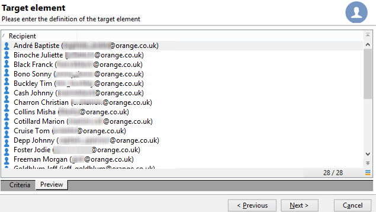

# 查询收件人表 {#querying-recipient-table}

在此示例中，我们希望恢复电子邮件域名为“orange.co.uk”且不居住在伦敦的收件人的姓名和电子邮件。

* 我们应该选择哪个表？

   收件人表(nms:recipient)

* 要选作输出列的字段

   电子邮件、名称、城市和帐号

* 收件人的筛选条件是什么？

   城市和电子邮件域

* 是否配置了类型？

   是，基于 **[!UICONTROL Account number]** 和 **[!UICONTROL Last name]**

要创建此示例，请应用以下步骤：

1. 单击 **[!UICONTROL Tools > Generic query editor...]** 然后选择 **收件人** (**nms:recipient**)表格。 然后单击 **[!UICONTROL Next]**。
1. 选择： **[!UICONTROL Last name]**, **[!UICONTROL First name]**, **[!UICONTROL Email]**, **[!UICONTROL City]** 和 **[!UICONTROL Account number]**. 这些字段将添加到 **[!UICONTROL Output columns]**. 然后单击 **[!UICONTROL Next]**。

   

1. 对列进行排序以按正确顺序显示列。 在此，我们希望按降序排列帐号，按字母顺序排列名称。 然后单击 **[!UICONTROL Next]**。

   

1. 在 **[!UICONTROL Data filtering]** 窗口，优化搜索：选择 **[!UICONTROL Filtering conditions]** 单击 **[!UICONTROL Next]**.
1. 的 **[!UICONTROL Target element]** 窗口中，您可以输入过滤器设置。

   定义以下过滤条件：电子邮件域等于“orange.co.uk”的收件人。 要执行此操作，请选择 **电子邮件域(@email)** 在 **[!UICONTROL Expression]** 列，选择 **等于** 在 **[!UICONTROL Operator]** 列中输入“orange.co.uk” **[!UICONTROL Value]** 列。

   

1. 如果需要，请单击 **[!UICONTROL Distribution of values]** 按钮以查看基于潜在客户电子邮件域的分发。 数据库中每个电子邮件域都有一个百分比。 在应用过滤器之前，将显示“orange.co.uk”以外的域。

   查询的摘要将显示在窗口底部： **电子邮件域等于“orange.co.uk”**.

1. 单击 **[!UICONTROL Preview]** 了解查询结果：仅显示“orange.co.uk”电子邮件域。

   

1. 我们现在将更改查询，以查找不住在伦敦的联系人。

   选择 **[!UICONTROL City (location/@city)]** 在 **[!UICONTROL Expression]** 列， **[!UICONTROL different from]** 作为运算符并输入 **[!UICONTROL London]** 在 **[!UICONTROL Value]** 列。

   

1. 这会将您转到 **[!UICONTROL Data formatting]** 窗口。 检查列顺序。 在“帐号”列下将“城市”列向上移动。

   取消选中“名字”列，将其从列表中删除。

   

1. 在 **[!UICONTROL Data preview]** 窗口，单击 **[!UICONTROL Start the preview of the data]**. 此函数计算查询的结果。

   的 **[!UICONTROL Column results]** 选项卡在列中显示查询结果。

   结果会显示不住在伦敦的所有拥有“orange.co.uk”电子邮件域的收件人。 未显示“名字”列，因为在上一阶段中未选中该列。 帐号按降序排序。

   

   的 **[!UICONTROL XML result]** 选项卡以XML格式显示结果。

   

   的 **[!UICONTROL Generated QSL queries]** 选项卡以SQL格式显示查询结果。

   
