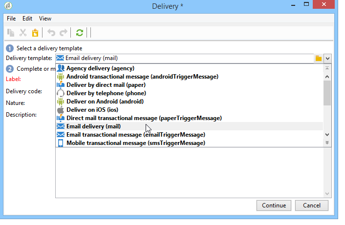

# 循环投放{#recurring-delivery}

A **[!UICONTROL Recurring delivery]** 利用活动，可配置特定于营销活动的投放模板发生次数。

 [通过观看视频了解此功能](#recurring-delivery-video)

此活动只能从 **[!UICONTROL Targeting and workflows]** 在营销活动中找到的选项卡。

操作步骤：

1. 选择活动将基于的投放模板。

   

1. 配置投放模板。

此活动的配置过程与根据可用选项创建投放模板的过程类似。

有关正在使用的此活动的示例，请参阅此 [部分](send-a-birthday-email.md#creating-a-recurring-delivery-in-a-targeting-workflow).

## 如何设置循环投放

A **循环投放** 每次执行时都会创建一个新的投放实例。 例如，如果工作流计划每周运行一次，那么一年后将产生 52 次投放。这也意味着广义日志和跟踪日志将按每个投放实例进行分隔。

如果要停止运行定期投放，则应完全取消活动或停止执行活动的工作流。 从Campaign仪表板停止投放只会停止投放发生：每次执行工作流时，将继续创建定期投放的下一个实例。

>[!NOTE]
>
>无法发送来自 **[!UICONTROL Recurring delivery]** 键入activity。
> 
>要通过活动工作流直接创建投放，请使用预配置的渠道特定活动(例如， **[!UICONTROL Email delivery]**)。

## 教程视频(#recurring-delivery-video)

此视频介绍如何配置循环投放和调度程序活动。

>[!VIDEO](https://video.tv.adobe.com/v/25040?quality=12)

提供了其他Campaign操作方法视频 [此处](https://experienceleague.adobe.com/docs/campaign-learn/tutorials/getting-started/introduction-to-adobe-campaign.html){target="_blank"}.
