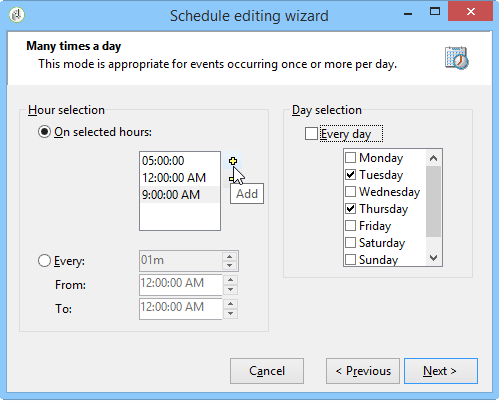

# 调度程序 {#scheduler}

此 **计划程序** 是一个持续性任务，会在计划指定的时间激活其过渡。

**[!UICONTROL Scheduler]** 活动应视为排程开始的时间。图表中的活动定向规则与 **[!UICONTROL Start]** 活动相同。此活动不得包含集客过渡。

## 最佳实践 {#best-practices}

* 请勿将工作流计划为每15分钟运行一次以上，因为它可能会影响整体系统性能，并在数据库中创建块。

* 请勿使用超过一个 **[!UICONTROL Scheduler]** 工作流中每个分支的活动。 请参阅 [使用活动](workflow-best-practices.md#using-activities).

* 使用调度程序活动可能会导致同时运行多个工作流执行。 例如，您可以让调度程序每小时触发一次工作流执行，但有时整个工作流的执行需要超过一小时。

  如果工作流已在运行，则您可能需要跳过执行。 有关如何防止同时执行工作流的详细信息，请参阅 [此页面](monitor-workflow-execution.md#preventing-simultaneous-multiple-executions).

* 请注意，如果工作流正在执行长期任务（如导入），或者wfserver模块已停止一段时间，则可以在数小时后激活过渡。 在这种情况下，可能需要将调度程序激活的任务的执行限制到特定时间范围。

## 配置调度程序活动 {#configuring-scheduler-activity}

调度程序定义转换的激活调度。 要对其进行配置，请双击图形对象，然后单击 **[!UICONTROL Change...]**

通过向导，可定义活动的频率和有效期。 配置步骤如下：

1. 选择激活频率并单击 **[!UICONTROL Next]**.

   

1. 给出激活时间和日期。 此步骤的参数取决于上一步骤中选择的频率。 如果选择每天启动活动多次，则配置选项将如下所示：

   

1. 定义计划的有效期，或指定执行计划的次数。

   

1. 检查配置并单击 **[!UICONTROL Finish]** 以保存。

   
