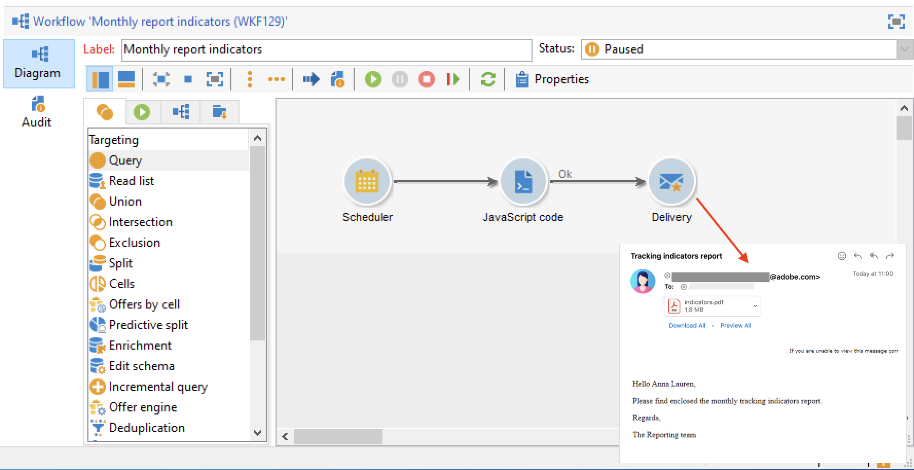

# 向列表发送报告{#send-a-report-to-a-list}

此用例详细说明了如何以PDF格式生成每月现成的&#x200B;**[!UICONTROL Tracking indicators]**&#x200B;报告，以及如何将其发送给收件人列表。



此用例的主要实施步骤包括：

* 为此报告创建收件人列表。 [了解详情](#step-1--create-the-recipient-list)。
* 创建一个投放模板，每次执行工作流时都会创建一个新投放。 [了解详情](#step-2--create-the-delivery-template)。
* 创建一个工作流，以生成PDF格式的报告，并将其发送到收件人列表。 [了解详情](#step-3--create-the-workflow))。

## 步骤1：创建收件人列表 {#step-1--create-the-recipient-list}

要创建目标收件人列表，请执行以下步骤：

1. 浏览到&#x200B;**[!UICONTROL Profiles and targets]**&#x200B;选项卡，单击&#x200B;**[!UICONTROL Lists]**&#x200B;链接。
1. 单击 **[!UICONTROL Create]** 按钮。
1. 选择&#x200B;**[!UICONTROL New list]**&#x200B;并为要发送的报告创建新的收件人列表。

有关创建列表的详细信息，请参阅[此章节](../../v8/audiences/create-audiences.md)。

## 第2步：创建投放模板 {#step-2--create-the-delivery-template}

要创建投放模板，请执行以下步骤：

1. 浏览到Adobe Campaign资源管理器的&#x200B;**[!UICONTROL Resources > Templates > Delivery templates]**&#x200B;节点并复制&#x200B;**[!UICONTROL Email delivery]**&#x200B;内置模板。

   有关创建投放模板的更多信息，请参阅[此章节](../../v8/send/create-templates.md)。

1. 输入模板参数：标签、目标（以前创建的收件人列表）、主题和内容。

   每次执行工作流时，都会更新&#x200B;**[!UICONTROL Tracking indicators]**&#x200B;报告，如[步骤3：创建工作流](#step-3--creating-the-workflow))中所述。

1. 要在投放中包含最新版本的报告，您需要添加&#x200B;**[!UICONTROL Calculated attachment]**：

   * 单击&#x200B;**[!UICONTROL Attachments]**&#x200B;链接，然后单击&#x200B;**[!UICONTROL Add]**&#x200B;按钮旁边的箭头。 选择 **[!UICONTROL Calculated attachment...]**。

     

   * 在&#x200B;**[!UICONTROL Type]**&#x200B;下拉列表中，选择最新的选项： **[!UICONTROL File name is computed during delivery of each message (it may then depend on the recipient profile)]**。

     

     在&#x200B;**[!UICONTROL Label]**&#x200B;字段中输入的值将不会显示在最终投放中。

   * 在文本区域中，输入文件的访问路径和名称。

     

     >[!CAUTION]
     >
     >路径和名称必须与在工作流的&#x200B;**[!UICONTROL JavaScript code]**&#x200B;类型活动中输入的路径和名称相同，如[步骤3：创建工作流](#step-3--creating-the-workflow)中所述。

   * 选择&#x200B;**[!UICONTROL Advanced]**&#x200B;选项卡并选中&#x200B;**[!UICONTROL Script the name of the file name displayed in the mails sent]**。 在文本区域中，在最终投放中输入附件的名称。

     

## 第3步：创建工作流 {#step-3--creating-the-workflow}

为此用例创建以下工作流。


它使用三个活动：

* 每月执行一次工作流的&#x200B;**[!UICONTROL Scheduler]**&#x200B;活动，
* 生成PDF格式报告的&#x200B;**[!UICONTROL JavaScript code]**&#x200B;活动，
* 引用之前创建的投放模板的&#x200B;**[!UICONTROL Delivery]**&#x200B;活动。

要构建此工作流，请执行以下步骤：

1. 浏览到Campaign Explorer的&#x200B;**[!UICONTROL Administration > Production > Technical workflows]**&#x200B;节点，并创建一个新文件夹来存储您的工作流。
1. 创建新工作流。

   

1. 首先添加&#x200B;**[!UICONTROL Scheduler]**&#x200B;类型活动并对其进行配置，以便工作流在每月第一个星期一执行。

   

   有关配置调度程序的详细信息，请参阅[调度程序](scheduler.md)。

1. 然后添加&#x200B;**[!UICONTROL JavaScript code]**&#x200B;类型活动。

   

   在编辑区域中输入以下代码：

   ```sql
   var reportName = "indicators";
   var path = "/tmp/indicators.pdf";
   var exportFormat = "PDF";
   var reportURL = "<PUT THE URL OF THE REPORT HERE>";
   var _ctx = <ctx _context="global" _reportContext="deliveryFeedback" />
   var isAdhoc = 0;
   
   xtk.report.export(reportName, _ctx, exportFormat, path, isAdhoc);
   ```


   变量一起使用：

   * **var reportName**：用双引号输入报告的内部名称。 在这种情况下，**跟踪指示器**&#x200B;报告的内部名称为“deliveryFeedback”。
   * **var路径**：输入文件的保存路径(“tmp”)、要为文件指定的名称(“deliveryFeedback”)以及文件扩展名(“.pdf”)。 在本例中，我们使用内部名称作为文件名。 值需要位于双引号之间并以“+”字符分隔。

     >[!CAUTION]
     >
     >文件必须保存在服务器上。 您必须为已计算的附件输入与编辑窗口的&#x200B;**[!UICONTROL General]**&#x200B;选项卡中相同的路径和名称，如详细的[此处](#step-2--create-the-delivery-template)所示。

   * **var exportFormat**：输入文件的导出格式(PDF)。
   * **var _ctx**（上下文）：在这种情况下，我们在其全局上下文中使用&#x200B;**[!UICONTROL Tracking indicators]**&#x200B;报告。

1. 通过使用以下选项添加&#x200B;**[!UICONTROL Delivery]**&#x200B;活动来完成：

   

   * **[!UICONTROL Delivery]**：选择&#x200B;**[!UICONTROL New, created from a template]**，然后选择之前创建的投放模板。
   * 对于&#x200B;**[!UICONTROL Recipients]**&#x200B;和&#x200B;**[!UICONTROL Content]**&#x200B;字段，请选择&#x200B;**[!UICONTROL Specified in the delivery]**。
   * **[!UICONTROL Action to perform]**：选择&#x200B;**[!UICONTROL Prepare and start]**。
   * 取消选中&#x200B;**[!UICONTROL Generate an outbound transition]**&#x200B;和&#x200B;**[!UICONTROL Process errors]**&#x200B;选项。

1. 保存更改并启动工作流。 该消息将于当月第一个星期一发送到收件人列表，并随附报告。
