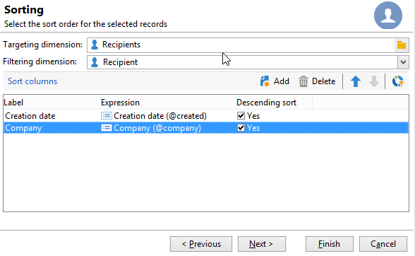

# 拆分{#split}

A **Split**-type活动允许您将目标拆分为多个子集。 使用所有接收结果构建目标：因此，必须完成所有先前的活动才能执行此活动。

此活动不会触发集客群体的联合。 如果多个过渡登陆一个拆分活动，我们建议插入 **[!UICONTROL Union]** 前面的活动。

>[!NOTE]
>
>不能对具有不同源的表执行拆分操作。 为此，您需要添加 **扩充** 之前的活动 **Split** 活动。

* 有关正在使用的拆分活动的示例，请参阅 [本节](targeting-workflows.md#create-subsets-using-the-split-activity).
* 有关说明如何使用拆分活动通过过滤条件将目标分段为不同群体的示例，请参见 [本节](cross-channel-delivery-workflow.md).
* 有关如何在拆分活动中使用实例变量的示例，请参见 [本节](javascript-scripts-and-templates.md).

要配置此活动，请在 **[!UICONTROL Subsets]** 选项卡，然后在中选择目标维度 **[!UICONTROL General]** 选项卡。

## 创建子集 {#create-subsets}

要创建子集，请执行以下操作：

1. 单击匹配字段中的标签，然后选择要应用的过滤器。
1. 要筛选集客群体，请选择 **[!UICONTROL Add a filtering condition]** 选项，然后单击 **[!UICONTROL Edit...]** 链接。

   选择要应用于要包含在此集中的数据的过滤器类型。

   该过程与相同 **查询**-type活动。

   >[!NOTE]
   >
   >您最多可以筛选两个外部数据库(FDA)中的数据。

1. 您可以指定从目标提取的最大记录数以创建子集。 要执行此操作，请查看 **[!UICONTROL Limit the selected records]** 选项，然后单击 **[!UICONTROL Edit...]** 链接。

   向导允许您为此子集的记录选择模式。 [了解详情](#limit-the-number-of-subset-records)。

   

1. 如果您愿意，可以 **添加其他子集** 使用 **[!UICONTROL Add]** 按钮。

   

   >[!NOTE]
   >
   >如果 **[!UICONTROL Enable overlapping of output populations]** 选项未选中，子集将按选项卡的顺序创建。 使用此窗口右上角的箭头来移动它们。 例如，如果第一个子集恢复初始群体的70%，则下一个子集将只对其余30%应用其选择标准，以此类推。

   对于创建的每个子集，将向拆分活动添加叫客过渡。

   

   您可以选择生成单个叫客过渡（例如，使用段代码标识集）：要执行此操作，请选择 **[!UICONTROL Generate subsets in the same table]** 中的选项 **[!UICONTROL General]** 选项卡。

   完成后，每个子集的段码将自动存储在一个附加的列中。 可在投放级别的个性化字段中访问此列。

## 限制子集记录数 {#limit-the-number-of-subset-records}

如果不希望使用子集中包含的整个群体，则可以限制它包含的记录数。

1. 在子集编辑窗口中，选中 **[!UICONTROL Limit the selected records]** 选项，然后单击 **[!UICONTROL Edit...]** 链接。
1. 为您的选择选择限制类型：

   * **[!UICONTROL Activate random sampling]**：此选项从记录中随机取样。 应用的随机取样类型取决于数据库引擎。
   * **[!UICONTROL Keep only the first records after sorting]**：利用此选项可根据一个或多个排序顺序定义限制。 如果您选择 **[!UICONTROL Age]** 字段作为排序标准，100作为限制，则仅保留100个最年轻的收件人。
   * **[!UICONTROL Keep the first ones after sorting (criteria, random)]**：此选项是前两个选项的组合。 它允许您根据一个或多个排序顺序定义限制，然后在某些记录具有与定义的标准相同的值时，对第一个记录应用随机选择。

     例如，如果您选择 **[!UICONTROL Age]** 字段作为排序标准，然后您定义100的限制，但数据库中2000个最年轻的收件人全部为18人，将从这些2000名收件人中随机选择100人。

   

1. 如果要定义排序标准，还可以通过附加步骤定义列和排序顺序。

   

1. 然后选择数据限制方法。

   

   可通过多种方法做到这一点：

   * **[!UICONTROL Size (in %)]**：记录的百分比。 例如，以下配置提取总群体的10%。

     百分比适用于初始群体，而不是活动结果。

   * **[!UICONTROL Size (as a % of the segment)]**：仅与子集有关而与初始群体无关的记录的百分比。
   * **[!UICONTROL Maximum size]**：最大记录数。
   * **[!UICONTROL By data grouping]**：您可以根据集客群体的指定字段中的值设置记录数限制。 [了解详情](#limit-the-number-of-subset-records-by-data-grouping)。
   * **[!UICONTROL By data grouping (in %)]**：根据指定字段中的值（使用百分比），您可以设置集客群体的记录数限制。 [了解详情](#limit-the-number-of-subset-records-by-data-grouping)。
   * **[!UICONTROL By data distribution]**：如果分组字段的值太多，或者您想避免为每个新的拆分活动再次输入值，则可以使用Adobe Campaign配置 **[!UICONTROL By data distribution]** 限制（可选分布式营销模块）。 [了解详情](#limit-the-number-of-subset-records-per-data-distribution)。

1. 单击 **[!UICONTROL Finish]** 批准记录选择标准。 定义的配置随后将显示在编辑器的中间窗口中。

## 按数据分组限制子集记录数 {#limit-the-number-of-subset-records-by-data-grouping}

您可以按数据分组限制记录数。 可使用固定值或百分比执行此限制。

例如，如果您选择 **[!UICONTROL Language]** 字段作为组字段，可以定义每种语言的记录列表。

1. 选择数据限制值后，选择 **[!UICONTROL By data grouping]** 或 **[!UICONTROL By data grouping (as a %)]** 并单击 **[!UICONTROL Next]**.

   

1. 然后选择分组字段( **[!UICONTROL Language]** 字段)，然后单击 **[!UICONTROL Next]**.

   

1. 最后，指定数据分组阈值（使用固定值或百分比，具体取决于之前选择的分组方法）。 要为每个值设置相同的阈值，例如，如果您希望将每种语言的记录数设置为10，请选择 **[!UICONTROL All data groupings are the same size]** 选项。 要为每个值设置不同的限制，请选择 **[!UICONTROL Limitations by grouping value]** 选项。 这将允许您为英语、法语等语言选择不同的限制。

   

1. 单击 **[!UICONTROL Finish]** 以批准限制并返回到编辑拆分活动。

## 限制每个数据分布的子集记录数 {#limit-the-number-of-subset-records-per-data-distribution}

如果分组字段包含的值过多，或者希望避免为每个新的拆分活动重置值，则可以使用Adobe Campaign根据数据分布创建限制。 选择时 [数据限制值](#create-subsets) 部分)，选择 **[!UICONTROL By data distribution]** 选项并从下拉菜单中选择模板。 下面演示了如何创建数据分发模板。

例如， **[!UICONTROL Local approval]** 使用分发模板的活动，请参阅 [此页面](local-approval-activity.md).

>[!CAUTION]
>
>此函数仅适用于 [分布式营销附加功能](../distributed-marketing/about-distributed-marketing.md). 请核实您的许可协议。

通过数据分发模板，您可以使用分组值列表限制记录数。 要创建数据分发模板，请应用以下步骤：

1. 要创建数据分发模板，请转到 **[!UICONTROL Resources > Campaign management > Data distribution]** 节点并单击 **[!UICONTROL New]**.

   

1. 此 **[!UICONTROL General]** 选项卡允许您输入分发的标签和执行上下文（定向维度、分发字段）。

   

   需要输入以下字段：

   * **[!UICONTROL Label]**：分发模板的标签。
   * **[!UICONTROL Targeting dimension]**：输入要应用数据分布的定向维度， **[!UICONTROL Recipient]** 例如。 此架构必须始终与定位工作流中使用的数据兼容。
   * **[!UICONTROL Distribution field]**：通过定向维度选择字段。 例如，如果您选择 **[!UICONTROL Email domain]** 字段中，将按域划分收件人列表。
   * **[!UICONTROL Distribution type]**：选择在中划分目标限制值的方式 **[!UICONTROL Distribution]** 选项卡： **[!UICONTROL Percentage]** 或 **[!UICONTROL Set]**.
   * **[!UICONTROL Approval storage]**：如果您使用 [本地审批](local-approval.md) 活动在定位工作流中，输入将存储审批结果的架构。 您必须为每个定位架构指定一个存储架构。 如果您使用 **[!UICONTROL Recipients]** 定位架构，输入默认值 **[!UICONTROL Local approval of recipients]** 存储模式。

     如果未经本地批准而由数据分组进行简单限制，则无需输入 **[!UICONTROL Approvals storage]** 字段。

1. 如果您使用 [本地审批](local-approval.md) 活动，输入 **[!UICONTROL Advanced settings]** 对于分发模板：

   

   需要输入以下字段：

   * **[!UICONTROL Approve targeted messages]**：如果您希望从要批准的收件人列表中预选所有收件人，请选中此选项。 如果未选中此选项，则不会预先选择任何收件人。

     >[!NOTE]
     >
     >此选项默认处于选中状态。

     

   * **[!UICONTROL Delivery label]**：可让您定义表达式，以在退货通知中显示投放标签。 默认表达式提供有关投放标准标签（计算字符串）的信息。 您可以修改此表达式。

     

   * **[!UICONTROL Grouping field]**：利用此字段，可定义用于在批准和返回通知中显示收件人的分组。

     

   * **[!UICONTROL Web Interface]**：用于将Web应用程序链接到收件人列表。 在批准和返回通知中，每个收件人都将可点击，并将链接到选定的Web应用程序。 此 **[!UICONTROL Parameters]** 字段(例如 **[!UICONTROL recipientId]**)，可配置要在URL和Web应用程序中使用的其他参数。

1. 此 **[!UICONTROL Breakdown]** 选项卡允许您定义分发值的列表。

   

   * **[!UICONTROL Value]**：输入分布值。
   * **[!UICONTROL Percentage / Set]**：输入链接到每个值的记录限制（固定或百分比）。

     此列由 **[!UICONTROL Distribution type]** 中的字段 **[!UICONTROL General]** 选项卡。

   * **[!UICONTROL Label]**：输入链接到每个值的标签。
   * **[!UICONTROL Group or operator]**：如果您使用[本地审批](local-approval.md) 活动，选择分配给每个分配值的运算符或运算符组。

     如果未经本地批准而由数据分组进行简单限制，则无需输入 **[!UICONTROL Group or operator]** 字段。

     >[!CAUTION]
     >
     >确保为操作员分配了适当的权限。

## 过滤参数 {#filtering-parameters}

单击 **[!UICONTROL General]** 选项卡，以输入活动标签。 为此拆分选择目标和筛选维度。 如有必要，可以更改给定子集的这些维度。

查看 **[!UICONTROL Generate complement]** 选项。 补充是集客目标减去子集的并集。 然后，将向活动添加其他叫客过渡，如下所示：

要使此选项正常工作，集客数据必须具有主键。

例如，如果数据是通过Netezza（不支持索引的概念）直接从外部数据库读取的， **[!UICONTROL Data loading (RDBMS)]** 活动，由生成的补充 **[!UICONTROL Split]** 活动将不正确。

要避免此情况，您可以拖放 **[!UICONTROL Enrichment]** 之前的活动 **[!UICONTROL Split]** 活动。 在 **[!UICONTROL Enrichment]** 活动，请查看 **[!UICONTROL Keep all additional data from the main set]** 并在附加数据中指定要用于配置过滤器的 **[!UICONTROL Split]** 活动。 来自集客过渡的数据 **[!UICONTROL Split]** 然后，将活动本地存储在Adobe Campaign服务器上的临时表中，并且可以正确生成补码。

此 **[!UICONTROL Enable overlapping of output populations]** 利用选项，可管理属于多个子集的群体：

* 如果未勾选该框，则拆分活动将确保即使收件人满足多个子集的条件，也无法存在于多个输出转换中。 它们将位于第一个选项卡的目标中，并带有匹配条件。
* 选中此框后，如果收件人符合筛选条件，则可以在多个子集中找到他们。 Adobe Campaign建议使用排除条件。

## 输入参数 {#input-parameters}

* 表名
* 模式

每个入站事件必须指定由这些参数定义的目标。

## 输出参数 {#output-parameters}

* 表名
* 模式
* recCount

这组三个值可标识排除项导致的目标。 **[!UICONTROL tableName]** 是记录目标标识符的表的名称， **[!UICONTROL schema]** 是群体的模式（通常为nms：recipient）和 **[!UICONTROL recCount]** 是表中的元素数。

与补充关联的转换具有相同的参数。
