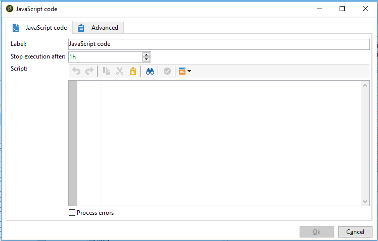

# SQL 代码和 JavaScript 代码{#sql-code-and-javascript-code}


## SQL 代码 {#sql-code}

**[!UICONTROL SQL code]**&#x200B;活动执行SQL脚本。 脚本是JST模板。


* **[!UICONTROL Script]**

  编辑器的中心区域包含要执行的脚本。 此脚本是一个JST模板，因此可以根据工作流上下文进行配置。

* **[!UICONTROL Processing errors]**

  请参阅[处理错误](monitor-workflow-execution.md#processing-errors)。

## JavaScript代码和高级JavaScript代码 {#javascript-code}

**[!UICONTROL JavaScript code]**&#x200B;和&#x200B;**[!UICONTROL Advanced JavaScript code]**&#x200B;活动在工作流上下文中执行JavaScript脚本。 有关脚本的更多信息，请参阅以下章节：

* [JavaScript 脚本和模板](javascript-scripts-and-templates.md)
* [工作流中的 JavaScript 代码示例](javascript-in-workflows.md)

### 执行延迟 {#exec-delay}

从20.2版本开始，向&#x200B;**[!UICONTROL JavaScript code]**&#x200B;和&#x200B;**[!UICONTROL Advanced JavaScript code]**&#x200B;活动添加了执行延迟。 默认情况下，执行阶段不能超过 1 小时。在此延迟后，进程将中止，并显示一条错误消息，活动执行将失败。

您可在这些活动中可用的&#x200B;**[!UICONTROL Stop execution after]**&#x200B;字段中更改此延迟。

要忽略此限制，您需要将该值设置为&#x200B;**0**。

### JavaScript 代码 {#js-code-desc}



* **[!UICONTROL Script]**：编辑器的中心区域包含要执行的脚本。

* **[!UICONTROL Process errors]**：请参阅[处理错误](monitor-workflow-execution.md#processing-errors)。

### 高级 JavaScript 代码 {#adv-js-code-desc}


* **[!UICONTROL First call]**：编辑器的第一个区域包含要在第一次调用期间执行的脚本。
* **[!UICONTROL Next calls]**：编辑器的第二个区域包含要在下次调用期间执行的脚本。
* **[!UICONTROL Transitions]**：您可以定义多个活动输出过渡。
* **[!UICONTROL Schedule]**： **[!UICONTROL Schedule]**&#x200B;选项卡允许您计划何时触发活动。

高级JavaScript是一项持续性的任务，如果未标记为已完成，则会定期召回。 要终止任务并防止将来出现调用，您必须使用&#x200B;**[!UICONTROL Next calls]**&#x200B;部分中的&#x200B;**task.setCompleted()**&#x200B;方法：

```
task.postEvent(task.transitionByName("ok")); // to transition to Ok branch
task.setCompleted();

return 0;
```
