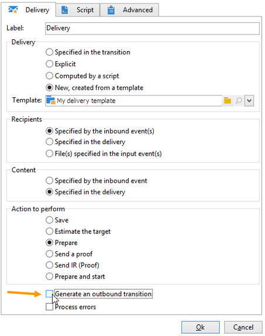

# 开始和结束{#start-and-end}

**[!UICONTROL Start]**&#x200B;和&#x200B;**[!UICONTROL End]**&#x200B;活动允许您以图形方式标记工作流的开始和结束。 这些活动没有功能影响，因此是可选的。

* **[!UICONTROL Start]**

  执行工作流时，会从没有集客过渡的活动和开始类型活动开始。

  

* **[!UICONTROL End]**

  您可以配置&#x200B;**[!UICONTROL End]**&#x200B;活动以中断所有正在进行的任务。 要实现此目的，请双击活动以显示其属性，然后选中相应的选项。

  

  启用结束活动后，将自动删除工作表中的数据。 如果不需要此操作，并且为了避免不必要的加载，您可以选择在最后一个活动输出中禁用过渡。 例如，在投放输出中，如果未计划任何流程，则取消选中相关选项，如下所示：

  
