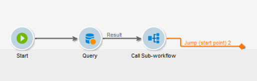

# 子工作流{#sub-workflow}

**[!UICONTROL Sub-workflow]**&#x200B;活动允许您触发另一个工作流的执行并恢复结果。 通过此活动，您可在使用简化界面的同时使用复杂的工作流。

您可以在单个工作流中调用多个子工作流。 子工作流被同步执行。

在下面的示例中，主工作流使用跳转调用子工作流。 有关跳转类型图形对象的详细信息，请参阅[本节](jump-start-point-and-end-point.md)。

1. 创建要用作另一个工作流中的子工作流的工作流。
1. 在工作流开头插入优先级为1的&#x200B;**[!UICONTROL Jump (end point)]**&#x200B;活动。 如果您有多个“端点”类型跳转，Adobe Campaign将使用编号最低的“端点”跳转。
1. 在工作流末尾插入优先级为2的&#x200B;**[!UICONTROL Jump (start point)]**&#x200B;活动。 如果您有多个“起点”类型跳转，Adobe Campaign将使用具有最高数字的“起点”跳转。

   

   >[!NOTE]
   >
   >如果子工作流活动引用具有多个&#x200B;**[!UICONTROL Jump]**&#x200B;活动的工作流，则子工作流将在编号最低的“端点”类型跳转和编号最高的“起点”类型跳转之间执行。
   >
   >要使子工作流正确运行，必须只有一个编号最低的“终点”类型跳转，并且只有一个编号最高的“起点”类型跳转。

1. 完成并保存此“子工作流”。
1. 创建主工作流。
1. 插入&#x200B;**[!UICONTROL Sub-workflow]**&#x200B;活动并将其打开。
1. 从&#x200B;**[!UICONTROL Workflow template]**&#x200B;下拉列表中选择您要使用的工作流。

   

1. 您还可以添加配置脚本以更改引用的工作流。
1. 单击 **[!UICONTROL Ok]**。它会从所选工作流中自动创建标签为&#x200B;**[!UICONTROL Jump (start point)]**&#x200B;活动的叫客过渡。

   

1. 运行工作流。

运行后，被调用为子工作流的工作流将保持&#x200B;**[!UICONTROL Being edited]**&#x200B;状态，这意味着以下内容：

* 无法右键单击过渡来显示目标。
* 无法显示中间群体的计数。
* 子工作流日志显示在主工作流中。

  

>[!NOTE]
>
>如果子工作流中发生任何错误，主工作流将暂停，并会创建子工作流的副本。

## 输入参数（可选） {#input-parameters--optional-}

* 表名
* 架构

每个入站事件必须指定由这些参数定义的目标。

## 输出参数 {#output-parameters}

* 表名
* 架构
* recCount

这组三个值标识查询所定向的群体。 **[!UICONTROL tableName]**&#x200B;是记录目标标识符的表的名称，**[!UICONTROL schema]**&#x200B;是群体的架构（通常为nms：recipient），**[!UICONTROL recCount]**&#x200B;是表中的元素数。

* targetSchema：此值是工作表的架构。 此参数对于具有&#x200B;**[!UICONTROL tableName]**&#x200B;和&#x200B;**[!UICONTROL schema]**&#x200B;的所有过渡都有效。
