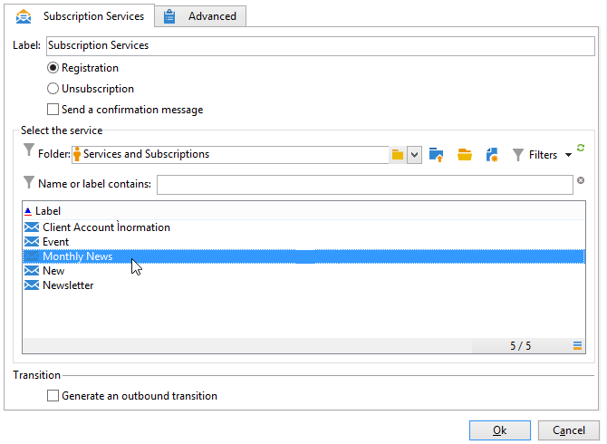

# 订阅服务{#subscription-services}

A **订阅服务**-type活动允许您为过渡中指定的群体创建或删除对信息服务的订阅。

要对其进行配置，请编辑活动并输入其标签，然后选择要执行的操作（订阅或退订）以及相关的服务，如以下示例所示：

1. 输入活动的标签。
1. 选择 **[!UICONTROL Generate an outbound transition]** 如果您希望在执行结束时创建过渡。

   通常，目标对信息服务的订阅会标记定位工作流的结尾，这也是默认情况下不激活该选项的原因。

1. 单击 **[!UICONTROL Subscription]** 或 **[!UICONTROL Unsubscription]** 您要将指定群体订阅到所选信息服务，或从所选信息服务取消订阅指定群体。
1. 选择 **[!UICONTROL Send a confirmation message]** 通知收件人他们已订阅或取消订阅服务。

   在与信息服务相关的投放模板中指定此消息的内容。

## 示例：订阅新闻稿的收件人列表 {#example--subscribe-a-list-of-recipients-to-a-newsletter}

在一次操作中，以下工作流旨在列出有资格订阅新闻通讯的收件人列表（面向居住在巴黎的劳动者），以便让他们订阅。

要实现此目的，还必须排除已订阅的收件人。

>[!CAUTION]
>
>在手动为收件人订阅服务之前，请验证这些收件人是否接受来自您的通信。

1. 添加以下三个查询：

   * 其中一项针对的是18至60岁的收件人。
   * 第二个目标是居住在巴黎的收件人。
   * 第三个定向是当前未订阅新闻稿的收件人。

1. 添加交叉引用不同结果的交叉点活动。
1. 如果需要，可插入列表更新，以使最新订阅者的列表保持最新。
1. 插入订阅服务活动，然后双击该活动以进行配置。
1. 输入活动标签并选择 **[!UICONTROL Subscription]**.

   如有需要，您可以通过查看 **[!UICONTROL Send a confirmation message]** 盒子。

1. 选择新闻稿所在的文件夹，然后从显示的列表中选择新闻稿。
1. 保留 **[!UICONTROL Generate outbound transition]** 已取消选中，以便此活动将标记工作流的结尾，然后单击 **[!UICONTROL Ok]**.

在执行工作流期间，与所有三个查询对应的收件人将添加到列表并订阅新闻稿。

您可以通过转到 **[!UICONTROL Subscription]** 选项卡。

## 输入参数 {#input-parameters}

* 表名
* 架构

每个入站事件都必须指定由这些参数定义的目标。
