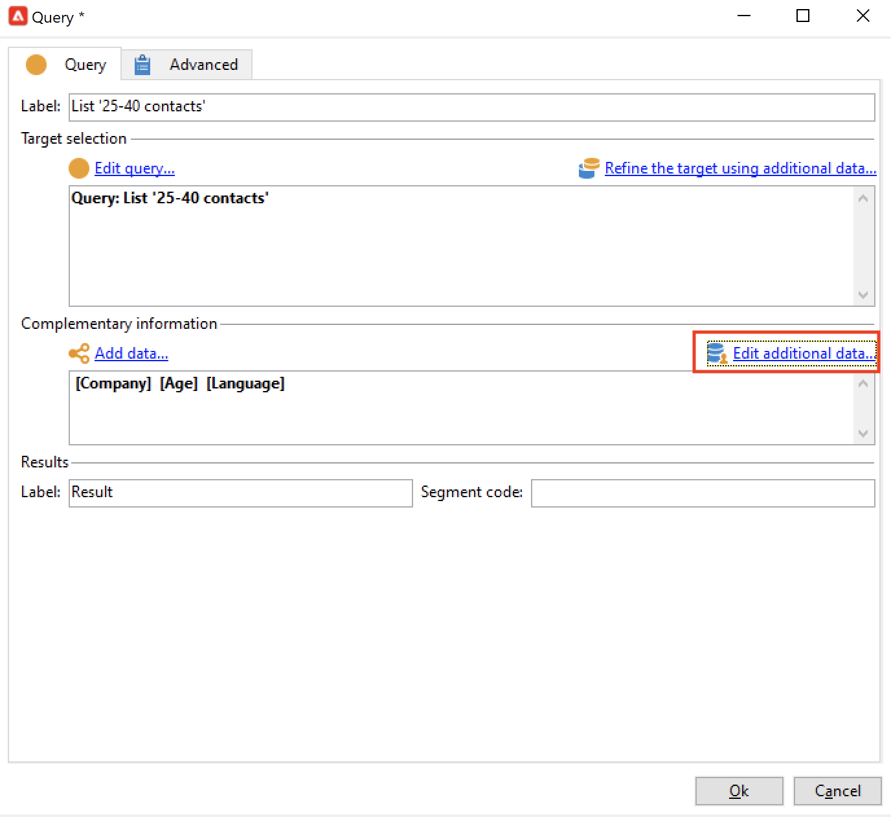
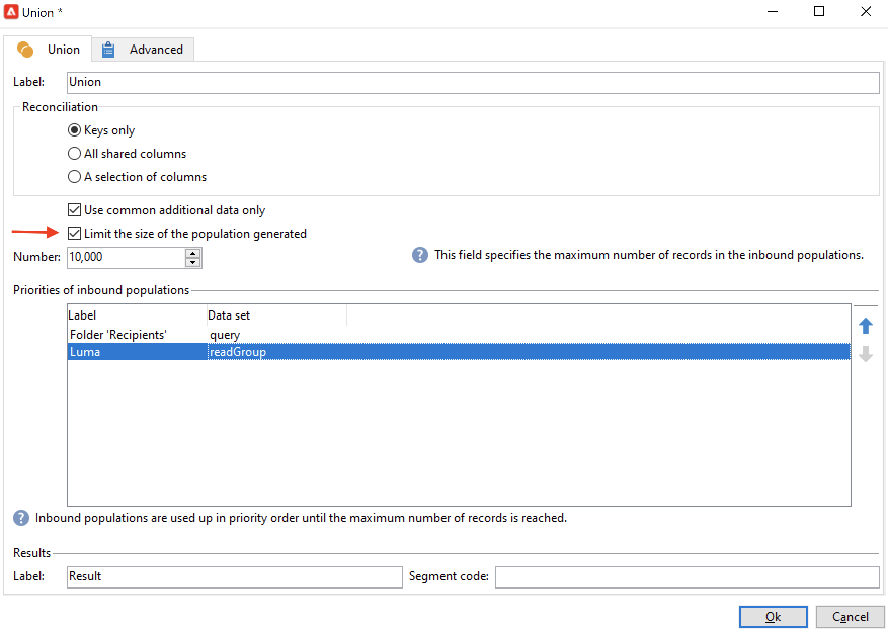
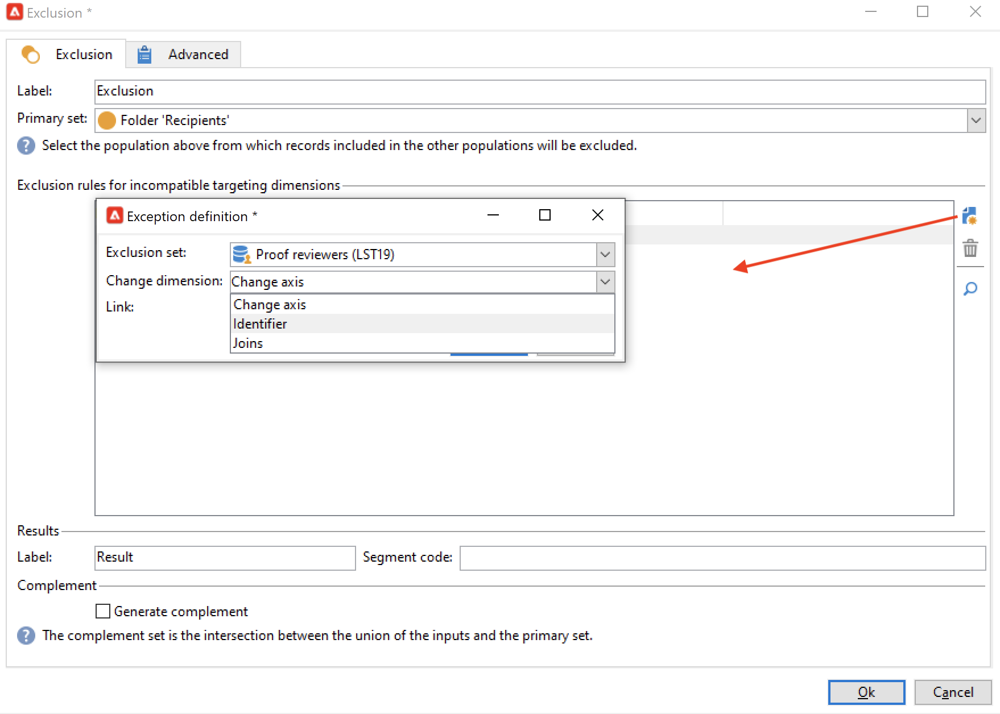

# 创建定位工作流{#target-data}

工作流可用于查询数据库并对数据进行分段。 Campaign工作流模块是一个功能强大的工具，可用于执行数据管理活动、提取、扩充和转换数据、管理受众以及优化群体。

利用定位工作流，可构建多个投放目标。 您可以通过工作流活动创建查询、根据特定条件定义联合或排除项、添加计划。 此定位的结果可以自动传输到充当投放操作目标的列表

除了这些活动之外，数据管理选项还允许您处理数据和访问高级功能，以满足复杂的定位问题。 有关更多信息，请参阅 [数据管理](targeting-workflows.md#data-management).

所有这些活动都可以在第一个工作流选项卡中找到。

>[!NOTE]
>
>有关定位活动的详情，请参见 [本节](activities.md).

定位工作流可以通过以下方式创建和编辑 **[!UICONTROL Profiles and Targets > Jobs > Targeting workflows]** Adobe Campaign节点，或者通过 **[!UICONTROL Profiles and Targets > Targeting workflows]** 主页的菜单。

营销活动框架中的定位工作流与所有营销活动工作流一起存储。

## 创建定位工作流程的关键步骤 {#implementation-steps-}

以下各节详细介绍了创建定位工作流的步骤：

1. **识别** 数据库中的数据 — 请参阅 [创建查询](#create-queries)
1. **准备** 数据以满足投放需求 — 请参阅 [扩充和修改数据](#enrich-and-modify-data)
1. **使用** 要执行更新或在投放中执行的数据 — 请参阅 [更新数据库](use-workflow-data.md#update-the-database)

定位期间执行的所有增强和所有处理的结果存储在个性化字段中并可访问，尤其是在创建个性化消息时使用。 有关更多信息，请参阅 [目标数据](use-workflow-data.md#target-data).

## 定位和筛选维度 {#targeting-and-filtering-dimensions}

在数据分段操作过程中，定位键将映射到筛选维度。定位维度可让您定义操作的目标人群：收件人、合同受益人、操作人员、订阅者等。筛选维度可让您根据特定标准选择人群：合同持有人、时事通讯订阅者等。

例如，要选择投保人寿保险单时间超过5年的客户，请选择以下定向维度： **客户端** 和以下过滤维度： **合同持有人**. 然后，您可以在查询活动中定义筛选条件

在定向维度选择阶段，界面中只提供兼容的筛选维度。

这两个维度必须相关。 因此， **[!UICONTROL Filtering dimension]** 列表取决于在第一个字段中指定的定向维度。

例如，对于收件人(**收件人**)，则以下筛选维度将可用：

而为 **访客**，该列表将包含以下筛选维度：

## 创建查询 {#create-queries}

### 使用其他数据 {#select-data}

A **[!UICONTROL Query]** 通过活动，可选择基本数据以构建目标群体。 如需详细信息，请参阅[此部分](query.md#create-a-query)。

您还可以使用以下活动来查询和优化数据库中的数据： [增量查询](incremental-query.md)， [读取列表](read-list.md).

可以在整个工作流的生命周期中收集要转发和处理的其他数据。 有关更多信息，请参阅 [添加数据](query.md#add-data) 和 [编辑其他数据](#edit-additional-data).

### 编辑其他数据 {#edit-additional-data}

添加附加数据后，您可以对其进行编辑或将其用于优化查询活动中定义的目标。

此 **[!UICONTROL Edit additional data...]** 链接允许您查看添加的数据，并对其进行修改或添加。

要将数据添加到以前定义的输出列，请在可用字段列表中选择该数据。 要创建新输出列，请单击 **[!UICONTROL Add]** 图标，然后选择该字段并单击 **[!UICONTROL Edit expression]**.

单击 **高级选择** 按钮。

为要添加的字段定义计算模式，例如聚合。

此 **[!UICONTROL Add a sub-item]** 选项允许您将计算数据附加到集合。 这样，您就可以从集合中选择附加数据或定义集合元素的汇总计算。

子元素将显示在它们所映射到的集合的子树中。

收藏集显示在 **[!UICONTROL Collections]** 子选项卡。 您可以通过单击 **[!UICONTROL Detail]** 图标。 过滤器向导允许您选择收集的数据并指定要应用于集合中数据的过滤条件。

### 使用附加数据优化目标 {#refine-the-target-using-additional-data}

通过收集的其他数据，可优化数据库中的数据筛选。 要执行此操作，请单击 **[!UICONTROL Refine the target using additional data...]** 链接：这允许您对添加的数据进行过度筛选。

### 均匀化数据 {#homogenize-data}

In **[!UICONTROL Union]** 或 **[!UICONTROL Intersection]** 类型活动，您可以选择仅保留共享的附加数据，以保持数据一致。 在这种情况下，此活动的临时输出工作表将仅包含在所有集客集中找到的附加数据。

### 使用附加数据进行协调 {#reconciliation-with-additional-data}

在数据协调阶段(**[!UICONTROL Union]**， **[!UICONTROL Intersection]**&#x200B;等。 活动)，您可以从其他列中选择要用于数据协调的列。 要实现此目的，请在所选列上配置协调并指定主集。 然后选择窗口下方的列中的列，如以下示例所示：

选择表达式并确认。

### 创建子集 {#create-subsets}

此 **[!UICONTROL Split]** 利用活动，可根据通过提取查询定义的条件创建子集。 对于每个子集，在编辑群体的筛选条件时，您将访问标准查询活动，从中可定义目标分段条件。

除了目标数据之外，您还可以仅使用附加数据作为筛选条件将目标拆分为多个子集。 如果您已购买 **联合数据访问** 选项。

如需详细信息，请参阅[此部分](#create-subsets-using-the-split-activity)。

## 区段数据 {#segment-data}

### 合并多个目标（并集） {#combine-several-targets--union-}

利用合并活动，您可以将多个活动的结果合并到一个过渡中。 集不一定必须是同质的。

以下数据协调选项可用：

* **[!UICONTROL Keys only]**

   如果输入群体是同质的，则可以使用此选项。

* **[!UICONTROL All columns in common]**

   利用此选项，可根据目标各个群体的共有所有列协调数据。

   Adobe Campaign根据列的名称标识列。 接受容差阈值：例如，“电子邮件”列可以识别为与“@email”列相同。

* **[!UICONTROL A selection of columns]**

   选择此选项可定义将应用数据协调的列的列表。

   首先，选择主集（包含源数据的集），然后选择要用于连接的列。

   

   >[!CAUTION]
   >
   >在数据协调期间，不会为群体去重。

   您可以将群体大小限制为给定的记录数。 为此，请单击相应的选项并指定要保留的记录数。

   此外，指定集客群体的优先级：窗口的下半部分列出了合并活动的集客过渡，并允许您使用窗口右侧的蓝色箭头对它们进行排序。

   首先，从列表中第一个集客过渡的群体中获取记录，然后，如果尚未达到最大值，则从第二个集客过渡的群体中获取记录，依此类推。

   

### 提取连接数据（交集） {#extract-joint-data--intersection-}

利用交集，可仅恢复由集客过渡群体共享的行。 此活动必须像合并活动一样进行配置。

此外，可以只保留选定的列，也可以只保留由集客群体共享的列。

有关交叉点活动的详情，请参见 [交叉](intersection.md) 部分。

### 排除群体（排除） {#exclude-a-population--exclusion-}

通过排除活动，您可以从其他目标群体中排除目标元素。 此活动的输出定向维度将是主集的定向维度。

如有必要，可以处理入站表。 事实上，要从其他维度中排除某个目标，该目标必须返回到与主要目标相同的定向维度。 要执行此操作，请单击 **[!UICONTROL Add]** 按钮并指定尺寸更改条件。

数据协调是通过标识符、更改轴或连接执行的。

### 使用拆分活动创建子集 {#create-subsets-using-the-split-activity}

此 **[!UICONTROL Split]** 活动是一个标准活动，通过该活动，可根据需要通过一个或多个筛选维度创建尽可能多的集，并可为每个子集生成一个输出过渡或生成一个唯一过渡。

集客过渡传送的附加数据可在筛选标准中使用。

要对其进行配置，您首先需要选择标准：

1. 在工作流中，拖放 **[!UICONTROL Split]** 活动。
1. 在 **[!UICONTROL General]** 选项卡中，选择所需的选项： **[!UICONTROL Use data from the target and additional data]**， **[!UICONTROL Use the additional data only]** 或 **[!UICONTROL Use external data]**.
1. 如果 **[!UICONTROL Use data from the target and additional data]** 选项时，您可以通过定向维度使用集客过渡传送的所有数据。

   

   创建子集时，会使用上述过滤参数。

   要定义筛选条件，请选择 **[!UICONTROL Add a filtering condition on the inbound population]** 选项，然后单击 **[!UICONTROL Edit...]** 链接。 然后，指定用于创建此子集的筛选条件。

   

   一个示例，显示如何在中使用筛选条件 **[!UICONTROL Split]** 有关将目标划分为不同群体的活动，请参阅 [本节](cross-channel-delivery-workflow.md).

   此 **[!UICONTROL Label]** 利用字段，可为新创建的子集指定一个名称，该名称将与叫客过渡匹配。

   您还可以为子集分配区段代码以标识该子集并使用它定位其群体。

   如有必要，您可以为要创建的每个子集分别更改定位和筛选维度。 要执行此操作，请编辑子集的过滤条件并检查 **[!UICONTROL Use a specific filtering dimension]** 选项。

   

1. 如果 **[!UICONTROL Use the additional data only]** 选项，则只提供附加数据用于子集过滤。

1. 如果 **联合数据访问** 选项时，将 **[!UICONTROL Use external data]** 用于在已配置的外部数据库中处理数据，或创建新数据库连接。

然后，我们需要添加新子集：

1. 单击 **[!UICONTROL Add]** 按钮并定义筛选条件。

   

1. 在中定义筛选维度 **[!UICONTROL General]** 选项卡（见上文）。默认情况下，它适用于所有子集。

   

1. 如有必要，可以单独更改每个子集的过滤维度。 通过此功能，可为所有金卡持有者构建一个组合，一个组合适合所有点击了最新新闻通讯的收件人，第三个组合适合过去30天内进行店内购买的18至25岁人士，所有组合均使用相同的拆分活动。 要执行此操作，请选择 **[!UICONTROL Use a specific filtering dimension]** 选项并选择数据筛选上下文。

创建子集后，默认情况下，拆分活动显示的输出过渡与子集显示的数量相同：

可以将所有这些子集分组到一个输出转变中。 在这种情况下，指向各个子集的链接将显示在段代码中，例如。 要执行此操作，请选择 **[!UICONTROL Generate all subsets in the same table]** 选项。

例如，您可以放置单个投放活动，并根据每个收件人集的区段代码对投放内容进行个性化。

还可以使用创建子集 **[!UICONTROL Cells]** 活动。 有关详情，请参阅 [单元格](cells.md) 部分。

### 使用目标数据 {#using-targeted-data}

标识并准备数据后，便可在以下上下文中使用它：

* 可在各个工作流阶段中进行数据处理后更新数据库中的数据。

   要了解更多信息， [更新数据](update-data.md).

* 您还可以刷新现有列表的内容。

   有关更多信息，请参阅 [列表更新](list-update.md).

* 您可以直接在工作流中准备或开始投放。

   有关更多信息，请参阅 [投放](delivery.md)， [投放控制](delivery-control.md) 和 [连续投放](continuous-delivery.md).

## 数据管理 {#data-management}

在Adobe Campaign中，数据管理通过提供更高效、更灵活的工具，结合了一系列活动来解决复杂的定位问题。 这样，您就可以使用与合约、订阅、对投放的反应等相关信息，对与联系人的所有通信实施一致的管理。 通过数据管理，您可以在分段操作期间跟踪数据生命周期，特别是：

* 通过包括未在数据集市中建模的数据，简化及优化定位流程（创建新表：根据设定，对每个定位工作流进行本地扩展）。
* 保留和传送缓冲区计算内容，尤其是在目标建构阶段或进行数据库管理时。
* 访问外部数据库（可选）：在定位过程中考虑异构数据库。

为了实施这些操作，Adobe Campaign提供：

* 数据收集活动： [文件传输](file-transfer.md)， [正在加载数据（文件）](data-loading--file-.md)， [数据加载(RDBMS)](data-loading--rdbms-.md)， [更新数据](update-data.md). 收集数据的第一步是准备数据，以便能够在其他活动中处理数据。 为了确保工作流正确执行并提供预期结果，需要监控多个参数。 例如，在导入数据时，此数据的主键(Pkey)对于每个记录必须是唯一的。
* 目标定位活动已通过“数据管理”选项进行了扩充： [查询](query.md)， [并集](union.md)， [交叉](intersection.md)， [Split](split.md). 这允许您在来自多个不同定向维的数据之间配置并集或交集，前提是数据协调是可能的。
* 数据转换活动： [扩充](enrichment.md)， [更改维度](change-dimension.md).

>[!CAUTION]
>
>链接两个工作流时，删除源表元素并不意味着删除链接到该元素的所有数据。
>  
>例如，通过工作流删除收件人并不会导致所有收件人的投放历史记录被删除。 但是，直接在“Recipients”文件夹中删除收件人确实会导致与此收件人关联的所有数据被删除。

### 扩充和修改数据 {#enrich-and-modify-data}

除了定向维度之外，过滤维度还允许您指定收集数据的性质。 请参阅[此小节](targeting-workflows.md#targeting-and-filtering-dimensions)。

识别的数据和收集的数据可以被扩充、聚合和操作以优化目标构建。 为此，除了中详述的数据操作活动之外，还需执行以下操作 [本节](#segmen-data)，请使用以下内容：

* 此 **[!UICONTROL Enrichment]** 通过活动，您可以暂时向架构添加列，并向某些元素添加信息。 有关详情，请参见 [扩充](enrichment.md) 活动存储库的部分。
* 此 **[!UICONTROL Edit schema]** 通过活动，可修改架构的结构。 有关详情，请参见 [编辑架构](edit-schema.md) 活动存储库的部分。
* 此 **[!UICONTROL Change dimension]** 利用活动，可在目标构建周期中更改定向维度。 有关详情，请参见 [更改维度](change-dimension.md) 部分。
