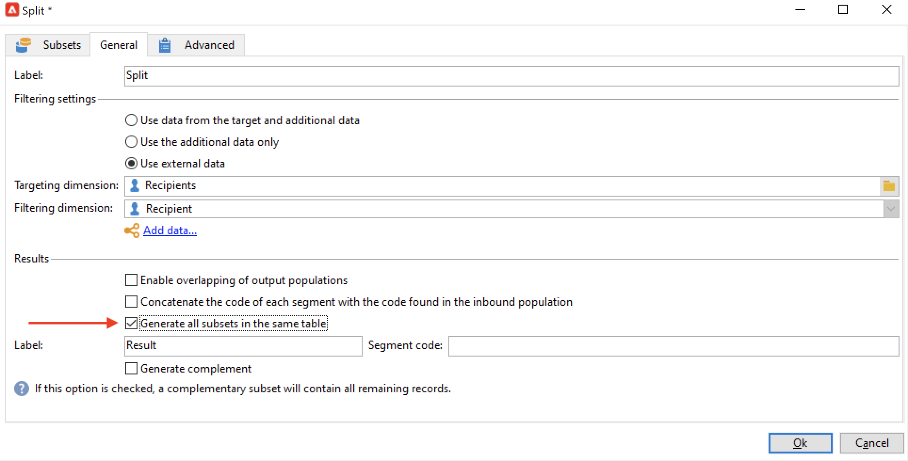

# 创建定位工作流{#target-data}

工作流可用于查询数据库和对数据进行分段。 营销活动工作流模块是一个功能强大的工具，可用于执行数据管理活动、提取、扩充和转换数据、管理受众并优化群体。

定位工作流允许您构建多个投放目标。 借助工作流活动，您可以创建查询、根据特定条件定义联合或排除、添加计划。 此定位的结果可自动转移到列表中，该列表可用作投放操作的目标

除了这些活动之外，数据管理选项还允许您处理数据并访问高级功能以满足复杂的定位问题。 有关更多信息，请参阅 [数据管理](targeting-workflows.md#data-management).

所有这些活动都可以在第一个工作流选项卡中找到。

>[!NOTE]
>
>定位活动详见 [此部分](activities.md).

定位工作流可通过 **[!UICONTROL Profiles and Targets > Jobs > Targeting workflows]** Adobe Campaign树的节点或通过 **[!UICONTROL Profiles and Targets > Targeting workflows]** 菜单。

营销活动框架内的定位工作流与所有营销活动工作流一起存储。

## 创建定位工作流的关键步骤 {#implementation-steps-}

有关创建定位工作流的详细步骤，请参阅以下章节：

1. **识别** 数据库中的数据 — 请参阅 [创建查询](#create-queries)
1. **准备** 满足投放需求的数据 — 请参阅 [丰富和修改数据](#enrich-and-modify-data)
1. **使用** 用于执行更新或在投放中执行更新的数据 — 请参阅 [更新数据库](use-workflow-data.md#update-the-database)

定位期间执行的所有扩充和所有处理的结果都存储在个性化字段中并可访问，特别是在创建个性化消息时使用。 有关更多信息，请参阅 [目标数据](use-workflow-data.md#target-data).

## 定位和筛选维度 {#targeting-and-filtering-dimensions}

在数据分段操作期间，定向键值会映射到过滤维度。 利用定向维度，可定义操作所定向的群体：收件人、合同受益人、操作员、订阅者等 通过筛选维度，您可以根据特定条件选择群体：合同持有者、新闻稿订阅者等

例如，要选择拥有寿险保单超过5年的客户，请选择以下定向维度： **客户** 和以下过滤维度： **合同持有人**. 然后，您可以在查询活动中定义筛选条件

在定向维度选择阶段，界面中仅提供兼容的过滤维度。

这两个维度必须相关。 因此， **[!UICONTROL Filtering dimension]** 列表取决于在第一个字段中指定的定向维度。

例如，对于收件人(**收件人**)，则以下过滤维度将可用：

为 **访客**，则列表将包含以下过滤维度：

## 创建查询 {#create-queries}

### 使用其他数据 {#select-data}

A **[!UICONTROL Query]** 活动允许您选择基本数据以构建目标群体。 如需详细信息，请参阅[此部分](query.md#create-a-query)。

您还可以使用以下活动来查询和优化来自数据库的数据： [增量查询](incremental-query.md), [读取列表](read-list.md).

可以收集要在整个工作流生命周期中转发和处理的其他数据。 有关更多信息，请参阅 [添加数据](query.md#add-data) 和 [编辑其他数据](#edit-additional-data).

### 编辑其他数据 {#edit-additional-data}

添加附加数据后，您可以对其进行编辑或使用它来优化查询活动中定义的目标。

的 **[!UICONTROL Edit additional data...]** 利用链接，可查看添加的数据并对其进行修改或添加到其中。

要向之前定义的输出列添加数据，请在可用字段列表中选择该数据。 要创建新的输出列，请单击 **[!UICONTROL Add]** 图标，然后选择字段并单击 **[!UICONTROL Edit expression]**.

单击 **高级选择** 按钮。

为要添加的字段定义计算模式，例如聚合。

的 **[!UICONTROL Add a sub-item]** 选项允许您将计算数据附加到集合。 这允许您从集合中选择附加数据，或定义集合元素的聚合计算。

子元素将显示在它们映射到的集合的子树中。

收藏集显示在 **[!UICONTROL Collections]** 子选项卡。 您可以通过单击 **[!UICONTROL Detail]** 图标。 过滤器向导允许您选择收集的数据并指定要应用于集合中数据的过滤条件。

### 使用附加数据优化目标 {#refine-the-target-using-additional-data}

通过收集的附加数据，可以优化数据库中的数据过滤。 为此，请单击 **[!UICONTROL Refine the target using additional data...]** 链接：这样，您就可以对添加的数据进行过滤。

### 数据均匀化 {#homogenize-data}

在 **[!UICONTROL Union]** 或 **[!UICONTROL Intersection]** 类型活动时，您可以选择仅保留共享的附加数据以保持数据一致。 在这种情况下，此活动的临时输出工作表将仅包含所有集客集中找到的附加数据。

### 与其他数据协调 {#reconciliation-with-additional-data}

在数据协调阶段(**[!UICONTROL Union]**, **[!UICONTROL Intersection]**&#x200B;等。 活动)，则可以从其他列中选择要用于数据协调的列。 为此，请针对所选列配置协调并指定主集。 然后，选择窗口下列中的列，如以下示例所示：

选择表达式并确认。

### 创建子集 {#create-subsets}

的 **[!UICONTROL Split]** 活动允许您根据通过提取查询定义的标准创建子集。 对于每个子集，在编辑群体的筛选条件时，您将访问标准查询活动，该活动允许您定义目标分段条件。

您可以将目标分割成多个子集，只使用附加数据作为筛选条件，或者除了目标数据之外，还使用附加数据。 如果您购买了 **联合数据访问** 选项。

如需详细信息，请参阅[此部分](#create-subsets-using-the-split-activity)。

## 区段数据 {#segment-data}

### 合并多个目标（并集） {#combine-several-targets--union-}

利用并集活动，可在一个过渡中合并多个活动的结果。 集不一定必须是同质的。

以下数据协调选项可用：

* **[!UICONTROL Keys only]**

   如果输入群体是同质的，则可以使用此选项。

* **[!UICONTROL All columns in common]**

   利用此选项，可根据目标各种群体共有的所有列协调数据。

   Adobe Campaign根据列的名称来标识列。 接受容差阈值：例如，“电子邮件”列可被识别为与“@email”列相同。

* **[!UICONTROL A selection of columns]**

   选择此选项可定义要应用数据协调之列的列表。

   首先，选择主集（包含源数据的集），然后选择要用于连接的列。

   

   >[!CAUTION]
   >
   >在数据协调期间，不会删除重复的群体。

   您可以将群体大小限制为给定数量的记录。 为此，请单击相应的选项并指定要保留的记录数。

   此外，指定集客群体的优先级：窗口的下部列出并集活动的集客过渡，并允许您使用窗口右侧的蓝色箭头对它们进行排序。

   将首先从列表中第一个集客过渡的群体中获取记录，如果未达到最大值，则将从第二个集客过渡的群体中获取记录，等等。

   

### 提取关节数据（交集） {#extract-joint-data--intersection-}

利用交集，可仅恢复集客过渡群体共享的线条。 必须像并集活动一样配置此活动。

此外，可以仅保留一些列选项，或仅保留集客群体共享的列。

有关交集活动的详情，请参阅 [交集](intersection.md) 中。

### 排除群体（排除） {#exclude-a-population--exclusion-}

利用排除活动，可从其他目标群体中排除目标的元素。 此活动的输出定向维度将为主集的维度。

必要时，可以处理集客表。 事实上，要从其他维度中排除某个目标，必须将此目标返回到与主目标相同的定向维度。 为此，请单击 **[!UICONTROL Add]** 按钮并指定维度更改条件。

通过标识符、更改轴或连接执行数据协调。

### 使用拆分活动创建子集 {#create-subsets-using-the-split-activity}

的 **[!UICONTROL Split]** 活动是一种标准活动，允许您通过一个或多个筛选维度创建所需数量的集，以及为每个子集生成一个输出过渡或一个唯一过渡。

由集客过渡传送的附加数据可用于筛选条件。

要对其进行配置，您首先需要选择以下标准：

1. 在您的工作流中，拖放 **[!UICONTROL Split]** 活动。
1. 在 **[!UICONTROL General]** 选项卡，选择所需的选项： **[!UICONTROL Use data from the target and additional data]**, **[!UICONTROL Use the additional data only]** 或 **[!UICONTROL Use external data]**.
1. 如果 **[!UICONTROL Use data from the target and additional data]** 选项时，利用定向维度可使用集客过渡传送的所有数据。

   

   在创建子集时，会使用上述筛选参数。

   要定义筛选条件，请选择 **[!UICONTROL Add a filtering condition on the inbound population]** 选项，然后单击 **[!UICONTROL Edit...]** 链接。 然后，指定用于创建此子集的筛选条件。

   

   显示如何在 **[!UICONTROL Split]** 将目标细分为不同群体的活动，如 [此部分](cross-channel-delivery-workflow.md).

   的 **[!UICONTROL Label]** 字段中，您可以为新创建的子集指定一个名称，该名称将匹配叫客过渡。

   您还可以为子集分配段码以识别该子集，并使用该子集来定位其群体。

   如有必要，您可以针对要创建的每个子集分别更改定位和筛选维度。 为此，请编辑子集的筛选条件并检查 **[!UICONTROL Use a specific filtering dimension]** 选项。

   

1. 如果 **[!UICONTROL Use the additional data only]** 选项，则仅提供用于子集筛选的附加数据。

1. 如果 **联合数据访问** 选项，则 **[!UICONTROL Use external data]** 允许您处理已配置的外部数据库中的数据，或创建与数据库的新连接。

然后，我们需要添加新子集：

1. 单击 **[!UICONTROL Add]** 按钮并定义筛选条件。

   

1. 在 **[!UICONTROL General]** 选项卡（请参阅上文）。默认情况下，它适用于所有子集。

   

1. 如有必要，您可以单独更改每个子集的过滤维度。 这样，您就可以为所有金牌卡持有者构建一个集，一个用于点击最新新闻稿的所有收件人，另一个用于18至25岁在过去30天内进行店内购买的人员，所有这些人都使用相同的拆分活动。 为此，请选择 **[!UICONTROL Use a specific filtering dimension]** 选项，然后选择数据过滤上下文。

创建子集后，默认情况下，拆分活动会显示与有子集一样多的输出过渡：

您可以将所有这些子集分组到一个输出过渡中。 在这种情况下，指向相应子集的链接将在段代码中可见，例如。 为此，请选择 **[!UICONTROL Generate all subsets in the same table]** 选项。

例如，您可以放置单个投放活动，并根据每个收件人集的段码对投放内容进行个性化。

还可以使用 **[!UICONTROL Cells]** 活动。 有关更多信息，请参阅 [单元格](cells.md) 中。

### 使用目标数据 {#using-targeted-data}

识别和准备数据后，即可在以下上下文中使用该数据：

* 您可以根据各种工作流阶段中的数据操作来更新数据库中的数据。

   欲知更多， [更新数据](update-data.md).

* 您还可以刷新现有列表的内容。

   有关更多信息，请参阅 [列表更新](list-update.md).

* 您可以在工作流中直接准备或开始投放。

   有关更多信息，请参阅 [投放](delivery.md), [投放控制](delivery-control.md) 和 [连续投放](continuous-delivery.md).

## 数据管理 {#data-management}

在Adobe Campaign中，数据管理通过提供更高效、更灵活的工具，将一组活动整合在一起，用于解决复杂的定位问题。 这样，您就可以使用与合同、订阅、对投放的反应等相关的信息，对与联系人的所有通信实施一致的管理。 通过数据管理，您可以在分段操作期间跟踪数据生命周期，特别是：

* 通过包括未在数据集市中建模的数据，简化及优化定位流程（创建新表：根据设定，对每个定位工作流进行本地扩展）。
* 保留和传送缓冲区计算内容，尤其是在目标建构阶段或进行数据库管理时。
* 访问外部数据库（可选）：在定位过程中考虑异构数据库。

为实施这些操作，Adobe Campaign提供：

* 数据收集活动： [文件传输](file-transfer.md), [数据加载（文件）](data-loading--file-.md), [数据加载(RDBMS)](data-loading--rdbms-.md), [更新数据](update-data.md). 收集数据的第一步是准备数据，以便在其他活动中对其进行处理。 需要监控多个参数，以确保工作流正确执行并提供预期结果。 例如，在导入数据时，此数据的主键(Pkey)对于每个记录必须是唯一的。
* 使用数据管理选项丰富了定位活动： [查询](query.md), [并集](union.md), [交集](intersection.md), [拆分](split.md). 这允许您在多个不同定向维度的数据之间配置并集或交集，但前提是可以进行数据协调。
* 数据转换活动： [扩充](enrichment.md), [更改维度](change-dimension.md).

>[!CAUTION]
>
>当链接两个工作流时，删除源表元素并不意味着链接到该工作流的所有数据都会被删除。
>  
>例如，通过工作流删除收件人不会导致删除该收件人的所有投放历史记录。 但是，直接在“收件人”文件夹中删除收件人确实会删除与此收件人关联的所有数据。

### 丰富和修改数据 {#enrich-and-modify-data}

除了定向维度之外，您还可以通过筛选维度指定收集数据的性质。 请参阅[此小节](targeting-workflows.md#targeting-and-filtering-dimensions)。

可以扩充、聚合和操作所识别和收集的数据以优化目标结构。 为此，除了详细介绍 [此部分](#segmen-data)，请使用以下代码：

* 的 **[!UICONTROL Enrichment]** 活动允许您向架构中添加列，以及向特定元素添加信息。 详见 [扩充](enrichment.md) 活动存储库的部分。
* 的 **[!UICONTROL Edit schema]** 活动允许您修改架构的结构。 详见 [编辑架构](edit-schema.md) 活动存储库的部分。
* 的 **[!UICONTROL Change dimension]** 活动允许您在目标构建周期中更改目标维度。 详见 [更改维度](change-dimension.md) 中。
