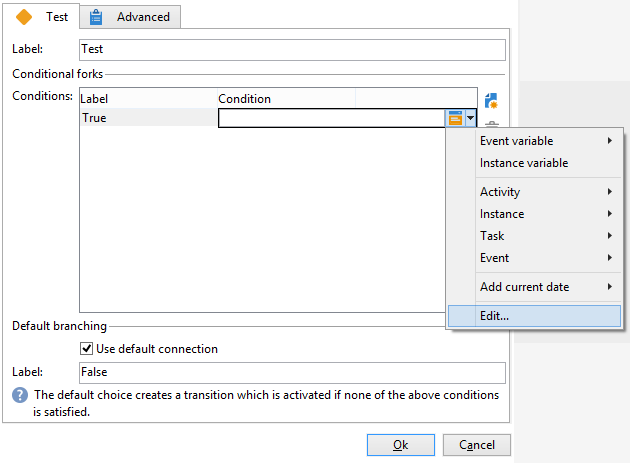

# 测试{#test}

A **测试** 类型活动可激活满足其关联条件的第一个过渡。 如果未满足条件，则 **[!UICONTROL Use the default fork]** 选项时，将激活默认过渡。

条件是必须计算为“true”或“false”的JavaScript表达式。 要输入表达式，请单击条件名称右侧的图标，然后选择 **[!UICONTROL Edit...]**.

有关可通过工作流JavaScript访问的应用程序服务器的所有其他JavaScript函数和SOAP方法的更多信息，请参阅 [JSAPI文档](https://experienceleague.adobe.com/developer/campaign-api/api/index.html?lang=zh-Hans).

您还可以直接从此编辑器插入变量。 有关如何使用变量的更多信息，请参阅 [此部分](javascript-scripts-and-templates.md#variables).

可以从活动属性编辑窗口添加、删除或排序条件，也可以从过渡中修改条件。

如果计算结果被不同条件重用，则可以在活动的初始化脚本中计算结果。 结果必须存储在要由条件脚本(task.vars.xxx)访问的任务的变量中。
