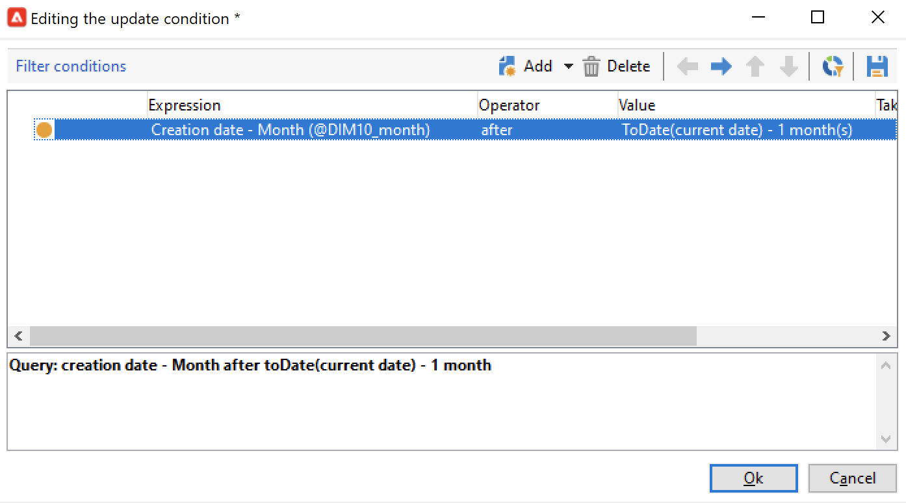

# 更新聚合{#update-aggregate}

可以使用特定活动更新[多维数据集](../../v8/reporting/gs-cubes.md)中为报告目的定义的聚合。 配置聚合时&#x200B;**[!UICONTROL Workflow]**&#x200B;选项卡可用。

在[本节](../../v8/reporting/customize-cubes.md#calculate-and-use-aggregates)中了解有关多维数据集和聚合的详细信息。

要更新聚合，请编辑&#x200B;**[!UICONTROL Update aggregate]**&#x200B;活动并选择要更新的多维数据集和聚合。

您可以配置&#x200B;**完整更新**&#x200B;或&#x200B;**部分更新**。

默认情况下，在每次计算期间都会执行完全更新。 要启用部分更新，请选择选项并定义更新条件。

好的做法是添加&#x200B;**[!UICONTROL Scheduler]**&#x200B;活动以设置计算更新的频率。
