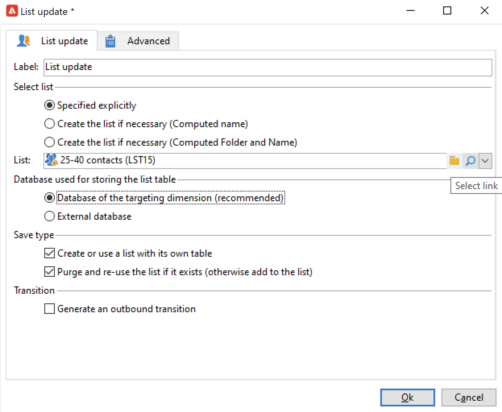

# 使用工作流数据{#how-to-use-workflow-data}

您可以使用工作流活动执行多个任务。 请查找下面的使用示例，通过创建列表、管理订阅、通过工作流发送消息，或丰富投放内容及其受众，来更新数据库。

在 [此部分](workflow-use-cases.md).

## 数据生命周期 {#data-life-cycle}

### 工作流临时工作表 {#work-table}

在工作流中，从一个活动传输到另一个活动的数据存储在临时工作表中。

可通过右键单击相应的过渡来显示和分析此数据。


要执行此操作，请选择相关菜单：

* **[!UICONTROL Display the target...]**

   此菜单显示有关目标群体的可用数据。

   

   您可以在 **[!UICONTROL Schema]** 选项卡。

   

   如需详细信息，请参阅[此部分](monitor-workflow-execution.md#worktables-and-workflow-schema)。

* **[!UICONTROL Analyze target...]**

   利用此菜单，可访问描述性分析向导，该向导可生成有关过渡数据的统计信息和报告。

   有关更多信息，请参阅 [Campaign Classic v7 文档](https://experienceleague.adobe.com/docs/campaign-classic/using/reporting/analyzing-populations/about-descriptive-analysis.html)。

在执行工作流时会清除目标数据。 只能访问最后一个工作表。 您可以配置工作流，以便所有工作表都保持可访问状态：检查 **[!UICONTROL Keep the result of interim populations between two executions]** 选项。


>[!CAUTION]
>
>此选项必须 **从** 在 **生产** 工作流。 此选项用于分析结果，仅用于测试目的，因此必须仅用于开发或暂存环境。


### 利用目标数据 {#target-data}

工作流临时工作表中存储的数据可用于个性化任务。 数据可在个性化字段中使用。

例如，您可以使用通过投放中的列表收集的数据。 要实现此目的，请使用以下语法：

```
%= targetData.FIELD %
```

**[!UICONTROL Target extension]** (targetData)类型个性化元素不适用于定位工作流。 必须在工作流中构建投放目标，并在投放的集客过渡中指定该目标。

在以下示例中，您将收集有关客户的信息列表，这些信息将用在个性化电子邮件中。 应用以下步骤：

1. 创建用于收集信息的工作流，将其与数据库中已有的数据进行协调，然后开始投放。

   

1. 在本例中，文件内容如下所示：

   ```
   Music,First name,Last name,Account,CD/DVD,Card
   Pop,David,BLAIR,4323,CD,0
   Rock,Daniel,ARCARI,3222,DVD,1
   Disco,Uma,ALTON,0488,DVD,0
   Jazz,Paul,BOLES,6475,CD,1
   Jazz,David,BOUKHARI,0841,DVD,1
   [...]
   ```

   要加载文件，请配置 **[!UICONTROL Data loading (file)]** 活动如下所示：

   

1. 配置 **[!UICONTROL Enrichment]** 活动，以将收集的数据与Adobe Campaign数据库中已有的数据进行协调。 在此，对帐密钥是帐号：

   

1. 然后，配置 **[!UICONTROL Delivery]**:它基于模板创建，且收件人由集客过渡指定。

   

   >[!CAUTION]
   >
   >只能使用过渡中包含的数据来个性化投放。 **targetData** 类型个性化字段仅适用于的集客群体 **[!UICONTROL Delivery]** 活动。

1. 在投放模板中，使用工作流中收集的字段。

   为此，请插入 **[!UICONTROL Target extension]** 类型个性化字段。

   

   在此，我们希望按照工作流收集的文件中所述插入客户最喜爱的音乐流派和媒体类型（CD或DVD）。

   作为加号，我们将为忠诚卡持有者（即“卡”值等于1的收件人）添加优惠券。

   

   **[!UICONTROL Target extension]** (targetData)类型数据会使用与所有个性化字段相同的特征插入到投放中。 它们也可用于主题、链接标签或链接本身。


## 更新数据库 {#update-the-database}

所有收集的数据都可用于更新数据库或投放。 例如，您可以扩充邮件内容的个性化可能性（包括邮件中的合同数、指定去年的平均购物车数等） 或详细定位群体（向合同合同持有者发送消息，定位在线服务的1,000位最佳订阅者，等等）。 此数据也可以在列表中导出或存档。

### 更新列表  {#list-updates}

Adobe Campaign数据库和现有列表的数据可以使用两个专用活动进行更新：

* 的 **[!UICONTROL List update]** 活动允许您在数据库中存储工作表。

   您可以选择或创建现有列表。 在这种情况下，会计算名称，可能还会计算记录文件夹。

   

   请参阅 [列表更新](list-update.md).

* 的 **[!UICONTROL Update data]** 活动会批量更新数据库中的字段。

   有关更多信息，请参阅 [更新数据](update-data.md).

### 管理订阅 {#subscription-management}

要了解如何通过工作流为信息服务的收件人订阅和取消订阅，请参阅 [订阅服务](subscription-services.md).
