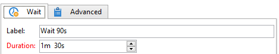

# 等待{#wait}

A **等待** 活动会在几秒到几个月之间的任意时间延迟后，激活其过渡。 等待任务不会阻止其他任务的执行；当此任务处于待处理状态时，工作流可以并行执行任务。

您可以使用编辑器输入标签和等待时间，如以下示例所示：

在 **[!UICONTROL Duration]** 字段中，可以使用您选择的单位表示该值：（根据操作员的区域设置）：

* 如果未指定区域设置： **s** 若为秒， **m** 几分钟， **h** 数小时， **d** 几天， **y** 多年了。 在批准时，该值会自动转换为最易读的单位。

   默认单位为日(**d**)。

* 而例如，如果区域设置设置为“Français”，则： **s** 若为秒， **mn** 几分钟， **h** 数小时， **j** 几天， **m** 几个月， **a** 多年了。 在批准时，该值会自动转换为可读性最强的单位，如上面的示例所示 **90年代** 已转换为 **1分30秒**.

   默认单位为日(**d**)。
