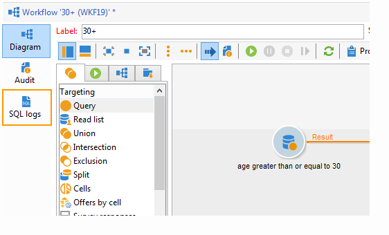

# 工作流属性{#workflow-properties}

## “执行”选项卡 {#execution-tab}

工作流中&#x200B;**[!UICONTROL Properties]**&#x200B;窗口的&#x200B;**[!UICONTROL Execution]**&#x200B;选项卡分为3个部分：

### 调度程序 {#scheduler}

此部分仅显示在营销活动工作流中。

* **[!UICONTROL Priority]**

  工作流引擎会根据此字段中定义的优先级条件处理要执行的工作流。 例如，所有优先级为&#x200B;**[!UICONTROL Average]**&#x200B;的工作流将先于优先级为&#x200B;**[!UICONTROL Low]**&#x200B;的工作流执行。

* **[!UICONTROL Schedule execution for a time of low activity]**

  此选项会将工作流启动延迟到不太繁忙的时间段。 某些工作流在数据库引擎的资源方面成本高昂。 我们建议将执行安排在活动较少的时间（例如，在晚上）执行。 在&#x200B;**[!UICONTROL Processes on campaigns]**&#x200B;技术工作流中定义了低活动时段。

### 执行 {#execution}

* **[!UICONTROL Default affinity]**

  如果您的安装包括多个工作流服务器，请使用此字段选择将要执行工作流的计算机。如果此字段中定义的值在任何服务器上都不存在，则工作流将保持待处理状态。

* **[!UICONTROL History in days]**

  数据库的工作表保存执行历史记录（任务、事件、日志）。 您可以在此处定义此工作流的存档天数：清理过程将每天删除一次最旧的存档。如果此字段中的值为零，则绝不会删除存档。

* **[!UICONTROL Log SQL queries in the journal]**

  此功能是为高级用户保留的。它涉及包含定位活动（查询、并集、交集等）的工作流。选中此选项后，在工作流执行期间发送到数据库的 SQL 查询将显示在 Adobe Campaign 中：这意味着您可以分析它们以优化查询或诊断问题。

  当启用该选项时，查询将显示在添加到工作流（活动工作流除外）和&#x200B;**[!UICONTROL Properties]**&#x200B;活动的&#x200B;**[!UICONTROL SQL logs]**&#x200B;选项卡中。 **[!UICONTROL Audit]**&#x200B;选项卡还包括SQL查询。

  

* **[!UICONTROL Execute in the engine]**

  此选项只能用于调试，不能用于生产。 启用后，工作流将具有优先级，并且所有其他工作流将停止，直到此工作流完成。

* **[!UICONTROL Enable watchdog supervisor to keep workflow running permanently]**

  此选项强制工作流在错误发生后自动重新启动。 启用后，重新启动将每30秒检查一次工作流的状态，并在需要时重新启动。 要调整30秒间隔，您可以创建`XtkWorkflow_WatchdogRestartTimerTimeout`技术选项并使用整数数据类型指定所需的延迟。

  >[!NOTE]
  >
  >* 从v8.6.4开始提供此选项。
  >
  >* 此选项针对高级用户，应仅针对&#x200B;**技术工作流**&#x200B;启用。
  >
  >* 默认情况下，[Enterprise (FFDA)部署](enterprise-deployment.md)的集中式复制工作流可用上下文将启用此选项。 [了解详情](../../v8/architecture/replication.md)

### 错误管理 {#error-management}

* **[!UICONTROL Troubleshooting]**

  此字段可让您定义在工作流任务出错时要执行的操作。提供了两个可能的选项：

   * **[!UICONTROL Stop the process]**：工作流已自动暂停。 工作流状态更改为&#x200B;**[!UICONTROL Failed]**。 问题解决后，使用&#x200B;**[!UICONTROL Start]**&#x200B;或&#x200B;**[!UICONTROL Restart]**&#x200B;按钮重新启动工作流。
   * **[!UICONTROL Ignore]**：触发错误的任务状态更改为&#x200B;**[!UICONTROL Failed]**，但工作流保留&#x200B;**[!UICONTROL Started]**&#x200B;状态。 此配置与定期任务相关：如果分支包含调度程序，它将在下次执行工作流时正常启动。

* **[!UICONTROL Consecutive errors]**

  在&#x200B;**[!UICONTROL In case of errors]**&#x200B;字段中选择&#x200B;**[!UICONTROL Ignore]**&#x200B;值后，此字段将变为可用。 您可以指定在流程停止前可忽略的错误的数量。一旦达到此数量，工作流状态将更改为&#x200B;**[!UICONTROL Failed]**。 如果此字段的值为 0，则无论错误数量是多少，工作流都绝不会停止。

* **[!UICONTROL Template]**

  此字段允许您选择通知模板，以在其状态更改为&#x200B;**[!UICONTROL Failed]**&#x200B;时发送给工作流主管。

  如果相关操作员的配置文件中包含电子邮件地址，则会通过电子邮件通知他们。 要定义工作流主管，请转到属性（**[!UICONTROL General]**&#x200B;选项卡）的&#x200B;**[!UICONTROL Supervisor(s)]**&#x200B;字段。

  

  **[!UICONTROL Notification to a workflow supervisor]**&#x200B;默认模板包括一个用于通过Web访问Adobe Campaign客户端控制台的链接，以便收件人可以在登录后处理问题。

  要创建个性化模板，请转到&#x200B;**[!UICONTROL Administration>Campaign management>Technical deliveries and templates]**。
