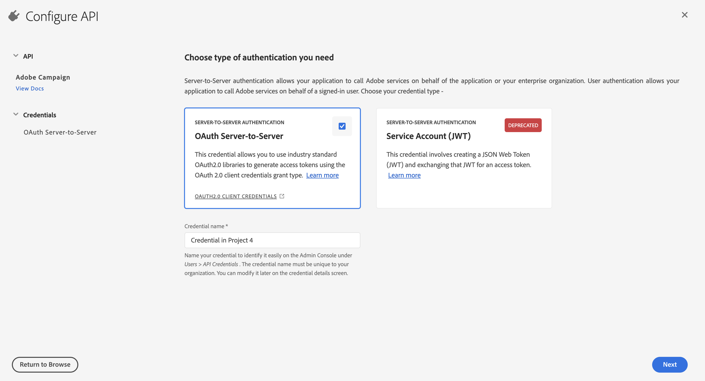
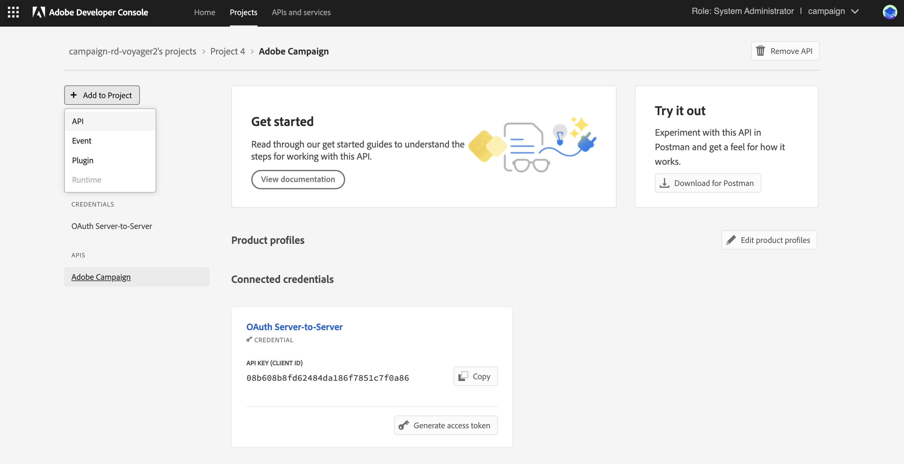
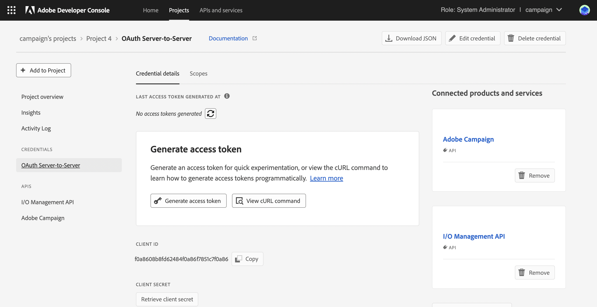

# 将Campaign技术操作员迁移到Adobe Developer Console {#migrate-tech-users-to-ims}

从Campaign v8.5开始，作为加强安全和身份验证流程工作的一部分，对Campaign v8的身份验证流程正在进行改进。 技术操作员现在可以使用[Adobe Identity Management System (IMS)](https://helpx.adobe.com/cn/enterprise/using/identity.html){target="_blank"}连接到Campaign。 在[Adobe Developer Console文档](https://developer.adobe.com/developer-console/docs/guides/authentication/ServerToServerAuthentication/){target="_blank"}中了解有关新服务器到服务器身份验证过程的更多信息。

技术操作员是为API集成明确创建的Campaign用户配置文件。 本文详细介绍了通过Adobe Developer控制台将技术操作员迁移到技术帐户所需的步骤。


## 您是否受影响？{#ims-impacts}

如果您从Campaign外部的系统向其Campaign营销实例或实时消息中心实例进行API调用，则必须通过Adobe Developer Console将技术操作员迁移到技术帐户，如下所述。

此更改从Campaign v8.5开始适用，从Campaign v8.6开始将是&#x200B;**强制的**。


## 迁移过程 {#ims-migration-procedure}

按照以下步骤在Adobe Developer Console中创建技术帐户，然后使用这些新创建的帐户能够更改在Adobe Campaign中进行API调用的所有外部系统的身份验证方法。

这些步骤概述如下：

* 在Adobe Developer Console中创建项目
* 为新创建的项目分配相应的API
* 将所需的Campaign产品配置文件授予项目
* 更新API以使用新创建的技术帐户凭据
* 从Campaign实例中删除旧版技术运算符

### 迁移的先决条件{#ims-migration-prerequisites}

<!--To be able to create the technical accounts which replace the technical operators, the prerequisite that the proper Campaign Product Profiles exist within the Admin Console for all Campaign instances need to be validated. You can learn more about Product Profiles within the Adobe Console in [Adobe Developer Console documentation](https://developer.adobe.com/developer-console/docs/guides/projects/){target="_blank"}.-->

对于进入消息中心实例的API调用，在升级到Campaign v8.5期间或配置实例期间应已创建产品配置文件。 此产品配置文件的名称为：

`campaign - <your campaign instance> - messagecenter`

如果您已使用基于IMS的身份验证来使用户访问Campaign，则Admin Console中应已存在API调用所需的产品配置文件。 如果您在Campaign中使用自定义运算符组来对营销实例进行API调用，则必须在Admin Console中创建该产品配置文件。

对于其他情况，您必须联系Adobe过渡经理，以便Adobe技术团队能够将您现有的操作员组和已命名权限迁移到Admin Console中的产品配置文件。


### 步骤1 — 在Adobe Developer Console中创建Campaign项目 {#ims-migration-step-1}

集成是作为Adobe Developer Console中&#x200B;**项目**&#x200B;的一部分创建的。 请参阅[Adobe Developer Console文档](https://developer.adobe.com/developer-console/docs/guides/projects/){target="_blank"}以了解有关项目的更多信息。

您可以使用之前创建的任何项目，也可以创建新项目。 有关创建项目的详细步骤，请参阅[Adobe Developer Console文档](https://developer.adobe.com/developer-console/docs/guides/getting-started/){target="_blank"}。 您可以找到以下关键步骤

<!--
For this migration, you must add below APIs in your project: **I/O Management API** and **Adobe Campaign**.

-->

要创建新项目，请在Adobe Developer Console的主屏幕中单击&#x200B;**新建项目**。


您可以使用&#x200B;**编辑项目**&#x200B;按钮重命名此项目。


### 步骤2 — 将API添加到您的项目中 {#ims-migration-step-2}

从新创建的项目屏幕中，根据需要添加API，以便能够将此项目用作您对Adobe Campaign的API调用的技术帐户。

要将API添加到项目中，请执行以下步骤：

1. 单击&#x200B;**添加API**以选择要添加到项目中的API。
   
1. 通过勾选Adobe Campaign卡片右上角的框，选择并将Adobe Campaign API添加到您的项目中，在将鼠标悬停在该卡片上时会显示该框
   
1. 单击屏幕底部的&#x200B;**下一步**。

### 步骤3 — 选择身份验证类型  {#ims-migration-step-3}

在&#x200B;**配置API**&#x200B;屏幕中，选择所需的身份验证类型。 此项目需要&#x200B;**OAuth服务器到服务器**&#x200B;身份验证。 请确保已选中它，然后单击屏幕底部的&#x200B;**下一步**。



<!--
Once your project is created in the Adobe Developer Console, add an API that uses Server-to-Server authentication. Learn how to set up the OAuth Server-to-Server credential in [Adobe Developer Console documentation](https://developer.adobe.com/developer-console/docs/guides/authentication/ServerToServerAuthentication/implementation/){target="_blank"}.

When the API has been successfully connected, you can access the newly generated credentials including Client ID and Client Secret, as well as generate an access token.-->

### 第4步 — 选择产品配置文件 {#ims-migration-step-4}

如先决条件部分中所述，您必须分配项目使用的相应产品配置文件。 在此步骤中，您必须选择要由正在创建的技术帐户使用的产品配置文件。

如果此技术帐户用于向消息中心实例进行API调用，请确保选择以`messagecenter`结尾的Adobe创建产品配置文件。

对于营销实例的API调用，请选择与实例和操作员组对应的产品配置文件。

选择所需的产品配置文件后，单击屏幕底部的&#x200B;**保存配置的API**。

<!--
You can now add your Campaign product profile to the project, as detailed below:

1. Open the Adobe Campaign API.
1. Click the **Edit product profiles** button

    

1. Assign all the relevant Product Profiles to the API, for example 'messagecenter', and save your changes.
1. Browse to the **Credential details** tab of your project, and copy the **Technical Account Email** value.-->

### 步骤5 — 将I/O管理API添加到您的项目中 {#ims-migration-step-5}


从项目屏幕中，单击&#x200B;**[!UICONTROL + Add to Project]**&#x200B;并选择屏幕左上角的&#x200B;**[!UICONTROL API]**&#x200B;以便能够将I/O管理API添加到此项目。



在&#x200B;**添加API**&#x200B;屏幕中，向下滚动以查找&#x200B;**I/O管理API**&#x200B;卡。 单击将鼠标悬停在信息卡上时显示的复选框以将其选中。 然后单击屏幕底部的&#x200B;**下一步**。


在&#x200B;**配置API**&#x200B;屏幕中，OAuth服务器到服务器身份验证已存在。 单击屏幕底部的&#x200B;**保存配置的API**。


这会将您带回新创建项目的I/O管理API中的项目屏幕。 单击屏幕顶部的痕迹导航中的项目名称，可返回到项目详细信息主页。


### 步骤6 — 验证项目设置 {#ims-migration-step-6}

请检查您的项目，确保它与“产品和服务”部分中显示的&#x200B;**I/O管理API**&#x200B;和&#x200B;**Adobe Campaign API**&#x200B;以及“凭据”部分中的&#x200B;**OAuth服务器到服务器**&#x200B;类似，如下所示。


### 步骤7 — 验证配置 {#ims-migration-step-7}

要尝试连接，请按照[Adobe Developer Console凭据指南](https://developer.adobe.com/developer-console/docs/guides/authentication/ServerToServerAuthentication/implementation/#generate-access-tokens){target="_blank"}中详述的步骤生成访问令牌并复制提供的示例cURL命令。 您可以使用这些凭据创建soap调用，以测试您是否可以正确进行身份验证并连接到Adobe Campaign实例。 我们建议在对第三方API集成进行所有更改之前执行此验证。

### 步骤8 — 更新第三方API集成 {#ims-migration-step-8}

您现在必须更新所有对Adobe Campaign进行调用的API集成，才能使用新创建的技术帐户。

有关API集成步骤的更多详细信息，包括用于顺利集成的示例代码，请参阅[Adobe Developer Console身份验证文档](https://developer.adobe.com/developer-console/docs/guides/authentication/ServerToServerAuthentication/){target="_blank"}。

以下是示例SOAP调用，其中显示了第三方系统的迁移之前和迁移之后。

使用Adobe Identity Management System (IMS)身份验证时，要生成WSDL文件，您应在postman调用中添加`Authorization: Bearer <IMS_Technical_Token_Token>`：

```
curl --location --request POST 'https://<instance_url>/nl/jsp/schemawsdl.jsp?schema=nms:rtEvent' \--header 'Authorization: Bearer <Technical account access token>'
```

完成并验证迁移过程后，Soap调用将更新如下：

* 迁移前：不支持技术帐户访问令牌。

  ```sql
  POST /nl/jsp/soaprouter.jsp HTTP/1.1
  Host: localhost:8080
  Content-Type: application/soap+xml;
  SOAPAction: "nms:rtEvent#PushEvent"
  charset=utf-8
  
  <?xml version="1.0" encoding="utf-8"?>  <soapenv:Envelope xmlns:soapenv="http://schemas.xmlsoap.org/soap/envelope/" xmlns:urn="urn:nms:rtEvent">
  <soapenv:Header/>
  <soapenv:Body>
      <urn:PushEvent>
          <urn:sessiontoken>SESSION_TOKEN</urn:sessiontoken>
          <urn:domEvent>
              <!--You may enter ANY elements at this point-->
              <rtEvent type="type" email="name@domain.com"/>
          </urn:domEvent>
      </urn:PushEvent>
  </soapenv:Body>
  </soapenv:Envelope>
  ```

* 迁移后：支持技术帐户访问令牌。 访问令牌应在`Authorization`标头中作为持有者令牌提供。 应在此处忽略会话令牌的使用，如以下soap调用示例中所示。

  ```sql
  POST /nl/jsp/soaprouter.jsp HTTP/1.1
  Host: localhost:8080
  Content-Type: application/soap+xml;
  SOAPAction: "nms:rtEvent#PushEvent"
  charset=utf-8
  Authorization: Bearer <IMS_Technical_Token_Token>
  
  <?xml version="1.0" encoding="utf-8"?>  <soapenv:Envelope xmlns:soapenv="http://schemas.xmlsoap.org/soap/envelope/" xmlns:urn="urn:nms:rtEvent">
  <soapenv:Header/>
  <soapenv:Body>
      <urn:PushEvent>
          <urn:sessiontoken></urn:sessiontoken>
          <urn:domEvent>
              <!--You may enter ANY elements at this point-->
              <rtEvent type="type" email="name@domain.com"/>
          </urn:domEvent>
      </urn:PushEvent>
  </soapenv:Body>
  </soapenv:Envelope>
  ```

### 步骤9 — （可选）在Campaign客户端控制台中更新技术帐户操作员 {#ims-migration-step-9}

此步骤是可选的，并且仅在营销实例中可用，不能在任何消息中心实例中使用。 如果已经为技术操作员定义了特定文件夹权限或已命名权限，但未通过分配的操作员组。 现在，您需要在Admin Console中更新新创建的技术帐户用户，以授予所需的文件夹权限或命名权限。

请注意，在对Campaign实例至少进行API调用后（IMS届时将在Campaign中创建用户），技术帐户用户才会存在于Adobe Campaign中。 如果您在Campaign中找不到技术用户，请确保能够成功发送API调用，如步骤7](#ims-migration-step-7)中所述[。

1. 要应用新的技术帐户用户所需的更改，请按照电子邮件地址在Campaign客户端控制台中找到它们。 此电子邮件地址是在上述项目创建和身份验证步骤中创建的。

   您可以通过单击项目&#x200B;**凭据**&#x200B;部分中的&#x200B;**OAuth服务器到服务器**&#x200B;标题找到此电子邮件地址。

   

   在“凭据”屏幕中，向下滚动以找到**技术帐户电子邮件**，然后单击&#x200B;**复制**&#x200B;按钮。

   

1. 您现在需要在Adobe Campaign客户端控制台中更新新创建的技术运算符。 您必须将现有的技术操作员文件夹权限应用到新的技术操作员。

   要更新此运算符，请执行以下步骤：

   1. 在Campaign客户端控制台资源管理器中，浏览到&#x200B;**管理>访问管理>运算符**。
   1. 访问用于API的现有技术操作员。
   1. 浏览到文件夹权限并检查权限。
   1. 将相同的权限应用到新创建的技术操作员。 此操作员的电子邮件是以前复制的&#x200B;**技术帐户电子邮件**&#x200B;值。
   1. 保存您的更改。


>[!CAUTION]
>
>新的技术操作员必须至少进行了一次要添加到Campaign客户端控制台的API调用。
>

### 步骤10 — 从Adobe Campaign中删除旧的技术运算符 {#ims-migration-step-10}

在迁移所有第三方系统以将新的技术帐户用于IMS身份验证后，您可以从Campaign客户端控制台中删除旧的技术操作员。

为此，您需要登录到Campaign客户端控制台，导航到&#x200B;**管理>访问管理>运算符**，然后找到旧的技术用户并将其删除。
