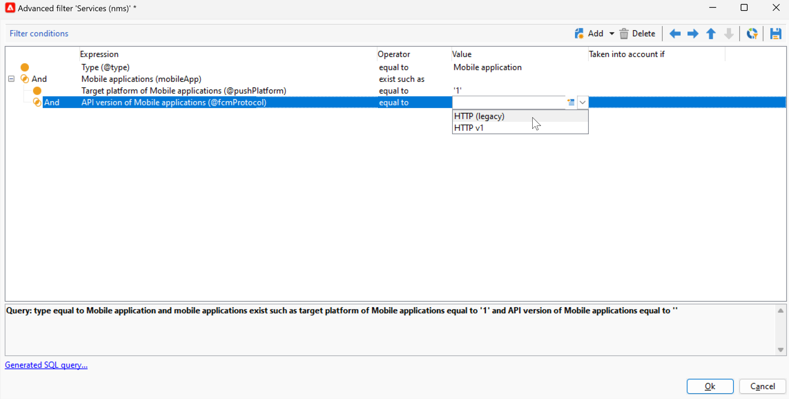

# 推送通知渠道更改 {#push-upgrade}

您可以使用Campaign在iOS和Android设备上发送推送通知。 为此，Campaign依赖于移动应用程序订阅服务。

Android Firebase Cloud Messaging (FCM)服务的一些重要更改将于2024年发布，可能会影响您的Adobe Campaign实施。 您可能需要更新Android推送消息的订阅服务配置才能支持此更改。

此外，Adobe强烈建议迁移到基于令牌的连接而不是APN的基于证书的连接，这种连接更加安全和可扩展。

## Google Android Firebase Cloud Messaging (FCM)服务 {#fcm-push-upgrade}

### 更改了哪些内容？ {#fcm-changes}

作为Google持续努力改进其服务的一部分，旧版FCM API将在以下日期停用 **2024年7月22日**. 在中了解有关Firebase云消息HTTP协议的更多信息 [Google Firebase文档](https://firebase.google.com/docs/cloud-messaging/migrate-v1){target="_blank"}.

Adobe Campaign Classic v7和Adobe Campaign v8已支持用于发送推送通知消息的最新API。 但是，某些旧实施仍依赖旧版API。 必须更新这些实施。

### 您是否受影响？ {#fcm-impact}

如果您当前的实施支持使用旧版API连接到FCM的订阅服务，则您会受到影响。 必须转换为最新的API才能避免任何服务中断。 在这种情况下，Adobe团队将会与您联系。

要检查您是否受到影响，您可以筛选 **服务和订阅** 根据以下过滤器：

* 如果您的任何活动推送通知服务使用 **HTTP（旧版）** API，您的设置将直接受到此更改的影响。 您必须查看当前配置并迁移到如下所述的新API。

* 如果您的设置仅使用 **HTTP v1** API来接收Android推送通知，则表明您已符合相关规定，无需执行进一步操作。

### 如何更新？ {#fcm-transition-procedure}

#### 先决条件 {#fcm-transition-prerequisites}

* 对于Campaign Classicv7,20.3.1版本中添加了对HTTP v1的支持。 如果您的环境运行在旧版本上，则迁移到HTTP v1的先决条件是将环境升级到 [最新Campaign Classic版本](https://experienceleague.adobe.com/docs/campaign-classic/using/release-notes/latest-release.html){target="_blank"}. 对于Campaign v8，所有版本都支持HTTP v1，无需升级。

* 需要Android Firebase Admin SDK服务的帐户JSON文件才能将移动应用程序移动到HTTP v1。 了解如何在中获取此文件 [Google Firebase文档](https://firebase.google.com/docs/admin/setup#initialize-sdk){target="_blank"}.

* 对于混合、托管和Managed Services部署，除了下面的过渡过程之外，请联系Adobe以更新实时(RT)执行服务器。 不影响中间源服务器。

* 作为Campaign Classic v7内部部署用户，您必须同时升级营销和实时执行服务器。 不影响中间源服务器。

#### 过渡过程 {#fcm-transition-steps}

要将环境移动到HTTP v1，请执行以下步骤：

1. 浏览到您的列表 **服务和订阅**.
1. 使用列出所有移动应用程序 **HTTP（旧版）** api版本。
1. 对于这些移动设备应用程序中的每一个，设置 **API版本** 到 **HTTP v1**.
1. 单击 **[!UICONTROL Load project json file to extract project details...]** 用于直接加载JSON密钥文件的链接。

   您还可以手动输入以下详细信息：

   * **[!UICONTROL Project Id]**
   * **[!UICONTROL Private Key]**
   * **[!UICONTROL Client Email]**

   

1. 单击 **[!UICONTROL Test the connection]** 以检查您的配置是否正确，以及营销服务器是否有权访问FCM。 请注意，对于中间源部署， **[!UICONTROL Test connection]** 按钮无法检查服务器是否有权访问Android Firebase Cloud Messaging (FCM)服务。
1. 作为一个选项，您可以使用一些来扩充推送消息内容 **[!UICONTROL Application variables]** 如果需要。 这些都是完全可自定义的，并且是发送到移动设备的消息有效负载的一部分。
1. 单击 **[!UICONTROL Finish]**，然后单击 **[!UICONTROL Save]**。

以下是FCM有效负荷名称，用于进一步个性化您的推送通知。 这些选项是详细的 [此处](#fcm-apps).

| 消息类型 | 可配置消息元素（FCM有效负荷名称） | 可配置选项（FCM有效负荷名称） |
|:-:|:-:|:-:|
| 数据消息 | N/A | validate_only |
| 通知消息 | title，标题，正文， android_channel_id，图标，声音，标记，颜色， click_action，图像，滚动条，粘性，可见性， notification_priority，通知优先级， notification_count   | validate_only |

>[!NOTE]
>
>所有这些更改应用于您的所有服务器后，交付给Android设备的所有新推送通知都将使用HTTP v1 API。 正在重试、进行中和正在使用的现有推送投放仍使用HTTP（旧版）API。

### 这对我的Android应用程序有何影响？ {#fcm-apps}

无需对Android Mobile应用程序的代码进行特定更改，通知行为不应发生变化。

但是，使用HTTP v1，您可以通过以下方式进一步个性化推送通知 **[!UICONTROL HTTPV1 additional options]**.

您可以：

* 使用 **[!UICONTROL Ticker]** 用于设置通知的滚动条文本的字段。
* 使用 **[!UICONTROL Image]** 用于设置要在通知中显示的图像URL的字段。
* 使用 **[!UICONTROL Notification Count]** 字段，用于设置直接在应用程序图标上显示的新未读信息的数量。
* 设置 **[!UICONTROL Sticky]** 选项设置为false，以便在用户单击通知时自动将其关闭。 如果设置为true，则即使用户单击通知，也会显示通知。
* 设置 **[!UICONTROL Notification Priority]** 通知的级别为“默认”、“最小”、“低”或“高”。
* 设置 **[!UICONTROL Visibility]** 您向公共、私人或机密发送的通知的级别。

欲知详情，请参阅 **[!UICONTROL HTTP v1 additional options]** 以及如何填写这些字段，请参阅 [FCM文档](https://firebase.google.com/docs/reference/fcm/rest/v1/projects.messages#androidnotification){target="_blank"}.

## Apple iOS推送通知服务(APN) {#apns-push-upgrade}

### 更改了哪些内容？ {#ios-changes}

按照Apple的建议，您应使用无状态身份验证令牌保护与Apple推送通知服务(APN)的通信。

基于令牌的身份验证提供了与APN进行通信的无状态方式。 无状态通信比基于证书的通信速度更快，因为它不要求APN查找与您的提供商服务器相关的证书或其他信息。 使用基于令牌的身份验证还有其他优势：

* 您可以使用来自多个提供程序服务器的相同令牌。

* 您可以使用一个令牌为您的公司的所有应用程序分发通知。

要了解有关到APN的基于令牌的连接，请参阅 [Apple开发人员文档](https://developer.apple.com/documentation/usernotifications/establishing-a-token-based-connection-to-apns){target="_blank"}.

Adobe Campaign Classic v7和Adobe Campaign v8支持基于令牌和基于证书的连接。 如果您的实施依赖于基于证书的连接，Adobe强烈建议您将其更新为基于令牌的连接。

### 您是否受影响？ {#ios-impact}

如果您当前的实施依赖于基于证书的请求来连接到APN，则您会受到影响。 建议转换为基于令牌的连接。

要检查您是否受到影响，您可以筛选 **服务和订阅** 根据以下过滤器：

* 如果您的任何活动推送通知服务使用 **基于证书的身份验证** 模式(.p12)下，您当前的实施应已审查并移至 **基于令牌的身份验证** 模式(.p8)，如下所述。

* 如果您的设置仅使用 **基于令牌的身份验证** iOS模式，则您的实施已处于最新状态，无需您执行任何进一步操作。

### 如何更新？ {#ios-transition-procedure}

#### 先决条件 {#ios-transition-prerequisites}

* 对于Campaign Classicv7，支持 **基于令牌的身份验证** 模式已在20.2版本中添加。 如果您的环境运行在旧版本上，则此更改的先决条件是将您的环境升级到 [最新Campaign Classic版本](https://experienceleague.adobe.com/docs/campaign-classic/using/release-notes/latest-release.html){target="_blank"}. 对于Campaign v8， **基于令牌的身份验证** 所有版本都支持模式，无需升级。

* 您需要APN身份验证令牌签名密钥来生成您的服务器使用的令牌。 您从Apple开发人员帐户请求此密钥，如中所述 [Apple开发人员文档](https://developer.apple.com/documentation/usernotifications/establishing-a-token-based-connection-to-apns){target="_blank"}.

* 对于混合、托管和Managed Services部署，除了下面的过渡过程之外，请联系Adobe以更新实时(RT)执行服务器。 不影响中间源服务器。

* 作为Campaign Classic v7内部部署用户，您必须同时升级营销和实时执行服务器。 不影响中间源服务器。

#### 过渡过程 {#ios-transition-steps}

要将iOS移动应用程序移动到基于令牌的身份验证模式，请执行以下步骤：

1. 浏览到您的列表 **服务和订阅**.
1. 使用列出所有移动应用程序 **基于证书的身份验证** 模式(.p12)。
1. 编辑每个移动设备应用程序，并浏览到 **证书/私钥** 选项卡。
1. 从 **身份验证模式** 下拉列表，选择 **基于令牌的身份验证** 模式(.p8)。
1. 填写APN连接设置 **[!UICONTROL Key Id]**， **[!UICONTROL Team Id]** 和 **[!UICONTROL Bundle Id]** 然后，通过单击 **[!UICONTROL Enter the private key...]**.

   

1. 单击 **[!UICONTROL Test the connection]** 以检查您的配置是否正确，以及服务器是否有权访问APN。 请注意，对于中间源部署， **[!UICONTROL Test connection]** 按钮无法检查服务器是否有权访问APN。
1. 单击 **[!UICONTROL Next]** 以开始配置生产应用程序，并按照上面详述的相同步骤操作。
1. 单击 **[!UICONTROL Finish]**，然后单击 **[!UICONTROL Save]**。

您的iOS应用程序现在已移至基于令牌的身份验证模式。
