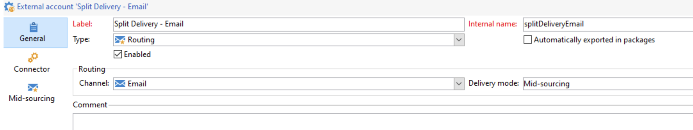

# Campaign架构快速入门{#gs-ac-archi}

## 环境 {#environments}

Campaign可用作单个实例，每个实例代表一个完整的Campaign环境。

提供了两种类型的环境：

* **生产环境**：为业务从业者托管应用程序。

* **非生产环境**：用于在将对应用程序所做的更改推送到生产环境之前进行各种性能和质量测试。

您可以将资源包从一个环境导出和导入到另一个环境。

 在中了解有关包的更多信息 [Campaign Classicv7文档](https://experienceleague.adobe.com/docs/campaign-classic/using/getting-started/administration-basics/working-with-data-packages.html){target="_blank"}

## 部署模型{#ac-deployment}

提供了两种部署模型：

* **Campaign FDA [!DNL Snowflake] 部署**

  在 [[!DNL Snowflake] FDA部署](fda-deployment.md)， [!DNL Adobe Campaign] v8已连接到 [!DNL Snowflake] 要通过联合数据访问功能访问数据：您可以访问和处理存储在以下位置中的外部数据和信息： [!DNL Snowflake] 在不更改Adobe Campaign数据结构的情况下创建数据库。 PostgreSQL是主数据库，Snowflake是辅助数据库。 您可以扩展数据模型并将数据存储在Snowflake上。 随后，您可以对具有出色性能的大型数据集运行ETL、分段和报告。

* **Campaign Enterprise (FFDA)部署**

  在上下文中 [企业(FFDA)部署](enterprise-deployment.md)， [!DNL Adobe Campaign] v8可与两个数据库配合使用：本地 [!DNL Campaign] 数据库用于用户界面实时消息传递和统一查询，并通过API进行编写，以及使用Cloud [!DNL Snowflake] 数据库，用于活动执行、批量查询和工作流执行。

  Campaign v8 企业版引入了&#x200B;**完全联合数据访问** (FFDA) 概念：所有数据现在都位于云数据库上的远程位置。凭借这种新架构，Campaign v8 企业版 (FFDA) 部署简化了数据管理：云数据库上不需要索引。您只需创建表格、复制数据即可开始。云数据库技术无需特定的维护来保证性能级别。

## 拆分投放执行 {#split}

>[!AVAILABILITY]
>
>此功能仅适用于具有多个MID实例配置的客户。

根据您的Campaign v8包，为您配置特定数量的中间源实例，负责执行投放。

默认情况下，所有渠道的外部帐户使用 **[!UICONTROL Alternate]** 路由模式，是指以交替方式从每个中间实例一次发送一次投放。

为了确保同时在速度和规模方面实现更好的性能，您可以允许将投放自动拆分到中间源实例中，以便更快地投放到收件人。 从营销实例执行投放时，此操作是透明的：发送投放后，所有日志都会合并在一起，然后再发送回营销实例作为单个投放对象。

为此，其他外部帐户使用 **[!UICONTROL Split]** 在为每个渠道进行配置时创建路由模式：

* 拆分投放 — 电子邮件(splitDeliveryEmail)
* 拆分投放 — 短信(splitDeliverySMS)
* 拆分提交 — iOS (splitDeliveryIOS)
* 拆分交付 — Android (splitDeliveryAndroid)

>[!IMPORTANT]
>
>默认情况下，“拆分投放 — 电子邮件”帐户启用拆分路由模式。 对于所有其他渠道的外部帐户，请联系客户关怀团队以启用此选项。
>
>默认情况下，在多个mid之间拆分投放的阈值为100K。 您可以在的“NmsDelivery_MultiMidSplitThreshold”选项中更改此值。 **[!UICONTROL Administration]** / **[!UICONTROL Platform]** / **[!UICONTROL Options]** 菜单。

要将拆分外部帐户作为发送投放的默认帐户，您需要更改投放模板中的路由选择提供程序。 为此，请执行以下步骤：

1. 导航至 **[!UICONTROL Resources]** / **[!UICONTROL Templates]** / **[!UICONTROL Delivery templates]** 文件夹并打开所需的投放模板。 在本例中，我们要编辑电子邮件投放模板。

   

1. 单击 **[!UICONTROL Properties]** 按钮并将路由提供商更改为相应的拆分投放外部帐户。

   

1. 保存您的更改。默认情况下，使用模板发送的所有投放现在都将使用拆分路由模式。

<!--In addition, you can select split external accounts as the default routing provider for all future delivery templates. To do this, change the value of the **[!UICONTROL xtkoption NmsBroadcast_DefaultProvider]** option to the name of the split account.

 -->

## 消息中心架构{#transac-msg-archi}

事务性消息（消息中心）是用于管理触发消息的 Campaign 模块。

 了解如何在中发送事务性消息 [本节](../send/transactional.md).

响应客户在网站上的操作，通过REST API发送事件Campaign，使用通过API调用提供的信息或数据填充消息模板，并将事务型消息实时发送给客户。 这些消息可以通过电子邮件、短信或推送通知单独或批量发送。

在该特定体系结构中，执行单元与控制实例分离，以确保高可用性和负载管理。

* 此 **控制实例** 营销人员和IT团队使用（或营销实例）创建、配置和发布消息模板。 此实例还集中了事件监控和历史记录。

   了解如何在中创建和发布消息模板 [本节](../send/transactional.md).

* 此 **执行实例** 检索传入事件（例如密码重置或网站订单）并发送个性化消息。 可以有多个执行实例通过负载平衡器处理消息，并扩展要处理的事件数以实现最大可用性。

>[!CAUTION]
>
>控制实例和执行实例必须安装在不同的计算机上。 他们不能共享同一个Campaign实例。

### 身份验证

为了使用这些功能，Adobe Campaign用户登录到控制实例以创建事务性消息模板，使用种子列表生成消息预览，显示报告和监视执行实例。

* 单个执行实例与Adobe托管的消息中心执行实例交互时，外部系统可以首先检索会话令牌（该令牌默认在24小时内过期），方法是使用提供的帐户登录和密码对会话登录方法进行API调用。
然后，利用执行实例响应上述调用提供的sessionToken，外部应用程序可以进行SOAP api调用（rtEvents或batchEvents）以发送通信，而无需在每个SOAP调用中包括帐户登录和密码。

* 多个执行实例在具有多个执行实例位于负载平衡器之后的多单元格执行体系结构中，外部应用程序调用的登录方法正在通过负载平衡器：因此，无法使用基于令牌的身份验证。 需要基于用户/密码的身份验证。

在中了解有关事务性消息传递事件的更多信息 [此页面](../send/event-processing.md).
